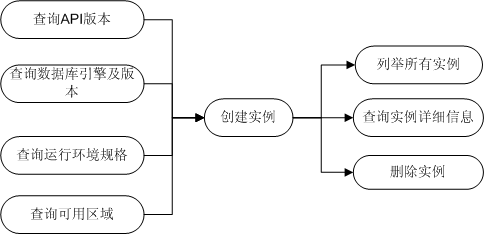
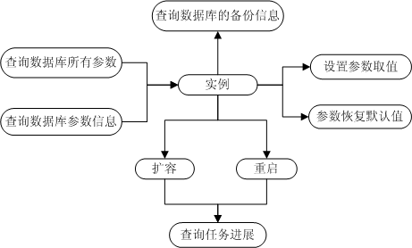
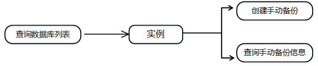

# RDS API使用场景

RDS的OpenAPI提供针对用户数据库实例的创建、查看、删除等基本操作，以及查询系统支持的API版本、数据库引擎及版本、运行环境规格、可用区域等操作。其主要的调用场景见下图：

**图 1**  使用场景一  

在创建实例之前，需要获取系统支持的数据库引擎及版本，运行环境规格以及可用区域信息。

在获取到信息之后，可以将返回结果作为调用参数，执行创建实例操作。

在实例创建成功后，用户可以对自己所属的实例进行列举、查询详细信息、删除操作。

**图 2**  使用场景二  

数据库实例需要先查询数据库所有参数和参数信息后才能进行设置参数取值和参数恢复默认值。

数据库实例可以进行扩容和重启，可以将返回的任务号作为调用参数查询异步任务的进展情况。

**图 3**  使用场景三  

Microsoft SQL Server创建局部备份说明，

在Microsoft SQL Server实例创建成功后，用户可在实例上创建自己的数据库\(需要使用“create database”的SQL\)，可以对自己所属的实例查询自建数据库，通过创建手动备份的接口创建Microsoft SQL Server局部备份。

用户可以通过查询数据库列表获取指定实例的自建数据库信息列表，从中选择需要做局部备份的数据库名。

在获取到信息之后，用户可通过创建手动备份来创建局部备份，通过查询手动备份信息查看Microsoft SQL Server局部备份的数据库列表。

