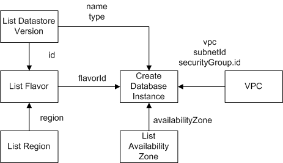

# 流程图

**图 1**  创建数据库实例流程图  

流程如下：

1.  查询List Datastore Version接口获取数据库ID、版本，响应结构体中的ID定义为$dbId，version定义为$version。
2.  获取region。变量定义为$region。

    请参见[地区和终端节点](http://developer.huaweicloud.com/dev/endpoint)。

3.  查询List Flavor接口获取flavorRef（对应接口ID），查询时用到[1](#li2331691915259)的$dbId、[2](#li92065713925)的$region，响应ID定义为$flavorId。
4.  获取availabilityZone，变量定义为$availabilityZone。

    请参见[地区和终端节点](http://developer.huaweicloud.com/dev/endpoint)。

5.  查询VPC接口，响应结果分别为$vpc、$subnetId、$securityGroup.id。
6.  调用Create Database Instance接口，请求body用到[2](#li92065713925)的$region、[3](#li1949189515259)的$flavorId、[4](#li5195434513937)的$availabilityZone、[5](#li4962172115259)的$vpc、$subnetId、$securityGroup.id。

