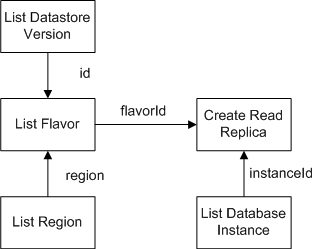

# 流程图

**图 1**  创建数据库主实例只读副本流程图  

流程如下：

1.  查询List Datastore Version接口，获取数据库ID、版本，响应结构体中的ID定义为$dbId，version定义为$version。
2.  获取region。变量定义为$region。

    请参见[地区和终端节点](http://developer.huaweicloud.com/dev/endpoint)。

3.  查询List Flavor接口获取flavorRef（对应接口ID），查询时用到[1](#li2045593523322)的$dbId、[2](#li119847382058)的$region，响应ID定义为$flavorId。
4.  查询List Database Instance获取租户数据库实例ID，响应ID定义为$instanceId。
5.  调用Create Read Replica接口，请求body用到了[3](#li28487351)的$flavorId、[4](#li4660681723547)的$instanceId参数。

