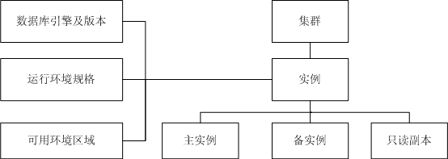

# 涉及的数据模型

在RDS的Web界面中，考虑到面向用户的易用性，将用户的数据库实例组织成集群的形式进行展现，通常一个MySQL集群中可以包含一个主实例、一个HA备实例、若干个只读副本，或者只包含一个主实例和若干个只读副本，不包含备实例，其中只读副本不超过5个。如[图1](#fig2452457419232)所示。

**图 1**  API数据模型  

在RDS的OpenAPI中，考虑到与OpenStack Trove的兼容，对外只以实例级别提供服务，与Web界面上的集群组织方式的对应关系为：

在创建实例时会默认创建出一个集群，并将创建出的实例显示在此集群下。

在列举实例时会将此用户所属的所有实例以列表方式给出，不会体现出集群到实例的层次关系。

删除只读副本与界面功能相同，都是指定实例进行删除；删除主备实例时会同时将实例所属的集群以及只读实例一同删除。

