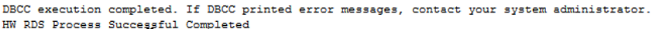

# SQL Server错误日志轮转

## 操作场景

使用存储过程关闭当前的错误日志文件，并循环错误日志扩展编号（就像重新启动服务器）。 新错误日志包含版本和版权信息，以及表明新日志已创建的一行。

## 前提条件

成功连接RDS for SQL Server实例。通过SQL Server客户端连接目标实例，具体操作请参见[通过公网连接SQL Server实例](https://support.huaweicloud.com/qs-rds/rds_03_0007.html)。

## 操作步骤

执行以下命令，循环SQL Server错误日志。

**EXEC \[msdb\].\[dbo\].\[rds\_cycle\_errorlog\]**

执行成功后，系统将会如下提示：

