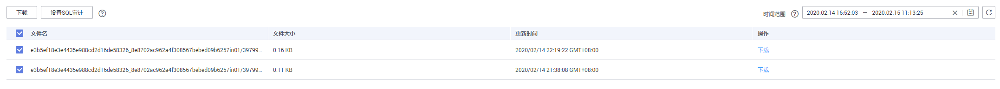

# 下载SQL审计日志

当您[开启SQL审计功能](开启SQL审计日志.md)，系统会将所有的SQL操作记录下来存入日志文件，方便用户进行下载、查询操作。RDS for MySQL默认关闭SQL审计功能，打开可能会有一定的性能影响。

> **说明：**   
>仅MySQL 5.6.43和MySQL 5.7.23及其以上版本支持SQL审计功能，如果您的数据库引擎版本较低，请提交工单申请升级到最新版本。  

## 操作步骤

1.  登录管理控制台。
2.  单击管理控制台左上角的，选择区域和项目。
3.  选择“数据库  \>  云数据库 RDS“。进入云数据库 RDS信息页面。
4.  在“实例管理”页面，选择目标实例，单击实例名称，进入实例的“基本信息“页签。
5.  在左侧导航栏单击“SQL审计“，在列表右上方选择时间范围，在列表中勾选目标日志，单击列表左上方的“下载“，批量下载SQL审计日志。

    您还可以选择单个审计日志，单击操作列中的“下载”，下载目标SQL审计日志。

    **图 1**  下载SQL审计日志  
    

