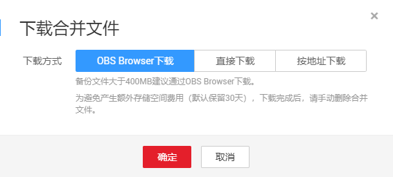
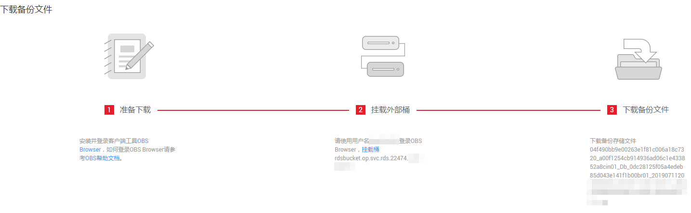

# 下载binlog备份文件

## 操作场景

用户可以下载手动和自动备份文件，用于本地存储备份或者恢复数据库。

RDS for MySQL支持用户下载binlog备份。您可以[下载单个Binlog备份文件](#zh-cn_topic_0192954021_section61116810348)，也可以[合并下载Binlog备份文件](#zh-cn_topic_0192954021_section147272814213)。

> **说明：**   
>云数据库MySQL 5.6/5.7版的实例支持合并下载Binlog备份文件。  

## 下载单个Binlog备份文件

1.  登录管理控制台。
2.  单击管理控制台左上角的，选择区域和项目。
3.  选择“数据库  \>  云数据库 RDS“。进入云数据库 RDS信息页面。
4.  在“实例管理“页面，单击目标实例名称，进入“基本信息”页面。
5.  在左侧导航栏，单击“备份恢复“，在“Binlog备份“子页签下，单击操作列中的“下载“。

    您也可以勾选需要下载的Binlog备份，单击左上角“下载”。

6.  下载任务执行完成后，您可在本地查看到Binlog备份文件。

## 合并下载Binlog备份文件

> **须知：**   
>不支持下载大于500MB以上的binlog合并文件。  

1.  登录管理控制台。
2.  单击管理控制台左上角的，选择区域和项目。
3.  选择“数据库  \>  云数据库 RDS“。进入云数据库 RDS信息页面。
4.  在“实例管理“页面，单击目标实例名称，进入“基本信息”页面.
5.  在左侧导航栏，单击“备份恢复“，在“Binlog合并下载“子页签下，选择要合并的Binlog的时间段，单击“合并“，合并任务下发成功。

    > **说明：**   
    >-   单次合并下载的时间段最长为24小时。  
    >-   可选的时间范围和自动备份策略的“保留天数“一致，有关自动备份策略保留天数，请参见[设置自动备份策略](设置自动备份策略.md)。  

6.  在“Binlog合并下载“页面，可查看该合并文件状态为“合并中“，当状态显示为“合并成功”，单击操作列中的“下载“。
7.  在弹出框中选择下载方式。

    **图 1**  选择下载方式  
    

    > **说明：**   
    >-   为避免产生额外存储空间费用，下载完成后，请手动删除合并文件。您可以在“合并下载“页面，单击操作列中的“删除“，删除合并文件。  
    >-   如果没有手动删除合并文件，系统会保留30天后自动删除合并文件。  

    -   **在弹出框中，单击“OBS Browser下载“，单击“确定“，通过OBS Browser客户端下载RDS合并文件**。

        **图 2**  下载指导页面  
        

        1.  单击[图2](#zh-cn_topic_0192954021_fig12571925104414)步骤1的“OBS Browser“，下载客户端工具OBS Browser。
        2.  解压并安装OBS Browser。
        3.  登录客户端工具OBS Browser。

            登录对象存储服务客户端相关操作，请参见《对象存储服务客户端指南》的“[登录客户端](https://support.huaweicloud.com/clientogw-obs/zh-cn_topic_0045829058.html)”章节。

        4.  挂载外部桶。

            在OBS Browser“挂载外部桶“页面，输入[图2](#zh-cn_topic_0192954021_fig12571925104414)步骤2的桶名称，挂载该桶。

            挂载外部桶相关操作，请参见《对象存储服务客户端指南》的“[配置挂载外部桶](https://support.huaweicloud.com/clientogw-obs/zh-cn_topic_0045829133.html)”章节。

        5.  下载合并文件。

            在OBS Browser界面，单击添加成功的外部桶桶名，进入对象列表页面，在右侧搜索栏，输入[图2](#zh-cn_topic_0192954021_fig12571925104414)步骤3的文件名称并检索，选中待下载的合并文件后，单击“下载”。

    -   **在弹出框中，单击“直接下载“，单击“确定“，通过浏览器直接下载数据库实例的合并文件**。
    -   **在弹出框中，单击“按地址下载”，单击****复制地址，通过下载地址下载合并文件**。

        对于MySQL，显示当前合并文件在链接有效期内的下载地址。

        -   您可以使用其他下载工具下载合并文件。
        -   您还可以使用**wget**命令下载合并文件：

            **wget -O** _FILE\_NAME_ **--no-check-certificate** **"**_DOWNLOAD\_URL_**"**

            命令中的参数解释如下：

            _FILE\_NAME_：下载成功后的合并文件名称，由于原始文件名称较长，可能会超出客户端文件系统的限制，建议下载合并文件时使用“**-O**”进行重命名。

            _DOWNLOAD\_URL_：需下载的合并文件所在路径。

