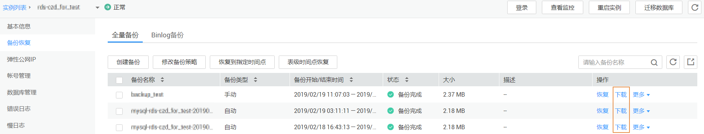
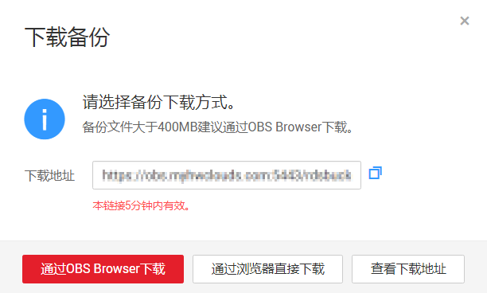

# 下载备份文件

## 操作场景

用户可以下载手动和自动备份文件，用于本地存储备份或者恢复数据库。

云数据库MySQL同时支持用户下载全量备份和binlog备份。

云数据库PostgreSQL同时支持用户下载全量备份和增量备份。

云数据库SQL Server仅支持用户下载全量备份。

## 操作步骤

1.  [登录云数据库](https://support.huaweicloud.com/qs-rds/rds_login.html)。
2.  在“实例管理“页面，选择目标实例，单击实例名称，进入实例的“基本信息“页签。
3.  对于MySQL引擎，在左侧导航栏中选择“备份恢复“，在“全量备份“或“binlog备份“子页签下，单击操作列中的“下载“。

    对于PostgreSQL引擎，在左侧导航栏中选择“备份恢复“，在“全量备份“或“增量备份“子页签下，单击操作列中的“下载“。

    对于SQL Server引擎，在左侧导航栏，单击“备份恢复“，单击操作列中的“下载“。

    **图 1**  下载备份文件  
    

4.  在弹出框中选择下载方式。

    **图 2**  选择下载方式并获取备份文件URL  
    

    -   通过OBS Browser下载

        > **说明：**   
        >若备份文件大于400MB，建议您使用OBS Broswer下载。  

        安装并登录OBS Browser客户端，请参考[《对象存储服务OBS工具指南》](https://support.huaweicloud.com/clientogw-obs/zh-cn_topic_0045829058.html)。

        登录OBS Browser客户端，在界面右侧搜索栏，输入华为云关系型数据库“下载备份文件“页面中提示的下载备份存储文件名称，检索并下载备份存储文件，SQL Server数据库支持用户下载单个数据库的备份文件。

    -   通过浏览器直接下载

        直接从浏览器下载备份文件。

    -   查看下载地址

        -   对于MySQL/PostgreSQL，显示当前备份文件的下载地址。
        -   对于SQL Server，显示当前备份的所有备份文件的下载地址，即支持用户下载单个数据库的备份文件。

        您可以复制下载地址，在链接有效期内，使用其他下载工具进行下载。

        您还可以使用**wget**命令下载备份文件：

        **wget -O** _文件名_ **--no-check-certificate** **"**_下载地址_**"**

        > **说明：**   
        >由于原始文件名称较长，可能会超出客户端文件系统的限制，建议下载备份文件时使用“**-O**”进行重命名。  

    通过备份文件在本地恢复数据请参考[通过备份文件恢复数据](https://support.huaweicloud.com/usermanual-rds/rds_08_0044.html)。

