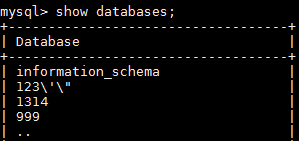

# 下载备份文件

## 操作场景

用户可以下载手动和自动备份文件，用于本地存储备份或者恢复数据库。

云数据库MySQL同时支持用户下载全量备份和binlog备份。

云数据库PostgreSQL同时支持用户下载全量备份和增量备份。

云数据库SQL Server仅支持用户下载全量备份。

## 操作步骤

1.  [登录云数据库](https://support.huaweicloud.com/qs-rds/rds_login.html)。
2.  [登录云数据库](https://support-intl.huaweicloud.com/zh-cn/qs-rds/rds_login.html)。
3.  [登录关系型数据库](null.md)。
4.  在“实例管理“页面，选择目标实例，单击实例名称，进入实例的“基本信息“页签。
5.  在“备份管理“页面，选择需要下载的可用备份，如果选择自动备份，单击“下载”，选择手动备份，单击“更多  \>  下载“，进入下载指导页面。
6.  对于MySQL引擎，在左侧导航栏中选择“备份恢复“，在“全量备份“或“binlog备份“子页签下，单击操作列中的“下载“。

    对于PostgreSQL引擎，在左侧导航栏中选择“备份恢复“，在“全量备份“或“增量备份“子页签下，单击操作列中的“下载“。

    对于SQL Server引擎，在左侧导航栏，单击“备份恢复“，单击操作列中的“下载“。

    **图 1**  下载备份文件  
    

7.  在弹出框中选择下载方式。

    **图 2**  选择下载方式并获取备份文件URL  
    

    -   通过OBS Browser下载

        > **说明：**   
        >若备份文件大于400MB，建议您使用OBS Broswer下载。  

        安装并登录[OBS Browser](http://developer.huaweicloud.com/tools/obs.html)客户端，请参考[《对象存储服务OBS工具指南》](https://support.huaweicloud.com/clientogw-obs/zh-cn_topic_0045829058.html)。

        安装并登录OBS Browser客户端，请参考[《对象存储服务OBS工具指南》](https://support-intl.huaweicloud.com/zh-cn/clientogw-obs/zh-cn_topic_0045829058.html)。

        登录OBS Browser客户端，在界面右侧搜索栏，输入华为云关系型数据库“下载备份文件“页面中提示的下载备份存储文件名称，检索并下载备份存储文件，SQL Server数据库支持用户下载单个数据库的备份文件。

        1.  安装并登录客户端工具OBS Browser，准备下载。

            登录对象存储服务客户端相关操作，请参见《对象存储服务客户端指南》的“[登录客户端](https://support.huaweicloud.com/clientogw-obs/zh-cn_topic_0045829058.html)”章节。

            登录对象存储服务客户端相关操作，请参见《对象存储服务客户端指南》的“[登录客户端](https://support-intl.huaweicloud.com/zh-cn/clientogw-obs/zh-cn_topic_0045829058.html)”章节。

        2.  挂载外部桶。

            挂载外部桶相关操作，请参见《对象存储服务客户端指南》的“[配置挂载外部桶](https://support.huaweicloud.com/clientogw-obs/zh-cn_topic_0045829133.html)”章节。

            挂载外部桶相关操作，请参见《对象存储服务客户端指南》的“[配置挂载外部桶](https://support-intl.huaweicloud.com/zh-cn/clientogw-obs/zh-cn_topic_0045829133.html)”章节。

        3.  下载备份文件。

            在OBS Browser界面的右侧搜索栏，输入华为云关系型数据库“下载备份文件“页面中提示的下载备份存储文件名称，检索并下载备份存储文件，SQL Server数据库支持用户下载单个数据库的备份文件。

    -   通过浏览器直接下载

        直接从浏览器下载备份文件。

    -   查看下载地址

        用户可以复制下载地址，在链接有效期内，使用其他下载工具进行下载。对于MySQL/PostgreSQL，显示当前备份文件的下载地址。对于SQL Server，显示当前备份的所有备份文件的下载地址，即支持用户下载单个数据库的备份文件。

    通过备份文件在本地恢复数据请参考[通过备份文件恢复数据](https://support.huaweicloud.com/usermanual-rds/rds_08_0044.html)。

    通过备份文件在本地恢复数据请参考[通过备份文件恢复数据](https://support-intl.huaweicloud.com/zh-cn/usermanual-rds/rds_08_0044.html)。

8.  下载并安装客户端工具[OBS Browser](https://obs.otc.t-systems.com/obsbrowser/OBSBrowser.zip)。
9.  下载并安装客户端工具[OBS Browser](http://oss.prod-cloud-ocb.orange-business.com/obsbrowser/OBSBrowser.zip)。
10. 下载并安装客户端工具OBS Browser。
11. 下载并安装客户端工具[OBS Browser](https://support.telefonicaopencloud.com/en-us/usermanual/obs/en-us_topic_0045853783.html)。
12. 登录对象存储对象存储服务客户端。

    登录对象存储服务客户端相关操作，请参见《对象存储服务客户端指南》的“[登录客户端](https://docs.otc.t-systems.com/en-us/usermanual/obs/en-us_topic_0045853477.html)”章节。

    登录对象存储服务客户端相关操作，请参见《对象存储服务客户端指南》的“[登录客户端](https://support.telefonicaopencloud.com/en-us/usermanual/obs/en-us_topic_0045853477.html)”章节。

    登录对象存储服务客户端相关操作，请参见《对象存储服务客户端指南》的“[登录客户端](https://docs.prod-cloud-ocb.orange-business.com/zh-cn/usermanual/obs/zh-cn_topic_0045829058.html)”章节。

    登录对象存储客户端相关操作，请参见《对象存储客户端指南》的“登录客户端”章节。

13. 挂载外部桶。

    在OBS Browser“挂载外部桶“页面，输入“下载备份文件“页面提供的桶名称，挂载该桶。

    挂载外部桶相关操作，请参见《对象存储服务客户端指南》的“[配置挂载外部桶](https://docs.otc.t-systems.com/en-us/usermanual/obs/en-us_topic_0045853737.html)”章节。

    挂载外部桶相关操作，请参见《对象存储服务客户端指南》的“[配置挂载外部桶](https://support.telefonicaopencloud.com/en-us/usermanual/obs/en-us_topic_0045853737.html)”章节。

    挂载外部桶相关操作，请参见《对象存储服务客户端指南》的“[配置挂载外部桶](https://docs.prod-cloud-ocb.orange-business.com/zh-cn/usermanual/obs/zh-cn_topic_0045829133.html)”章节。

    挂载外部桶相关操作，请参见《对象存储客户端指南》的“配置挂载外部桶”章节。

14. 下载备份文件。

    在OBS Browser界面的右侧搜索栏，输入华为云关系型数据库“下载备份文件“页面中提示的下载备份存储文件名称，检索并下载备份存储文件，SQL Server数据库支持用户下载单个数据库的备份文件。

## 通过备份文件在本地恢复数据

> **说明：**   
>以MySQL为例，在ECS上通过备份文件恢复数据。  
>在恢复数据之前，您需要完成以下准备工作：  
>-   确保ECS的操作系统为CentOS 7.4 64bit。  
>-   已安装MySQL5.6。  

1.  下载qpress程序，并上传到ECS进行安装。

    在[网站](http://www.quicklz.com)下载文件“qpress-11-linux.x64.tar”, 并上传到ECS上。

    **tar -xvf** _qpress-11-linux-x64.tar_

    **mv** _qpress /usr/bin/_

2.  下载XtraBackup软件，并上传到ECS进行安装。

    > **注意：**   
    >请确保XtraBackup为2.4.9及其以上版本，否则后续步骤会报错。  

    在[网站](https://www.percona.com/downloads/XtraBackup/LATEST/)下载文件“percona-xtrabackup-24-2.4.9-1.el7.x86\_64.rpm”，并上传到ECS上。

    **rpm -ivh** _percona-xtrabackup-24-2.4.9-1.el7.x86\_64.rpm_

3.  在ECS上解压下载好的全备文件。
    1.  创建一个临时目录backupdir。

        **mkdir** _backupdir_

    2.  解压文件。

        **xbstream  -x** **<** _./全备文件.qp_ **-C** _./backupdir/_

        **innobackupex  --decompress** _./backupdir_

        **find** _./backupdir/ _ **-name** _'\*.qp'_ **|** _xargs_ **rm -f**

4.  应用日志。

    **innobackupex --apply-log **_./backupdir_

5.  停止MySQL数据库服务，备份原来的数据目录。创建新的数据目录并修改目录权限。

    **service **_mysql_** stop**

    > **说明：**   
    >如果是MySQL5.7, 则需执行如下命令：  
    >**/bin/systemctl stop  mysqld.service**  

    **mv** _/var/lib/mysql/data /var/lib/mysql/data\_bak_

    **mkdir **_/var/lib/mysql/data_

    **chown** _mysql:mysql /var/lib/mysql/data_

    _/var/lib/mysql/data_：用户的MySQL数据库目录。

6.  拷贝全备文件，并修改目录权限。

    **innobackupex --defaults-file=/etc/my.cnf --copy-back** _./backupdir_

    **chown -R** _mysql:mysql /var/lib/mysql/data_

7.  启动数据库。

    **service**_ mysql_ **start**

    > **说明：**   
    >如果是MySQL5.7, 则需执行如下命令：  
    >**/bin/systemctl start  mysqld.service**  

8.  登录数据库，查看数据恢复结果。

    **mysql –u –root**

    **show databases**

    **图 3**  查看数据恢复结果  
    

