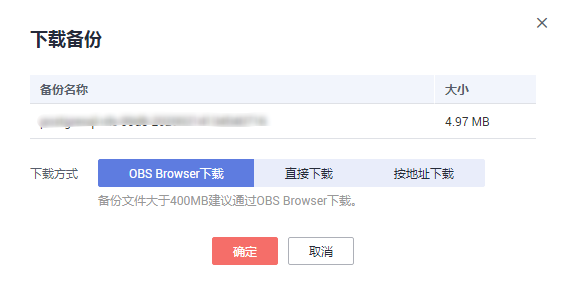
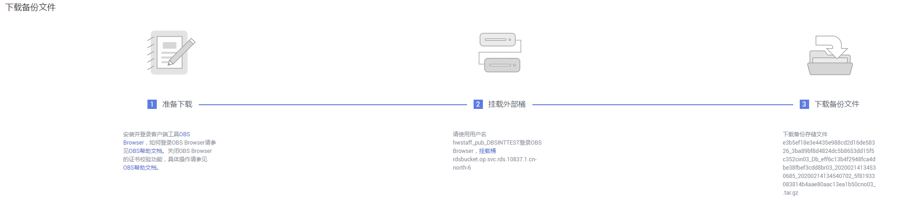

# 下载备份文件

## 操作场景

用户可以下载手动和自动备份文件，用于本地存储备份或者恢复数据库。

云数据库PostgreSQL同时支持用户下载全量备份和增量备份。

## 下载全量备份

1.  登录管理控制台。
2.  单击管理控制台左上角的，选择区域和项目。
3.  选择“数据库  \>  云数据库 RDS“。进入云数据库 RDS信息页面。
4.  在“备份管理“页面，选择需要下载的可用备份，单击操作列中的“下载”。

    您也可进入目标实例的“基本信息“页面，在左侧导航栏选择“备份恢复“，在“全量备份“子页签下，单击操作列中的“下载“。

5.  在弹出框中选择下载方式。

    **图 1**  选择下载方式  
    

    > **说明：**   
    >若备份文件大于400MB，建议您使用OBS Broswer下载。  

    -   **在弹出框中，单击“OBS Browser下载“，单击“确定“，通过OBS Browser客户端下载RDS备份文件**。

        **图 2**  下载指导页面  
        

        1.  单击[图2](#fig172831541171914)步骤1的“OBS Browser“，下载客户端工具OBS Browser。
        2.  解压并安装OBS Browser。
        3.  登录客户端工具OBS Browser。

            登录对象存储服务客户端相关操作，请参见《对象存储服务客户端指南》的“[登录客户端](https://support.huaweicloud.com/clientogw-obs/zh-cn_topic_0045829058.html)”章节。

        4.  配置OBS Browser不启用证书校验。

            配置OBS Browser相关操作，请参见《对象存储服务工具指南》中“[系统配置](https://support.huaweicloud.com/clientogw-obs/zh-cn_topic_0045829119.html)”的内容。

            > **说明：**   
            >由于关系型数据库“下载备份文件“页面提供的桶名称不支持证书校验，需要在挂载外部桶之前关闭OBS Browser证书校验，待备份文件下载完成后再启用。  

        5.  挂载外部桶。

            在OBS Browser“挂载外部桶“页面，输入[图2](#fig172831541171914)步骤2的桶名称，挂载该桶。

            挂载外部桶相关操作，请参见《对象存储服务客户端指南》的“[配置挂载外部桶](https://support.huaweicloud.com/clientogw-obs/zh-cn_topic_0045829133.html)”章节。

        6.  下载备份文件。

            在OBS Browser界面，单击添加成功的外部桶的桶名，进入对象列表页面，在右侧搜索栏，输入[图2](#fig172831541171914)步骤3的文件名称并检索，选中待下载的文件后，单击“下载”。

        7.  备份文件下载完成后，配置OBS Browser启用证书校验。

    -   **在弹出框中，单击“直接下载“，单击“确定“，通过浏览器直接下载数据库实例的备份文件**。
    -   **在弹出框中，单击“按地址下载”，单击****复制地址，通过下载地址下载备份文件**。

        对于PostgreSQL，显示当前备份文件在链接有效期内的下载地址。

        -   您可以使用其他下载工具下载备份文件，比如浏览器或迅雷等。
        -   您还可以使用**wget**命令下载备份文件：

            **wget -O** _FILE\_NAME_ **--no-check-certificate** **"**_DOWNLOAD\_URL_**"**

            命令中的参数解释如下：

            _FILE\_NAME_：下载成功后的备份文件名称，由于原始文件名称较长，可能会超出客户端文件系统的限制，建议下载备份文件时使用“**-O**”进行重命名。

            _DOWNLOAD\_URL_：需下载的备份文件所在路径。

6.  您可根据业务需要，参考[通过备份文件恢复数据\(PostgreSQL\)](通过备份文件恢复数据(PostgreSQL).md)，在本地进行数据恢复。

## 下载增量备份

1.  登录管理控制台。
2.  单击管理控制台左上角的，选择区域和项目。
3.  选择“数据库  \>  云数据库 RDS“。进入云数据库 RDS信息页面。
4.  在“实例管理“页面，单击目标实例名称，进入“基本信息”页面，在左侧导航栏，单击“备份恢复“，在“增量备份“子页签下，单击操作列中的“下载“。

    您也可以勾选需要下载的增量备份，单击左上角“下载”。

5.  下载任务执行完成后，您可在本地查看到增量备份文件。

