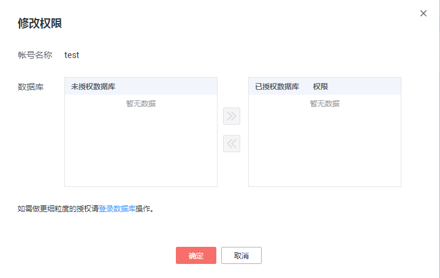

# 修改权限

## 操作场景

您可将自己创建的数据库帐号，授权给指定的数据库，对于已授权的数据库，您也可取消授权。

## 限制条件

恢复中的实例，不可进行该操作。

## 操作步骤

1.  登录管理控制台。
2.  单击管理控制台左上角的，选择区域和项目。
3.  选择“数据库  \>  云数据库 RDS“。进入云数据库 RDS信息页面。
4.  在“实例管理“页面，选择目标实例，单击实例名称，进入实例的“基本信息“页。
5.  在左侧导航栏，单击“帐号管理“，选择目标帐号，单击操作列的“修改权限“。
6.  在弹出框中，选择一个或多个指定的未授权数据库，单击进行授权。您还可以选择一个或多个指定的已授权数据库，单击取消授权。

    **图 1**  修改帐号权限  
    

    -   如果没有未授权数据库，您可参见[创建数据库](创建数据库.md)进行创建。
    -   如需使用更细粒度的授权，请至数据管理服务DAS进行操作。

7.  单击“确定“，提交修改。

