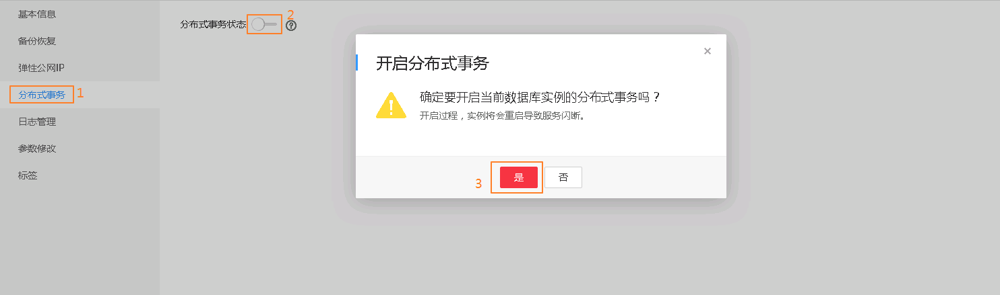
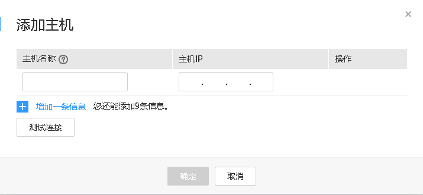
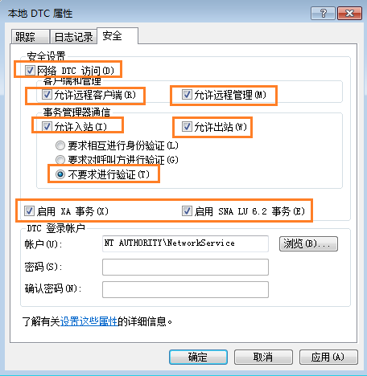

# 分布式事务

## 操作背景

分布式事务指事务的参与者、支持事务的服务器、资源服务器以及事务管理器分别位于不同的分布式系统的不同节点之上。简单的说，就是一次大的操作由不同的小操作组成，这些小的操作分布在不同的服务器上，且属于不同的应用，分布式事务需要保证这些小操作要么全部成功，要么全部失败。本质上来说，分布式事务就是为了保证不同数据库的数据一致性。

MSDTC服务提供分布式事务服务，如果要在数据库中使用分布式事务，必须在参与的双方服务器启动MSDTC（Distributed Transaction Coordinator）服务。RDS for Sqlserver在开启分布式事务的时候已经启动MSDTC，其他服务器请参考[设置远程服务器MSDTC（分布式事务处理协调器）](#section1923413545597)进行启动。

更多介绍请参见[Microsoft SQL Server官网MS DTC 分布式事务介绍](https://docs.microsoft.com/zh-cn/previous-versions/sql/sql-server-2008/ms190799(v=sql.100))。

## 使用限制

-   只读实例不支持分布式事务。
-   分布式事务功能一旦开启，将不允许关闭。
-   开启分布式事务会导致实例重启，请谨慎操作。
-   SQL Server数据库建立DBlink后，如果发生主备切换，DBlink不会自动同步到新的主实例，您需要在新的主实例重新建立DBlink。

## 开启分布式事务

1.  登录管理控制台。
2.  单击管理控制台左上角的，选择区域和项目。
3.  选择“数据库  \>  云数据库 RDS“。进入云数据库 RDS信息页面。
4.  在“实例管理”页面，选择目标实例，单击实例名称，进入实例的“基本信息“页签。
5.  在左侧导航栏单击“分布式事务“，在“分布式事务“页面单击“分布式事务状态“后的。
6.  在“开启分布式事务“弹出框中，单击“是“，开启分布式事务功能。开启过程，实例将会重启。

    **图 1**  开启分布式事务  
    

## 添加主机

1.  登录管理控制台。
2.  单击管理控制台左上角的，选择区域和项目。
3.  选择“数据库  \>  云数据库 RDS“。进入云数据库 RDS信息页面。
4.  在“实例管理”页面，选择目标实例，单击实例名称，进入实例的“基本信息“页签。
5.  在左侧导航栏单击“分布式事务“，在“分布式事务“页面单击“添加主机“。
6.  在“添加主机”弹出框中，添加主机名称和主机IP，然后单击“测试连接”，当所有的主机地址测试连接成功后，单击“确认”即可添加成功。
    -   主机名称：输入要与RDS实例建立分布式事务的主机名。主机名在1到64个字符之间，由字母、数字或中划线组成，不能包含其他特殊字符，且主机名字不可重复。
    -   主机IP：  输入要与RDS实例建立分布式事务的主机IP。主机IP需要先配置安全组的出入规则。

        关于添加安全组规则的详细要求，可参考《虚拟私有云用户指南》的“[添加安全组规则](https://support.huaweicloud.com/usermanual-vpc/zh-cn_topic_0030969470.html)”章节。

        > **说明：**   
        >-   如果添加的主机为ECS并且与RDS在相同VPC内，请填写ECS的私有IP。私有IP可以在ECS实例的实例详情页面查看。  
        >-   如果添加的主机为ECS并且与RDS在不同VPC内，请填写ECS的公网IP，并且请参考[绑定和解绑弹性公网IP](绑定和解绑弹性公网IP（SQL-Server）.md)为RDS实例绑定EIP。  

        **图 2**  添加主机  
        

## 远程服务器上的名称解析（ECS设置）

1.  登录管理控制台。
2.  单击管理控制台左上角的，选择区域和项目。
3.  选择“数据库  \>  云数据库 RDS“。进入云数据库 RDS信息页面。
4.  在左侧导航栏单击“分布式事务“，在“分布式事务“页面获取到RDS实例信息。
5.  将RDS实例信息配置到ECS的hosts文件中，路径为**“C:\\Windows\\System32\\drivers\\etc\\hosts”**。

## 设置远程服务器MSDTC（分布式事务处理协调器）

1.  打开“控制面板”，选择“系统和安全 \> 管理工具”，在“管理工具”页面打开“组件服务”。
2.  选择“计算机 \> 我的电脑 \> Distributed Transaction Coordinator”。
3.  右键单击“本地DTC”，选择“属性”。
4.  在弹框中，选择“安全”页签，相关配置如[图3](#fig569033416215)所示，配置完成后，单击“确定”。

    **图 3**  本地DTC属性  
    

## 删除主机

1.  登录管理控制台。
2.  单击管理控制台左上角的，选择区域和项目。
3.  选择“数据库  \>  云数据库 RDS“。进入云数据库 RDS信息页面。
4.  在“实例管理”页面，选择目标实例，单击实例名称，进入实例的“基本信息“页签。
5.  在左侧导航栏单击“分布式事务“，在“分布式事务“页面的列表中，选择需要删除的主机，单击“操作“列的“删除”。

    您也可以在“分布式事务“页面，选择一个或多个需要删除的主机，单击列表上方的“批量删除主机“。

6.  在弹出确认框中单击“是”，删除主机。

