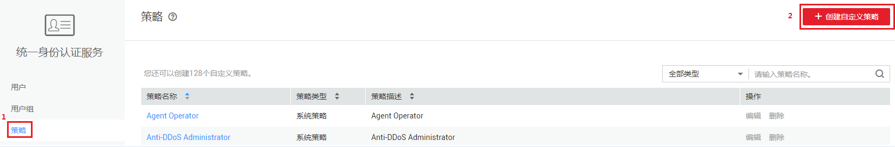
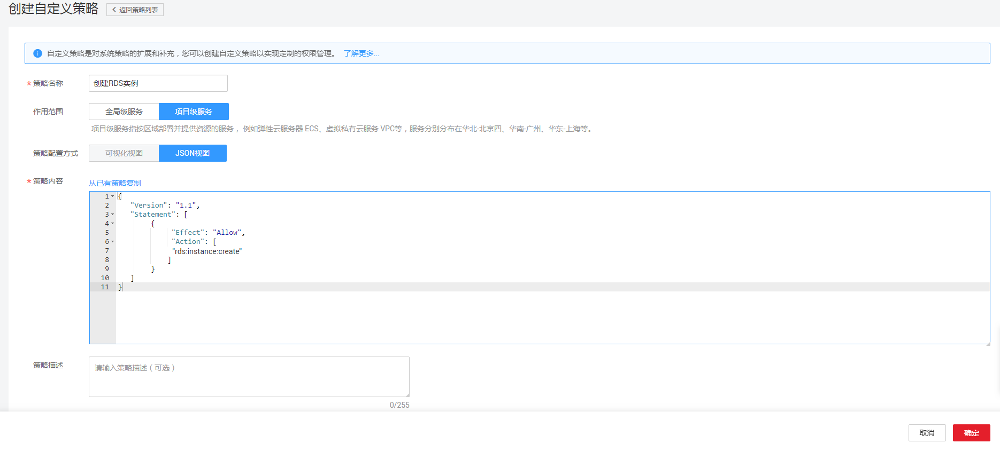

# 创建RDS自定义策略<a name="rds_pg_07_0003"></a>

如果系统预置的RDS权限，不满足您的授权要求，可以创建自定义策略。自定义策略中可以添加的授权项（Action）请参考[策略及授权项说明](https://support.huaweicloud.com/api-rds/rds_10_0002.html)。如下以定制一个用户仅能创建RDS实例的策略为例。

## 前提条件<a name="rds_07_0003_zh-cn_topic_0172661626_section24121565"></a>

-   请先在IAM控制台中开通细粒度策略，开通方法请参见：[申请细粒度访问控制公测](https://support.huaweicloud.com/usermanual-iam/iam_01_019.html)。
-   自定义策略需要编写策略（JSON格式），请您先熟悉策略结构，具体请参见[1.4 ](策略语法-细粒度策略.md)。
-   请确定自定义策略需要允许哪些操作，拒绝哪些操作，并获取操作对应的授权项。授权项请参见[策略及授权项说明](https://support.huaweicloud.com/api-rds/rds_10_0002.html)。

## 操作步骤<a name="rds_07_0003_zh-cn_topic_0172661626_section15767494"></a>

如下以创建名为“创建RDS实例”的策略为例，创建一个仅支持创建RDS实例的自定义策略。

1.  在IAM控制台，单击左侧导航栏的“策略”，在右上角选择“创建自定义策略”。

    

2.  在“创建自定义策略”中，填写如下参数：

    **图 1**  创建自定义策略<a name="rds_07_0003_fig20893185110012"></a>  
    

    -   “策略名称”：填写“创建RDS实例”。
    -   “作用范围”：RDS为项目级服务，选择“项目级服务”。
    -   “策略配置方式”：JSON视图。
    -   “策略内容”：将如下内容拷贝至策略信息中，并单击“检验语法”。如下策略表示允许创建RDS实例。

        ```
        {
        	"Version": "1.1",
        	"Statement": [{
        		"Effect": "Allow",
        		"Action": ["rds:instance:create"]
        	}]
        }
        ```

3.  单击“确定”，系统会自动校验语法，如跳转到策略列表，则自定义策略创建成功；如提示“策略内容错误”，请按照语法规范进行修改。

## 验证自定义策略权限<a name="rds_07_0003_section101229715271"></a>

1.  将新创建的自定义策略授予用户组，使得用户组中的用户仅具备创建RDS实例的权限。
2.  用户登录并验证自定义策略定义的权限：创建RDS实例。

    权限授予成功后，用户可以通过控制台以及REST API等多种方式验证。此处以登录控制台为例，介绍用户如何验证创建RDS实例的权限。

    1.  使用新创建的用户登录华为云，登录方法选择为“IAM用户登录”。
        -   账号名为该IAM用户所属华为云账号的名称。
        -   用户名和密码为账号在IAM创建用户时输入的用户名和密码。

    2.  在关系型数据库页面，进行创建RDS实例操作，操作成功，权限配置正确并已生效。
    3.  尝试进行其他操作，例如：删除RDS实例

        系统显示“权限不足”，权限配置正确并已生效。


## 策略样例<a name="rds_07_0003_zh-cn_topic_0172661626_section7689721"></a>

-   示例1：授权用户创建RDS实例

    ```
    {
    	"Version": "1.1",
    	"Statement": [{
    		"Effect": "Allow",
    		"Action": ["                      rds:instance:create                  "]
    	}]
    }
    ```

-   示例2：拒绝用户删除RDS实例

    拒绝策略需要同时配合其他策略使用，否则没有实际作用。用户被授予的策略中，一个授权项的作用如果同时存在Allow和Deny，则遵循Deny优先。

    如果您给用户授予RDS Admin的系统策略，但不希望用户拥有RDS Admin中定义的删除RDS实例，您可以创建一条拒绝删除云服务的自定义策略，然后同时将RDS Admin和拒绝策略授予用户，根据Deny优先原则，则用户可以对RDS实例执行除了_删除RDS实例_外的所有操作。拒绝策略示例如下：

    ```
    {
    	"Version": "1.1",
    	"Statement": [{
    		"Action": ["rds:instance:delete"],
    		"Effect": "Deny"
    	}]
    }
    ```


