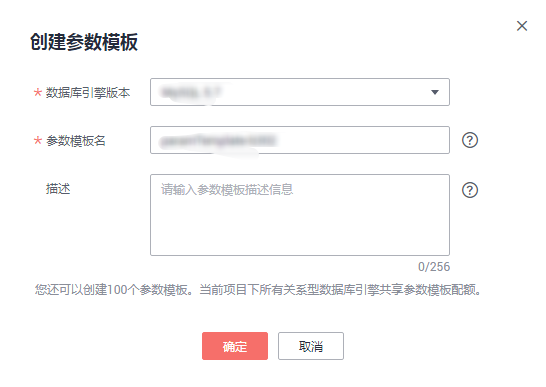

# 创建参数模板

您可以使用数据库参数模板中的参数来管理数据库引擎配置。数据库参数模板就像是引擎配置值的容器，这些值可应用于一个或多个数据库实例。

如果您在创建数据库实例时未指定客户创建的数据库参数模板，系统将会为您的数据库实例适配默认的数据库参数模板。该默认组包含数据库引擎默认值和系统默认值，具体根据引擎、计算等级及实例的分配存储空间而定。您无法修改默认数据库参数模板的参数设置，您必须创建自己的数据库参数模板才能更改参数设置的默认值。

> **须知：**   
>并非所有数据库引擎参数都可在客户创建的数据库参数模板中进行更改。  

如果您想使用您自己的数据库参数模板，只需创建一个新的数据库参数模板，创建实例的时候选择该参数模板，如果是在创建实例后有这个需求，可以重新应用该参数模板，请参见[应用参数模板](应用参数模板.md)。

若您已成功创建数据库参数模板，并且想在新的数据库参数模板中包含该组中的大部分自定义参数和值时，复制参数模板是一个方便的解决方案，请参见[复制参数模板](复制参数模板.md)。

以下是您在使用数据库参数模板中的参数时应了解的几个要点：

-   当您修改当前实例的参数模板并保存后，仅应用于当前实例，不会对其他实例造成影响。
-   当您更改动态参数并保存数据库参数模板时，将立即应用更改，而不管“应用”设置如何。当您更改静态参数并保存数据库参数模板时，参数更改将在您手动重启数据库实例后生效。
-   当您批量修改参数模板，更改动态参数并保存数据库参数模板时，需执行“应用”操作，才会对实例生效。当您更改静态参数并保存数据库参数模板时，参数更改将在您应用到实例后，手动重启数据库实例后生效。
-   在数据库参数模板内设置参数不恰当可能会产生意外的不利影响，包括性能降低和系统不稳定。修改数据库参数时应始终保持谨慎，且修改数据库参数模板前要备份数据。将参数模板更改应用于生产数据库实例前，您应当在测试数据库实例上试用这些参数模板设置更改。

> **说明：**   
>关系型数据库和文档数据库服务不共享参数模板配额。  
>每个用户最多可以创建100个关系型数据库参数模板，各关系型数据库引擎共享该配额。  

## 操作步骤

1.  登录管理控制台。
2.  单击管理控制台左上角的，选择区域和项目。
3.  选择“数据库  \>  云数据库 RDS“。进入云数据库 RDS信息页面。
4.  在“参数模板管理“页面，单击“创建参数模板”。
5.  选择数据库引擎版本，命名并添加对该参数模板的描述，单击“确定”，创建参数模板。
    -   选择该数据库引擎参数模板所需应用的参数模板类型。
    -   参数模板名称长度在1\~64个字符之间，区分大小写，可包含字母、数字、中划线、下划线或句点，不能包含其他特殊字符。
    -   参数模板的描述长度不能超过256个字符，且不能包含回车和\>!<"&'=特殊字符。

        **图 1**  创建参数模板  
        

