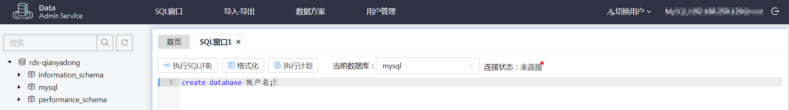

# 创建帐号<a name="TOPIC_0142028379"></a>

> **说明：**   
>帐号管理功能目前仅支持MySQL引擎。  

## 操作场景<a name="section7898787175059"></a>

创建华为云关系型数据库实例时，系统默认同步创建root用户，您可根据业务需要，添加其他用户。

您可通过以下两种方式创建帐号，请根据实际需求选择。

-   通过RDS创建帐号：简单易用，不需要记忆任何命令。
-   通过DAS创建帐号：需要熟悉创建命令，但功能更强大灵活。

## 通过RDS创建帐号<a name="section12881532101618"></a>

1.  登录管理控制台。
2.  单击管理控制台左上角的，选择区域和项目。

    您可选择自己的专属计算集群（Dedicated Computing Cluster，简称DCC）。

3.  选择“数据库  \>  关系型数据库“，进入关系型数据库信息页面。
4.  在“实例管理“页面，选择目标实例，单击实例名称，进入实例的“基本信息“页签。
5.  在“帐号管理“页签，单击“创建帐号“。在“创建帐号“弹出框中，输入数据库帐号、授权数据库，并输入密码和确认密码，单击“确定“。
    -   数据库帐号必须以小写字母开头，且必须以小写字母或数字结尾，可包含数字或下划线，不能包含其他特殊字符。
        -   若数据库版本为MySQL5.6，帐号为1～16位。
        -   若数据库版本为MySQL5.7，帐号为1～32位。

    -   选择指定的未授权数据库，单击进行授权，或选择指定的已授权数据库，单击取消授权。如果没有未授权数据库，您可进行创建，请参见[创建数据库](创建数据库.md)，后期也可修改权限，请参见[修改权限](修改权限.md)。
    -   密码最小长度为8位～32位，必须是大写字母、小写字母、数字和特殊字符的组合，其中可输入~ ! @ \# % ^ \* - \_ = + ?特殊字符。

6.  数据库帐号添加成功后，您可在当前实例的数据库帐号列表中，对其进行管理。

## 通过DAS创建帐号<a name="section147022441336"></a>

1.  登录管理控制台。
2.  单击管理控制台左上角的，选择区域和项目。

    您可选择自己的专属计算集群（Dedicated Computing Cluster，简称DCC）。

3.  选择“数据库  \>  关系型数据库“，进入关系型数据库信息页面。
4.  在“实例管理“页面，选择目标实例，单击操作列的“登录“，进入数据管理服务登录界面。

    **图 1**  通过DAS登录数据库<a name="fig56246975814"></a>  
    

5.  正确输入数据库用户名和密码，单击“登录“，即可进入您的数据库。
6.  在“SQL窗口“输入命令创建帐号。

    ```
    create database 帐号名;
    ```

    **图 2**  创建帐号<a name="fig51821934141910"></a>  
    


