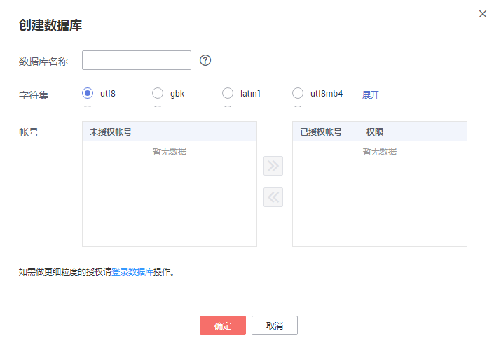

# 创建数据库<a name="rds_05_0019"></a>

> **说明：**   
>数据库管理功能目前仅支持MySQL引擎。  

## 操作场景<a name="section7898787175059"></a>

华为云关系型数据库实例创建成功后，您可根据业务需要，创建更多数据库。

## 限制条件<a name="section461718913309"></a>

恢复中的实例，不可进行该操作。

## 通过RDS创建数据库<a name="section13116113272414"></a>

1.  登录管理控制台。
2.  单击管理控制台左上角的，选择区域和项目。
3.  选择“数据库  \>  云数据库 RDS“。进入云数据库 RDS信息页面。
4.  在“实例管理“页面，选择目标实例，单击实例名称，进入实例的“基本信息“页。
5.  在左侧导航栏，单击“数据库管理“，单击“创建数据库“，在弹出框中输入数据库名称、选择字符集并授权数据库帐号，单击“确定“。

    **图 1**  创建数据库<a name="fig1446134014207"></a>  
    

    -   数据库名称长度可在1～64个字符之间，由字母、数字、中划线、下划线或$组成，中划线和$累计总长度小于等于10个字符，且不能包含其他特殊字符（MySQL 8.0不可包含$）。
    -   字符集默认utf8，您可根据业务进行选择，单击“展开“可查看更多。
    -   选择指定的一个或多个未授权帐号，单击进行授权（必选），或选择一个或多个指定的已授权帐号，单击取消授权。

        如果没有未授权帐号，您可进行创建，具体操作请参见[创建数据库用户](创建数据库用户.md)。

    -   如需使用更细粒度的授权，请至数据管理服务DAS进行操作。

6.  数据库创建成功后，您可在当前实例的数据库列表中，对其进行管理。

    > **须知：**   
    >“AUTO\_PK\_ROW\_ID“列名是RDS for MySQL数据库保留列名，用户无法创建。  


## 通过DAS创建数据库<a name="section1064035173317"></a>

1.  登录管理控制台。
2.  单击管理控制台左上角的，选择区域和项目。
3.  选择“数据库  \>  云数据库 RDS“。进入云数据库 RDS信息页面。
4.  在“实例管理“页面，选择目标实例，单击操作列的“登录“，进入数据管理服务登录界面。

    **图 2**  登录数据库<a name="fig56246975814"></a>  
    

5.  正确输入数据库用户名和密码，单击“登录“，即可进入您的数据库。
6.  在“SQL窗口“输入命令创建数据库。

    ```
    create database 数据库名;
    ```


