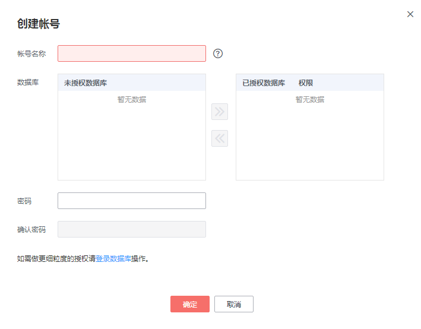

# 创建数据库用户<a name="rds_05_0009"></a>

## 操作场景<a name="section7898787175059"></a>

创建华为云关系型数据库MySQL实例时，系统默认同步创建root用户，您可根据业务需要，添加其他用户。

您可通过以下两种方式创建帐号，请根据实际需求选择。

-   [通过RDS创建帐号](#section12881532101618)：简单易用，不需要记忆任何命令。
-   [通过DAS创建帐号](#section147022441336)：需要熟悉创建命令，但功能更强大灵活。

## 限制条件<a name="section461718913309"></a>

恢复中的实例，不可进行该操作。

## 通过RDS创建帐号<a name="section12881532101618"></a>

1.  登录管理控制台。
2.  单击管理控制台左上角的，选择区域和项目。
3.  选择“数据库  \>  云数据库 RDS“。进入云数据库 RDS信息页面。
4.  在“实例管理“页面，选择目标实例，单击实例名称，进入实例的“基本信息“页。
5.  在左侧导航栏，单击“帐号管理“，单击“创建帐号“。在“创建帐号“弹出框中，输入数据库帐号、授权数据库，并输入密码和确认密码，单击“确定“。

    **图 1**  创建账号<a name="fig1013816221950"></a>  
    

    -   数据库帐号名称在1到32个字符之间，由字母、数字、中划线或下划线组成，不能包含其他特殊字符。
        -   若数据库版本为MySQL5.6，帐号长度为1～16个字符。
        -   若数据库版本为MySQL5.7和8.0，帐号长度为1～32个字符。

    -   选择一个或多个指定的未授权数据库，单击进行授权，或选择一个或多个指定的已授权数据库，单击取消授权。

        如果没有未授权数据库，您可进行创建，请参见[创建数据库](创建数据库.md)，后期也可修改权限，请参见[修改权限](修改权限.md)。

    -   密码长度为8\~32个字符，至少包含大写字母、小写字母、数字、特殊字符三种字符的组合，其中允许输入\~!@\#%^\*-\_=+?,特殊字符。
    -   如需使用更细粒度的授权，请至数据管理服务DAS进行操作。

6.  数据库帐号添加成功后，您可在当前实例的数据库帐号列表中，对其进行管理。

## 通过DAS创建帐号<a name="section147022441336"></a>

1.  登录管理控制台。
2.  单击管理控制台左上角的，选择区域和项目。
3.  选择“数据库  \>  云数据库 RDS“。进入云数据库 RDS信息页面。
4.  在“实例管理“页面，选择目标实例，单击操作列的“登录“，进入数据管理服务登录界面。

    **图 2**  通过DAS登录数据库<a name="fig56246975814"></a>  
    

5.  正确输入数据库用户名和密码，单击“登录“，即可进入您的数据库。
6.  创建帐号。
    -   在顶部菜单栏选择“其他操作“\>“用户管理“，进入用户管理页面。单击“创建用户”，进入用户信息编辑页面，填写相应的用户信息，如基本信息、高级选项、全局权限、对象权限，在“对象权限”页签中，可进行新增和删除权限信息，单击“保存“，并在SQL预览弹出框中单击“确定“。
    -   您也可以在“SQL窗口“输入命令创建帐号。

        ```
        create database 帐号名;
        ```


