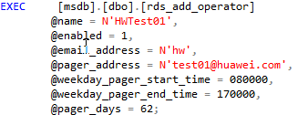
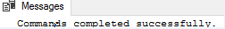

# 创建用于警报和作业的操作员<a name="rds_09_0015"></a>

## 操作场景<a name="section8396171433610"></a>

使用存储过程创建用于警报和作业的操作员（通知收件人）。

## 前提条件<a name="section193577239368"></a>

成功连接RDS for SQL Server实例。通过SQL Server客户端连接目标实例，具体操作请参见[通过公网连接SQL Server实例](https://support.huaweicloud.com/qs-rds/rds_03_0007.html)。

## 操作步骤<a name="section02001241183614"></a>

执行以下命令，创建用于警报和作业的操作员

**EXEC \[msdb\].\[dbo\].\[rds\_add\_operator\]**

**@name ='name'**

**@enabled=enabled**

**@email\_address='email\_address'**

**@pager\_address='pager\_address'**

**@weekday\_pager\_start\_time= weekday\_pager\_start\_time**

**@weekday\_pager\_end\_time= weekday\_pager\_end\_time**

**@saturday\_pager\_start\_time= saturday\_pager\_start\_time**

**@saturday\_pager\_end\_time= saturday\_pager\_end\_time**

**@sunday\_pager\_start\_time= sunday\_pager\_start\_time**

**@sunday\_pager\_end\_time= sunday\_pager\_end\_time**

**@pager\_days= pager\_days**

**@netsend\_address ='netsend\_address'**

**@category\_name='category'**

**表 1**  参数说明

<a name="table105314311374"></a>
<table><thead align="left"><tr id="row85414323713"><th class="cellrowborder" valign="top" width="22.8%" id="mcps1.2.3.1.1"><p id="p1654443193713"><a name="p1654443193713"></a><a name="p1654443193713"></a>参数</p>
</th>
<th class="cellrowborder" valign="top" width="77.2%" id="mcps1.2.3.1.2"><p id="p1654343103715"><a name="p1654343103715"></a><a name="p1654343103715"></a>说明</p>
</th>
</tr>
</thead>
<tbody><tr id="row75411433371"><td class="cellrowborder" valign="top" width="22.8%" headers="mcps1.2.3.1.1 "><p id="p14551435378"><a name="p14551435378"></a><a name="p14551435378"></a>'name'</p>
</td>
<td class="cellrowborder" valign="top" width="77.2%" headers="mcps1.2.3.1.2 "><p id="p155164393714"><a name="p155164393714"></a><a name="p155164393714"></a>操作员（通知收件人）的名称。此名称必须唯一，并且不能包含百分号（ % ）字符。名称为sysname，无默认值。</p>
</td>
</tr>
<tr id="row955543153711"><td class="cellrowborder" valign="top" width="22.8%" headers="mcps1.2.3.1.1 "><p id="p25524313712"><a name="p25524313712"></a><a name="p25524313712"></a>enabled</p>
</td>
<td class="cellrowborder" valign="top" width="77.2%" headers="mcps1.2.3.1.2 "><p id="p1955154323718"><a name="p1955154323718"></a><a name="p1955154323718"></a>指示操作员的当前状态。<span class="parmname" id="parmname1833371045016"><a name="parmname1833371045016"></a><a name="parmname1833371045016"></a>“enabled”</span>为<span class="parmvalue" id="parmvalue4733013145014"><a name="parmvalue4733013145014"></a><a name="parmvalue4733013145014"></a>“tinyint”</span>，默认值为1 （已启用）。 如果为0，则不启用操作员且不会收到通知。</p>
</td>
</tr>
<tr id="row65574333716"><td class="cellrowborder" valign="top" width="22.8%" headers="mcps1.2.3.1.1 "><p id="p165544312373"><a name="p165544312373"></a><a name="p165544312373"></a>'email_address'</p>
</td>
<td class="cellrowborder" valign="top" width="77.2%" headers="mcps1.2.3.1.2 "><p id="p1955144315372"><a name="p1955144315372"></a><a name="p1955144315372"></a>操作员的电子邮件地址。此字符串将直接传递到电子邮件系统。<span class="parmname" id="parmname1623418217505"><a name="parmname1623418217505"></a><a name="parmname1623418217505"></a>“email_address”</span>为<span class="parmvalue" id="parmvalue185841329135016"><a name="parmvalue185841329135016"></a><a name="parmvalue185841329135016"></a>“nvarchar（100）”</span>，默认值为NULL。</p>
</td>
</tr>
<tr id="row4554437377"><td class="cellrowborder" valign="top" width="22.8%" headers="mcps1.2.3.1.1 "><p id="p7551143163714"><a name="p7551143163714"></a><a name="p7551143163714"></a>'pager_address'</p>
</td>
<td class="cellrowborder" valign="top" width="77.2%" headers="mcps1.2.3.1.2 "><p id="p45584363719"><a name="p45584363719"></a><a name="p45584363719"></a>操作员的寻呼地址。此字符串将直接传递到电子邮件系统。<span class="parmname" id="parmname119604355020"><a name="parmname119604355020"></a><a name="parmname119604355020"></a>“pager_address”</span>为<span class="parmvalue" id="parmvalue9769114985010"><a name="parmvalue9769114985010"></a><a name="parmvalue9769114985010"></a>“nvarchar（100）”</span>，默认值为NULL。</p>
</td>
</tr>
<tr id="row12551243173720"><td class="cellrowborder" valign="top" width="22.8%" headers="mcps1.2.3.1.1 "><p id="p855114333720"><a name="p855114333720"></a><a name="p855114333720"></a>weekday_pager_start_time</p>
</td>
<td class="cellrowborder" valign="top" width="77.2%" headers="mcps1.2.3.1.2 "><p id="p255154311373"><a name="p255154311373"></a><a name="p255154311373"></a>时间，在该时间之后SQL Server代理将寻呼通知发送到工作日的指定操作员，从星期一到星期五。<span class="parmname" id="parmname941784413620"><a name="parmname941784413620"></a><a name="parmname941784413620"></a>“weekday_pager_start_time”</span>的值为<span class="parmvalue" id="parmvalue103818494366"><a name="parmvalue103818494366"></a><a name="parmvalue103818494366"></a>“int”</span>，默认值为090000，指示9:00 A.M。 并且必须使用HHMMSS格式输入。</p>
</td>
</tr>
<tr id="row1055843203714"><td class="cellrowborder" valign="top" width="22.8%" headers="mcps1.2.3.1.1 "><p id="p185534313713"><a name="p185534313713"></a><a name="p185534313713"></a>weekday_pager_end_time</p>
</td>
<td class="cellrowborder" valign="top" width="77.2%" headers="mcps1.2.3.1.2 "><p id="p175511439377"><a name="p175511439377"></a><a name="p175511439377"></a>一个时间，在此时间之后，SQLServerAgent服务不再向星期一到星期五的工作日发送寻呼通知。<span class="parmname" id="parmname05831159153612"><a name="parmname05831159153612"></a><a name="parmname05831159153612"></a>“weekday_pager_end_time”</span>值为<span class="parmvalue" id="parmvalue14218122183710"><a name="parmvalue14218122183710"></a><a name="parmvalue14218122183710"></a>“int”</span>，默认值为180000，表示6:00 P.M. 并且必须使用HHMMSS格式输入。</p>
</td>
</tr>
<tr id="row416314415402"><td class="cellrowborder" valign="top" width="22.8%" headers="mcps1.2.3.1.1 "><p id="p516374117407"><a name="p516374117407"></a><a name="p516374117407"></a>saturday_pager_start_time</p>
</td>
<td class="cellrowborder" valign="top" width="77.2%" headers="mcps1.2.3.1.2 "><p id="p1016454114011"><a name="p1016454114011"></a><a name="p1016454114011"></a>SQLServerAgent服务在星期六向指定操作员发送寻呼通知的时间。 <span class="parmname" id="parmname175442963711"><a name="parmname175442963711"></a><a name="parmname175442963711"></a>“saturday_pager_start_time”</span>的值为<span class="parmvalue" id="parmvalue1990621563718"><a name="parmvalue1990621563718"></a><a name="parmvalue1990621563718"></a>“int”</span>，默认值为090000，指示9:00 A.M。 并且必须使用HHMMSS格式输入。</p>
</td>
</tr>
<tr id="row11862193411409"><td class="cellrowborder" valign="top" width="22.8%" headers="mcps1.2.3.1.1 "><p id="p2862123415401"><a name="p2862123415401"></a><a name="p2862123415401"></a>saturday_pager_end_time</p>
</td>
<td class="cellrowborder" valign="top" width="77.2%" headers="mcps1.2.3.1.2 "><p id="p1586263417409"><a name="p1586263417409"></a><a name="p1586263417409"></a>一个时间，在此时间之后，SQLServerAgent服务不再向周六的指定操作员发送寻呼通知。<span class="parmname" id="parmname1974432514512"><a name="parmname1974432514512"></a><a name="parmname1974432514512"></a>“saturday_pager_end_time”</span>的值为<span class="parmvalue" id="parmvalue48506284515"><a name="parmvalue48506284515"></a><a name="parmvalue48506284515"></a>“int”</span>，默认值为180000，表示6:00 P.M. 并且必须使用HHMMSS格式输入。</p>
</td>
</tr>
<tr id="row191111539194014"><td class="cellrowborder" valign="top" width="22.8%" headers="mcps1.2.3.1.1 "><p id="p311173920403"><a name="p311173920403"></a><a name="p311173920403"></a>sunday_pager_start_time</p>
</td>
<td class="cellrowborder" valign="top" width="77.2%" headers="mcps1.2.3.1.2 "><p id="p17111939154018"><a name="p17111939154018"></a><a name="p17111939154018"></a>SQLServerAgent服务在星期日向指定操作员发送寻呼通知的时间。 <span class="parmname" id="parmname1653844911372"><a name="parmname1653844911372"></a><a name="parmname1653844911372"></a>“sunday_pager_start_time”</span>的值为<span class="parmvalue" id="parmvalue8805185212373"><a name="parmvalue8805185212373"></a><a name="parmvalue8805185212373"></a>“int”</span>，默认值为090000，指示9:00 A.M。 并且必须使用HHMMSS格式输入。</p>
</td>
</tr>
<tr id="row6842163613405"><td class="cellrowborder" valign="top" width="22.8%" headers="mcps1.2.3.1.1 "><p id="p8842133612408"><a name="p8842133612408"></a><a name="p8842133612408"></a>sunday_pager_end_time</p>
</td>
<td class="cellrowborder" valign="top" width="77.2%" headers="mcps1.2.3.1.2 "><p id="p484212367400"><a name="p484212367400"></a><a name="p484212367400"></a>在星期日上，SQLServerAgent服务不再向指定操作员发送寻呼通知的时间。 <span class="parmname" id="parmname759199123918"><a name="parmname759199123918"></a><a name="parmname759199123918"></a>“sunday_pager_end_time”</span>的值为<span class="parmvalue" id="parmvalue5406111214394"><a name="parmvalue5406111214394"></a><a name="parmvalue5406111214394"></a>“int”</span>，默认值为180000，表示6:00 P.M. 并且必须使用HHMMSS格式输入。</p>
</td>
</tr>
<tr id="row102481825104714"><td class="cellrowborder" valign="top" width="22.8%" headers="mcps1.2.3.1.1 "><p id="p92499256473"><a name="p92499256473"></a><a name="p92499256473"></a>pager_days</p>
</td>
<td class="cellrowborder" valign="top" width="77.2%" headers="mcps1.2.3.1.2 "><p id="p524932516474"><a name="p524932516474"></a><a name="p524932516474"></a>是一个数字，指示操作员可用于页面的日期（受限于指定的开始/结束时间）。pager_days为tinyint，默认值为0，表示运算符从不可用于接收页面。 有效值为0至127。 pager_days是通过添加所需日期的各个值来计算的。 例如，从星期一到星期五是2+4+8+16+32 = 62。下表列出了一周中每天的值。</p>
<a name="ul15484486474"></a><a name="ul15484486474"></a><ul id="ul15484486474"><li>值为1，表示星期日。</li><li>值为2，表示星期一。</li><li>值为4，表示星期二。</li><li>值为8，表示星期三。</li><li>值为16，表示星期四。</li><li>值为32，表示星期五。</li><li>值为64，表示星期六。</li></ul>
</td>
</tr>
<tr id="row19150194834910"><td class="cellrowborder" valign="top" width="22.8%" headers="mcps1.2.3.1.1 "><p id="p1015016488496"><a name="p1015016488496"></a><a name="p1015016488496"></a>'netsend_address'</p>
</td>
<td class="cellrowborder" valign="top" width="77.2%" headers="mcps1.2.3.1.2 "><p id="p1993085924918"><a name="p1993085924918"></a><a name="p1993085924918"></a>要向其发送网络消息的操作员的网络地址。netsend_address为nvarchar（100），默认值为NULL。</p>
</td>
</tr>
<tr id="row1852352175010"><td class="cellrowborder" valign="top" width="22.8%" headers="mcps1.2.3.1.1 "><p id="p1152417214509"><a name="p1152417214509"></a><a name="p1152417214509"></a>'netsend_address' 'category'</p>
</td>
<td class="cellrowborder" valign="top" width="77.2%" headers="mcps1.2.3.1.2 "><p id="p1652418217508"><a name="p1652418217508"></a><a name="p1652418217508"></a>此操作员的类别名称。category 的类型为sysname，默认值为 NULL。</p>
</td>
</tr>
</tbody>
</table>

执行成功后，系统将会如下提示：

```
Commands completed successfully.
```

## 示例<a name="section1150104675017"></a>



回显如下所示：



