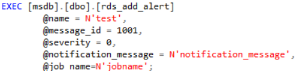

# 创建警报<a name="rds_09_0013"></a>

## 操作场景<a name="section69761816162012"></a>

使用存储过程创建一个警报。

## 前提条件<a name="section11945143132017"></a>

成功连接RDS for SQL Server实例。通过SQL Server客户端连接目标实例，具体操作请参见[通过公网连接SQL Server实例](https://support.huaweicloud.com/qs-rds/rds_03_0007.html)。

## 操作步骤<a name="section1334017544208"></a>

执行以下命令，创建一个警报

**EXEC \[msdb\].\[dbo\].\[rds\_add\_alert\]**

**@name='name'**

**@message\_id=message\_id**

**@severity=severity**

**@enabled=enabled**

**@delay\_between\_responses= delay\_between\_responses**

**@notification\_message='notification\_message'**

**@include\_event\_description\_in=include\_event\_description\_in**

**@database\_name='database'**

**@event\_description\_keyword='event\_description\_keyword\_pattern'**

**@job\_id=job\_id**

**@job\_name='job\_name'**

**@raise\_snmp\_trap=raise\_snmp\_trap**

**@performance\_condition='performance\_condition'**

**@category\_name='category'**

**@wmi\_namespace=‘wmi\_namespace’**

**@wmi\_query=‘wmi\_query’**

**表 1**  参数说明

<a name="table573391115587"></a>
<table><thead align="left"><tr id="row47343119586"><th class="cellrowborder" valign="top" width="22.85%" id="mcps1.2.3.1.1"><p id="p1873410115582"><a name="p1873410115582"></a><a name="p1873410115582"></a>参数</p>
</th>
<th class="cellrowborder" valign="top" width="77.14999999999999%" id="mcps1.2.3.1.2"><p id="p1373411165812"><a name="p1373411165812"></a><a name="p1373411165812"></a>说明</p>
</th>
</tr>
</thead>
<tbody><tr id="row5734141165817"><td class="cellrowborder" valign="top" width="22.85%" headers="mcps1.2.3.1.1 "><p id="p137341411155812"><a name="p137341411155812"></a><a name="p137341411155812"></a>'name'</p>
</td>
<td class="cellrowborder" valign="top" width="77.14999999999999%" headers="mcps1.2.3.1.2 "><p id="p187342118582"><a name="p187342118582"></a><a name="p187342118582"></a>警报名称。该名称显示在为响应警报而发送的电子邮件或寻呼消息中。它必须唯一，并且可以包含百分号（ % ）字符。名称为sysname，无默认值。</p>
</td>
</tr>
<tr id="row17341611145812"><td class="cellrowborder" valign="top" width="22.85%" headers="mcps1.2.3.1.1 "><p id="p1273411175818"><a name="p1273411175818"></a><a name="p1273411175818"></a>message_id</p>
</td>
<td class="cellrowborder" valign="top" width="77.14999999999999%" headers="mcps1.2.3.1.2 "><p id="p4734121155812"><a name="p4734121155812"></a><a name="p4734121155812"></a>定义警报的消息错误号。（它通常与sysmessages表中的错误号相对应。）<span class="parmname" id="parmname48991537454"><a name="parmname48991537454"></a><a name="parmname48991537454"></a>“message_id”</span>的值为<span class="parmvalue" id="parmvalue10391557124517"><a name="parmvalue10391557124517"></a><a name="parmvalue10391557124517"></a>“int”</span>，默认值为0。如果使用严重性来定义警报，则<span class="parmname" id="parmname182318464619"><a name="parmname182318464619"></a><a name="parmname182318464619"></a>“message_id”</span>必须为<span class="parmvalue" id="parmvalue151935715469"><a name="parmvalue151935715469"></a><a name="parmvalue151935715469"></a>“0”</span>或 <span class="parmvalue" id="parmvalue0891110114614"><a name="parmvalue0891110114614"></a><a name="parmvalue0891110114614"></a>“NULL”</span>。</p>
</td>
</tr>
<tr id="row673413116586"><td class="cellrowborder" valign="top" width="22.85%" headers="mcps1.2.3.1.1 "><p id="p4734171115583"><a name="p4734171115583"></a><a name="p4734171115583"></a>severity</p>
</td>
<td class="cellrowborder" valign="top" width="77.14999999999999%" headers="mcps1.2.3.1.2 "><p id="p1148905252020"><a name="p1148905252020"></a><a name="p1148905252020"></a><span>定义警报的严重级别（从1到25）。</span> <span>如果sysmessages表中存储的任何SQL Server消息都发送到带有指定严重性的Microsoft Windows应用程序日志，则会导致发送警报。</span><span>严重性为int，默认值为0。</span><span>如果使用</span><em id="i1920019532208"><a name="i1920019532208"></a><a name="i1920019532208"></a>message_id</em><span>来定义警报，则严重性必须为0。</span></p>
</td>
</tr>
<tr id="row18734611145819"><td class="cellrowborder" valign="top" width="22.85%" headers="mcps1.2.3.1.1 "><p id="p27341311195815"><a name="p27341311195815"></a><a name="p27341311195815"></a>enabled</p>
</td>
<td class="cellrowborder" valign="top" width="77.14999999999999%" headers="mcps1.2.3.1.2 "><p id="p273491117582"><a name="p273491117582"></a><a name="p273491117582"></a>指示警报的当前状态。enabled为tinyint，默认值为1（已启用）。如果为0，则不启用警报，也不触发警报。</p>
</td>
</tr>
<tr id="row2734121135812"><td class="cellrowborder" valign="top" width="22.85%" headers="mcps1.2.3.1.1 "><p id="p473431135814"><a name="p473431135814"></a><a name="p473431135814"></a>delay_between_responses</p>
</td>
<td class="cellrowborder" valign="top" width="77.14999999999999%" headers="mcps1.2.3.1.2 "><p id="p11734311195813"><a name="p11734311195813"></a><a name="p11734311195813"></a>警报响应之间的等待时间（以秒为单位）。<span class="parmname" id="parmname5704113594611"><a name="parmname5704113594611"></a><a name="parmname5704113594611"></a>“delay_between_responses”</span>的值为<span class="parmvalue" id="parmvalue353404014463"><a name="parmvalue353404014463"></a><a name="parmvalue353404014463"></a>“int”</span>，默认值为0，这意味着响应之间不等待（每次出现警报时都生成响应）。响应可以为下面的一种或两种形式：</p>
<a name="ul16267822424"></a><a name="ul16267822424"></a><ul id="ul16267822424"><li>通过电子邮件或寻呼发送的一个或多个通知。</li><li>要执行的作业。</li></ul>
<p id="p737013379218"><a name="p737013379218"></a><a name="p737013379218"></a>例如，当警报在短时间内重复产生时，通过设置该值就有可能避免发送重复的电子邮件。</p>
</td>
</tr>
<tr id="row573491125814"><td class="cellrowborder" valign="top" width="22.85%" headers="mcps1.2.3.1.1 "><p id="p1373419114582"><a name="p1373419114582"></a><a name="p1373419114582"></a>'notification_message'</p>
</td>
<td class="cellrowborder" valign="top" width="77.14999999999999%" headers="mcps1.2.3.1.2 "><p id="p27341711175811"><a name="p27341711175811"></a><a name="p27341711175811"></a>作为电子邮件、net send或寻呼通知的一部分发送给操作员的可选附加消息。<span class="parmname" id="parmname63944174711"><a name="parmname63944174711"></a><a name="parmname63944174711"></a>“notification_message”</span>值为<span class="parmvalue" id="parmvalue128981471476"><a name="parmvalue128981471476"></a><a name="parmvalue128981471476"></a>“nvarchar（512）”</span>，默认值为NULL。指定notification_message可用于添加特别注释，如补救过程。</p>
</td>
</tr>
<tr id="row12330121718310"><td class="cellrowborder" valign="top" width="22.85%" headers="mcps1.2.3.1.1 "><p id="p1233081713318"><a name="p1233081713318"></a><a name="p1233081713318"></a>include_event_description_in</p>
</td>
<td class="cellrowborder" valign="top" width="77.14999999999999%" headers="mcps1.2.3.1.2 "><p id="p1823792492520"><a name="p1823792492520"></a><a name="p1823792492520"></a><span>include_event_description_in是否应将SQL Server错误的说明作为通知消息的一部分包括在内。</span><em id="i139517863615"><a name="i139517863615"></a><a name="i139517863615"></a>include_event_description_in</em><span>为tinyint，默认值为5（电子邮件和网络发送），并且可以将这些值中的一个或多个与or逻辑运算符组合在一起。</span></p>
</td>
</tr>
<tr id="row2041569139"><td class="cellrowborder" valign="top" width="22.85%" headers="mcps1.2.3.1.1 "><p id="p44151191439"><a name="p44151191439"></a><a name="p44151191439"></a>'database'</p>
</td>
<td class="cellrowborder" valign="top" width="77.14999999999999%" headers="mcps1.2.3.1.2 "><p id="p124151199310"><a name="p124151199310"></a><a name="p124151199310"></a>必须发生错误才能触发警报的数据库。如果未提供数据库，则会触发警报，而不考虑错误发生的位置。数据库为sysname。不允许用方括号 ([ ]) 将名称括起来。默认值为 NULL。</p>
</td>
</tr>
<tr id="row82772315719"><td class="cellrowborder" valign="top" width="22.85%" headers="mcps1.2.3.1.1 "><p id="p1527720319714"><a name="p1527720319714"></a><a name="p1527720319714"></a>'event_description_keyword_pattern'</p>
</td>
<td class="cellrowborder" valign="top" width="77.14999999999999%" headers="mcps1.2.3.1.2 "><p id="p14277531771"><a name="p14277531771"></a><a name="p14277531771"></a>SQL Server错误说明所需的字符序列。可以使用 Transact-SQL LIKE表达式模式匹配字符。<span class="parmname" id="parmname1035213556479"><a name="parmname1035213556479"></a><a name="parmname1035213556479"></a>“event_description_keyword_pattern”</span>的值为<span class="parmvalue" id="parmvalue198131517485"><a name="parmvalue198131517485"></a><a name="parmvalue198131517485"></a>“nvarchar（100）”</span> ，默认值为NULL。 此参数适用于筛选对象名称（例如，% customer_table% ）。</p>
</td>
</tr>
<tr id="row1599019261973"><td class="cellrowborder" valign="top" width="22.85%" headers="mcps1.2.3.1.1 "><p id="p129911826579"><a name="p129911826579"></a><a name="p129911826579"></a>job_id</p>
</td>
<td class="cellrowborder" valign="top" width="77.14999999999999%" headers="mcps1.2.3.1.2 "><p id="p899162612717"><a name="p899162612717"></a><a name="p899162612717"></a>为了响应此警报而运行的作业的标识号。<span class="parmname" id="parmname17689154812"><a name="parmname17689154812"></a><a name="parmname17689154812"></a>“job_id”</span>的值为<span class="parmvalue" id="parmvalue499219128488"><a name="parmvalue499219128488"></a><a name="parmvalue499219128488"></a>“uniqueidentifier”</span>，默认值为NULL。</p>
</td>
</tr>
<tr id="row113413291710"><td class="cellrowborder" valign="top" width="22.85%" headers="mcps1.2.3.1.1 "><p id="p101348291274"><a name="p101348291274"></a><a name="p101348291274"></a>'job_name'</p>
</td>
<td class="cellrowborder" valign="top" width="77.14999999999999%" headers="mcps1.2.3.1.2 "><p id="p913419292712"><a name="p913419292712"></a><a name="p913419292712"></a>为响应此警报而执行的作业的名称。<span class="parmname" id="parmname35190499489"><a name="parmname35190499489"></a><a name="parmname35190499489"></a>“job_name”</span>的值为<span class="parmvalue" id="parmvalue183023535489"><a name="parmvalue183023535489"></a><a name="parmvalue183023535489"></a>“sysname”</span>，默认值为 NULL。</p>
</td>
</tr>
<tr id="row135369137317"><td class="cellrowborder" valign="top" width="22.85%" headers="mcps1.2.3.1.1 "><p id="p105365131430"><a name="p105365131430"></a><a name="p105365131430"></a>raise_snmp_trap</p>
</td>
<td class="cellrowborder" valign="top" width="77.14999999999999%" headers="mcps1.2.3.1.2 "><p id="p105369131934"><a name="p105369131934"></a><a name="p105369131934"></a>在版本7.0 SQL Server中未实现。<span class="parmname" id="parmname20591128174820"><a name="parmname20591128174820"></a><a name="parmname20591128174820"></a>“raise_snmp_trap”</span>的值为<span class="parmvalue" id="parmvalue128661230104813"><a name="parmvalue128661230104813"></a><a name="parmvalue128661230104813"></a>“tinyint”</span>，默认值为0。</p>
</td>
</tr>
<tr id="row86811111539"><td class="cellrowborder" valign="top" width="22.85%" headers="mcps1.2.3.1.1 "><p id="p8681311932"><a name="p8681311932"></a><a name="p8681311932"></a>'performance_condition'</p>
</td>
<td class="cellrowborder" valign="top" width="77.14999999999999%" headers="mcps1.2.3.1.2 "><p id="p176818112311"><a name="p176818112311"></a><a name="p176818112311"></a>以 "itemcomparatorvalue" 格式表示的值。performance_condition的默认值为nvarchar（512） ，默认值为 NULL,其中包含这些元素。</p>
<a name="ul10162172842613"></a><a name="ul10162172842613"></a><ul id="ul10162172842613"><li>格式元素为项，表示<span>性能对象、性能计数器或计数器的命名实例</span>。</li><li>格式元素为<em id="i125741021292"><a name="i125741021292"></a><a name="i125741021292"></a>Comparator</em>，表示<span>以下运算符之一： </span><span>&gt;</span><span>、</span><span>&lt;</span><span> 或 =</span>。</li><li>格式元素为<em id="i143028589298"><a name="i143028589298"></a><a name="i143028589298"></a>Value</em>，表示<span>计数器的数值</span>。</li></ul>
</td>
</tr>
<tr id="row776415710149"><td class="cellrowborder" valign="top" width="22.85%" headers="mcps1.2.3.1.1 "><p id="p1676425711412"><a name="p1676425711412"></a><a name="p1676425711412"></a>'category'</p>
</td>
<td class="cellrowborder" valign="top" width="77.14999999999999%" headers="mcps1.2.3.1.2 "><p id="p8764155791419"><a name="p8764155791419"></a><a name="p8764155791419"></a>警报类别的名称。category的类型为sysname，默认值为 NULL。</p>
</td>
</tr>
<tr id="row13312909153"><td class="cellrowborder" valign="top" width="22.85%" headers="mcps1.2.3.1.1 "><p id="p153131405153"><a name="p153131405153"></a><a name="p153131405153"></a>'wmi_namespace'</p>
</td>
<td class="cellrowborder" valign="top" width="77.14999999999999%" headers="mcps1.2.3.1.2 "><p id="p23131902155"><a name="p23131902155"></a><a name="p23131902155"></a>要查询事件的WMI命名空间。wmi_namespace的值为sysname，默认值为NULL。只支持本地服务器上的命名空间。</p>
</td>
</tr>
<tr id="row6379441101514"><td class="cellrowborder" valign="top" width="22.85%" headers="mcps1.2.3.1.1 "><p id="p23790412159"><a name="p23790412159"></a><a name="p23790412159"></a>'wmi_query'</p>
</td>
<td class="cellrowborder" valign="top" width="77.14999999999999%" headers="mcps1.2.3.1.2 "><p id="p1737911416155"><a name="p1737911416155"></a><a name="p1737911416155"></a>指定警报的WMI事件的查询。wmi_query的值为nvarchar（512），默认值为 NULL。</p>
</td>
</tr>
</tbody>
</table>

执行成功后，系统将会如下提示：

```
Commands completed successfully.
```

## 示例<a name="section92353210175"></a>



回显如下：


