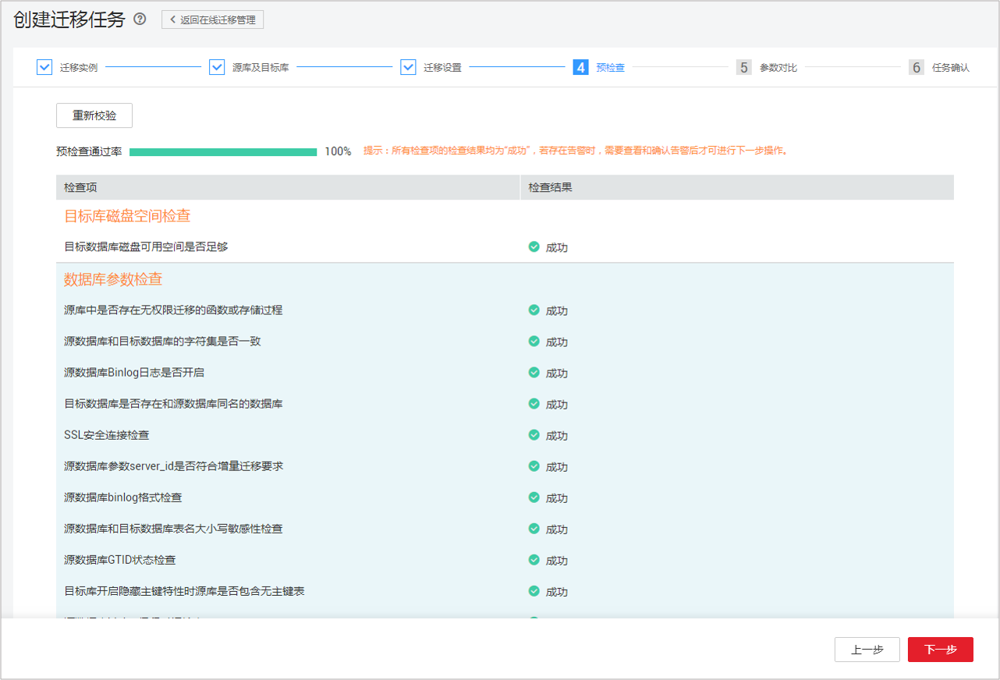

# 创建跨区域的灾备实例

## 操作背景

主实例支持搭建主备高可用架构，当主实例所在区域发生突发性自然灾害等状况，主节点（Master）和备节点（Slave）均无法连接时，可将异地灾备实例切换为主实例，在应用端修改数据库链接地址后，即可快速恢复应用的业务访问。

RDS通过数据迁移服务（DRS）实现主实例和跨区域的灾备实例之间的实时同步。可通过DRS数据迁移服务实现同步信息查询、同步状态查看，详细信息请参见[数据复制服务用户指南](https://support.huaweicloud.com/usermanual-drs/drs_04_0005.html)。

## 计费说明

RDS灾备实例与主实例配置默认相同，且RDS通过数据传输实现主实例和异地灾备实例之间的实时同步。因此，创建灾备实例会同时产生RDS和DRS两种费用，价格详情请参见[价格计算器](https://www.huaweicloud.com/pricing.html#/rds)。

## 前提条件

-   已成功创建主实例。
-   主实例作为源实例已开启公网访问并已绑定弹性公网IP。
-   配置同步关系前需确认当前帐号所在的用户组的全局服务中已添加Security Administrator权限。

## 限制条件

-   仅支持中国大陆区域。
-   云数据库MySQL 5.6/5.7版本（金融版除外）的实例支持创建跨区域的灾备实例。
-   灾备实例不支持备份设置、备份恢复、数据库管理。
-   灾备实例暂不支持端口修改、密码修改。
-   一个实例只可创建一个灾备实例，当需要再创建其他region灾备实例时，须先删除已有的灾备实例。

## 创建灾备实例

1.  登录管理控制台。
2.  单击管理控制台左上角的，选择区域和项目。
3.  选择“数据库  \>  云数据库 RDS“。进入云数据库 RDS信息页面。
4.  在“实例管理“页面，选择目标主实例，在操作列选择“更多  \>  创建灾备“。
5.  在“创建灾备实例”页面，设置灾备实例信息后，单击“立即购买“。

    **表 1**  基本信息

    
    <table><thead align="left"><tr id="zh-cn_topic_0226191437_row7439380519"><th class="cellrowborder" valign="top" width="17.669999999999998%" id="mcps1.2.3.1.1">
参数

    </th>
    <th class="cellrowborder" valign="top" width="82.33%" id="mcps1.2.3.1.2">
描述

    </th>
    </tr>
    </thead>
    <tbody><tr id="zh-cn_topic_0226191437_row134493845110"><td class="cellrowborder" valign="top" width="17.669999999999998%" headers="mcps1.2.3.1.1 ">
计费模式

    </td>
    <td class="cellrowborder" valign="top" width="82.33%" headers="mcps1.2.3.1.2 ">
灾备实例仅支持按需计费模式。

    </td>
    </tr>
    <tr id="zh-cn_topic_0226191437_row94443810513"><td class="cellrowborder" valign="top" width="17.669999999999998%" headers="mcps1.2.3.1.1 ">
区域

    </td>
    <td class="cellrowborder" valign="top" width="82.33%" headers="mcps1.2.3.1.2 ">
除主实例所属区域外，其他区域都可选。

    
 须知： 

不同区域内的产品内网不互通，且购买后不能更换，请谨慎选择。

    

    </td>
    </tr>
    <tr id="zh-cn_topic_0226191437_row1244183825117"><td class="cellrowborder" valign="top" width="17.669999999999998%" headers="mcps1.2.3.1.1 ">
实例名称

    </td>
    <td class="cellrowborder" valign="top" width="82.33%" headers="mcps1.2.3.1.2 ">
实例名称的长度在4~64个字符之间，必须以字母开头，可包含字母、数字、中划线或下划线，不能包含其他特殊字符。

    </td>
    </tr>
    <tr id="zh-cn_topic_0226191437_row124473835110"><td class="cellrowborder" valign="top" width="17.669999999999998%" headers="mcps1.2.3.1.1 ">
数据库引擎

    </td>
    <td class="cellrowborder" valign="top" width="82.33%" headers="mcps1.2.3.1.2 ">
引擎及版本同主实例一致。

    </td>
    </tr>
    <tr id="zh-cn_topic_0226191437_row104423812511"><td class="cellrowborder" valign="top" width="17.669999999999998%" headers="mcps1.2.3.1.1 ">
实例类型

    </td>
    <td class="cellrowborder" valign="top" width="82.33%" headers="mcps1.2.3.1.2 ">
单机。

    </td>
    </tr>
    <tr id="zh-cn_topic_0226191437_row8451386519"><td class="cellrowborder" valign="top" width="17.669999999999998%" headers="mcps1.2.3.1.1 ">
可用区

    </td>
    <td class="cellrowborder" valign="top" width="82.33%" headers="mcps1.2.3.1.2 ">
有的区域支持单可用区和多可用区，有的区域只支持单可用区。请根据实际提供的列表进行选择。

    </td>
    </tr>
    <tr id="zh-cn_topic_0226191437_row1545938145114"><td class="cellrowborder" valign="top" width="17.669999999999998%" headers="mcps1.2.3.1.1 ">
时区

    </td>
    <td class="cellrowborder" valign="top" width="82.33%" headers="mcps1.2.3.1.2 ">
时区可在创建实例时选择，后期可修改。

    </td>
    </tr>
    </tbody>
    </table>

    **表 2**  规格与存储

    
    <table><thead align="left"><tr id="zh-cn_topic_0226191437_row445238195117"><th class="cellrowborder" valign="top" width="19.98%" id="mcps1.2.3.1.1">
参数

    </th>
    <th class="cellrowborder" valign="top" width="80.02%" id="mcps1.2.3.1.2">
描述

    </th>
    </tr>
    </thead>
    <tbody><tr id="zh-cn_topic_0226191437_row134610383512"><td class="cellrowborder" valign="top" width="19.98%" headers="mcps1.2.3.1.1 ">
性能规格

    </td>
    <td class="cellrowborder" valign="top" width="80.02%" headers="mcps1.2.3.1.2 ">
通用增强型。内核优化，高并发场景下相对于社区版性能提升50%以上，最大支持连接数10万，支持自建数据库在线和离线迁移，大规模应用于互联网领域。

    
实例的CPU和内存。不同性能规格对应不同连接数和最大IOPS。

    
关于性能规格详情，请参见<a href="https://support.huaweicloud.com/productdesc-rds/rds_01_0029.html" target="_blank" rel="noopener noreferrer">数据库实例规格</a>。

    

    
创建成功后可进行规格变更，请参见<a href="https://support.huaweicloud.com/usermanual-rds/zh-cn_topic_scale_rds.html" target="_blank" rel="noopener noreferrer">变更实例的CPU和内存规格</a>。

    

    </td>
    </tr>
    <tr id="zh-cn_topic_0226191437_row14472385516"><td class="cellrowborder" valign="top" width="19.98%" headers="mcps1.2.3.1.1 ">
存储类型

    </td>
    <td class="cellrowborder" valign="top" width="80.02%" headers="mcps1.2.3.1.2 ">
实例的存储类型决定实例的读写速度。最大吞吐量越高，读写速度越快。

    
超高I/O：最大吞吐量350MB/s。

    
 说明： 

选择“专属存储”的用户默认只显示购买专属分布式存储服务时选择的存储类型。

    

    </td>
    </tr>
    <tr id="zh-cn_topic_0226191437_row748123818517"><td class="cellrowborder" valign="top" width="19.98%" headers="mcps1.2.3.1.1 ">
存储空间

    </td>
    <td class="cellrowborder" valign="top" width="80.02%" headers="mcps1.2.3.1.2 ">
所申请的存储空间会有必要的文件系统开销，这些开销包括索引节点和保留块，以及数据库运行必需的空间。

    <ul id="zh-cn_topic_0226191437_ul1848143812513"><li>存储空间支持40GB到4000GB，用户选择容量大小必须为10的整数倍。部分用户支持40GB~6000GB，如果您想创建存储空间最大为6000GB的数据库实例，或提高扩容上限到10000GB，请联系客服开通。</li><li>存储空间可大于或等于主实例的存储空间。</li></ul>
    </td>
    </tr>
    <tr id="zh-cn_topic_0226191437_row8487382514"><td class="cellrowborder" valign="top" width="19.98%" headers="mcps1.2.3.1.1 ">
磁盘加密

    </td>
    <td class="cellrowborder" valign="top" width="80.02%" headers="mcps1.2.3.1.2 "><ul id="zh-cn_topic_0226191437_ul5481238205112"><li>不加密：未开启加密功能。</li><li>加密：提高数据安全性，对性能有一定影响。
密钥名称：选择或创建密钥，该密钥是最终租户密钥。

    <ul id="zh-cn_topic_0226191437_ul219093002520"><li>创建密钥可参考《数据加密服务用户指南》的“密钥管理”章节内容。</li></ul>
    
 须知： 
<ul id="zh-cn_topic_0226191437_ul1217717042715"><li>华为云关系型数据库实例创建成功后，请勿禁用或删除正在使用的秘钥，否则会导致华为云关系型数据库服务不可用，数据无法恢复。</li><li>实例创建成功后，不可修改磁盘加密状态，且无法更改密钥。</li><li>存放在对象存储服务上的备份数据不会被加密。</li></ul>
    

    </li></ul>
    </td>
    </tr>
    <tr id="zh-cn_topic_0226191437_row2048738195119"><td class="cellrowborder" valign="top" width="19.98%" headers="mcps1.2.3.1.1 ">
虚拟私有云

    </td>
    <td class="cellrowborder" valign="top" width="80.02%" headers="mcps1.2.3.1.2 ">
提供可弹性申请的网络资源，对数据库实例进行网络隔离和访问控制，提供数据库实例运行环境。

    </td>
    </tr>
    <tr id="zh-cn_topic_0226191437_row749143835116"><td class="cellrowborder" valign="top" width="19.98%" headers="mcps1.2.3.1.1 ">
内网安全组

    </td>
    <td class="cellrowborder" valign="top" width="80.02%" headers="mcps1.2.3.1.2 ">
控制网络出/入及端口的访问，默认添加了华为云关系型数据库实例所属的内网安全组访问。

    
内网安全组限制实例的安全访问规则，加强华为云关系型数据库服务与其他服务间的安全访问。请确保所选取的内网安全组允许客户端访问数据库实例。

    
如果没有可选的内网安全组，华为云关系型数据库服务默认为您分配内网安全组资源。

    </td>
    </tr>
    <tr id="zh-cn_topic_0226191437_row1349193820519"><td class="cellrowborder" valign="top" width="19.98%" headers="mcps1.2.3.1.1 ">
参数模板

    </td>
    <td class="cellrowborder" valign="top" width="80.02%" headers="mcps1.2.3.1.2 ">
数据库参数模板就像是数据库引擎配置值的容器，参数模板中的参数可应用于一个或多个相同类型的数据库实例。对于HA实例创建成功后，主备参数模板相同。实例创建成功后，参数模板可进行修改。

    
具体请参见<a href="https://support.huaweicloud.com/usermanual-rds/zh-cn_topic_configuration.html" target="_blank" rel="noopener noreferrer">编辑参数</a>。

    </td>
    </tr>
    <tr id="zh-cn_topic_0226191437_row1549153818519"><td class="cellrowborder" valign="top" width="19.98%" headers="mcps1.2.3.1.1 ">
标签

    </td>
    <td class="cellrowborder" valign="top" width="80.02%" headers="mcps1.2.3.1.2 ">
可选配置，对关系型数据库的标识。使用标签可以方便识别和管理您拥有的关系型数据库服务资源。每个实例最多支持10个标签配额。

    
实例创建成功后，您可以单击实例名称，在标签页签下查看对应标签。关于标签的详细操作，请参见<a href="https://support.huaweicloud.com/usermanual-rds/rds_tag.html" target="_blank" rel="noopener noreferrer">标签</a>。

    </td>
    </tr>
    </tbody>
    </table>

6.  在规格确认详情页面，进行信息确认。
    -   如果需要重新选择，单击“上一步”，回到服务选型页面修改基本信息。
    -   信息确认无误，单击“提交“，下发新增灾备实例的请求。

7.  在创建灾备实例完成“任务提交成功“信息提示页面，单击“返回实例列表“，您可在灾备实例所属区域的实例管理页面，单击实例名称进入基本信息页面，对其进行查看和管理。

    您也可在主实例的实例管理页面，在“实例类型“栏单击灾备实例名称，进入灾备实例基本信息页面，对其进行查看和管理。

    > **说明：**   
    >实例创建成功后，RDS会自动触发一次全量备份。  

## 配置同步关系

RDS通过数据迁移服务（DRS）实现主实例和跨区域的灾备实例之间的实时同步。

可通过DRS数据迁移服务实现同步信息查询、同步状态查看，详细信息请参见[数据复制服务用户指南](https://support.huaweicloud.com/usermanual-drs/drs_04_0005.html)。

1.  登录管理控制台。
2.  单击管理控制台左上角的，选择区域和项目。
3.  选择“数据库  \>  云数据库 RDS“。进入云数据库 RDS信息页面。
4.  在实例列表中，单击目标灾备实例的名称，进入实例的基本信息页面。
5.  选择左侧导航栏“弹性公网IP“，单击“绑定弹性公网IP“，在绑定弹性公网IP弹出框中选择待绑定的弹性公网IP，单击“确定“。

    > **说明：**   
    >灾备实例与其他实例存在同步复制关系，不能进行解绑弹性公网IP操作。  

6.  选择左侧导航栏“基本信息“，在“基本信息“页面，单击“实例拓扑图“模块的，进入“配置同步任务“页面。

    **图 1**  配置同步关系  
    

    > **说明：**   
    >-   主实例为本次配置同步关系中的源库，以下称源库；灾备实例为本次配置同步关系中的目标库，以下称目标库。  
    >-   同步关系配置过程中会创建迁移实例，并自动开启迁移实例的弹性公网IP。  

7.  在配置同步任务页面“源库信息“栏，填写数据库用户名、数据库密码，按需设置加密证书，单击“测试连接“。

    > **说明：**   
    >-   数据复制服务可以通过迁移实例连接源数据库，读取源数据，然后将数据复制到目标数据库中。  
    >-   迁移实例创建中，大约需要2-5分钟。  
    >-   迁移实例未创建成功时，测试连接和下一步按钮不可操作。  

8.  测试连接成功后，勾选页面下方的协议，单击“下一步“。

    **图 2**  源库信息  
    

    **表 3**  源库信息

    
    <table><thead align="left"><tr id="zh-cn_topic_0226191437_row39811847163110"><th class="cellrowborder" valign="top" width="23.29%" id="mcps1.2.3.1.1">
<strong id="zh-cn_topic_0226191437_b7980164714316">参数</strong>

    </th>
    <th class="cellrowborder" valign="top" width="76.71%" id="mcps1.2.3.1.2">
<strong id="zh-cn_topic_0226191437_b1981174713111">描述</strong>

    </th>
    </tr>
    </thead>
    <tbody><tr id="zh-cn_topic_0226191437_row3981247123115"><td class="cellrowborder" valign="top" width="23.29%" headers="mcps1.2.3.1.1 ">
IP地址或域名

    </td>
    <td class="cellrowborder" valign="top" width="76.71%" headers="mcps1.2.3.1.2 ">
源数据库的IP地址或域名。

    </td>
    </tr>
    <tr id="zh-cn_topic_0226191437_row16981144713117"><td class="cellrowborder" valign="top" width="23.29%" headers="mcps1.2.3.1.1 ">
端口

    </td>
    <td class="cellrowborder" valign="top" width="76.71%" headers="mcps1.2.3.1.2 ">
源数据库服务端口，可输入范围为1024~65535间的整数。

    </td>
    </tr>
    <tr id="zh-cn_topic_0226191437_row398154718312"><td class="cellrowborder" valign="top" width="23.29%" headers="mcps1.2.3.1.1 ">
数据库用户名

    </td>
    <td class="cellrowborder" valign="top" width="76.71%" headers="mcps1.2.3.1.2 ">
源数据库的用户名。

    </td>
    </tr>
    <tr id="zh-cn_topic_0226191437_row12982847163112"><td class="cellrowborder" valign="top" width="23.29%" headers="mcps1.2.3.1.1 ">
数据库密码

    </td>
    <td class="cellrowborder" valign="top" width="76.71%" headers="mcps1.2.3.1.2 ">
源数据库的用户名所对应的密码。

    </td>
    </tr>
    <tr id="zh-cn_topic_0226191437_row139821147183119"><td class="cellrowborder" valign="top" width="23.29%" headers="mcps1.2.3.1.1 ">
SSL安全连接

    </td>
    <td class="cellrowborder" valign="top" width="76.71%" headers="mcps1.2.3.1.2 ">
默认开启该功能，对迁移链路进行加密，提高安全性。

    </td>
    </tr>
    <tr id="zh-cn_topic_0226191437_row1498213473311"><td class="cellrowborder" valign="top" width="23.29%" headers="mcps1.2.3.1.1 ">
加密证书

    </td>
    <td class="cellrowborder" valign="top" width="76.71%" headers="mcps1.2.3.1.2 ">
源数据库的加密证书。

    </td>
    </tr>
    </tbody>
    </table>

    > **说明：**   
    >-   源数据库的IP地址或域名、数据库用户名和密码，会被系统加密暂存，直至删除该迁移任务后自动清除。  
    >-   源数据库的IP地址或域名、端口和加密证书为默认选项，无需修改。  

    **表 4**  目标库信息

    
    <table><thead align="left"><tr id="zh-cn_topic_0226191437_row4983174713314"><th class="cellrowborder" valign="top" width="23%" id="mcps1.2.3.1.1">
<strong id="zh-cn_topic_0226191437_b4983947193113">参数</strong>

    </th>
    <th class="cellrowborder" valign="top" width="77%" id="mcps1.2.3.1.2">
<strong id="zh-cn_topic_0226191437_b2983184713311">描述</strong>

    </th>
    </tr>
    </thead>
    <tbody><tr id="zh-cn_topic_0226191437_row4983247133111"><td class="cellrowborder" valign="top" width="23%" headers="mcps1.2.3.1.1 ">
数据库实例名称

    </td>
    <td class="cellrowborder" valign="top" width="77%" headers="mcps1.2.3.1.2 ">
默认为创建迁移任务时选择的RDS实例，不可进行修改。

    </td>
    </tr>
    <tr id="zh-cn_topic_0226191437_row1698314763114"><td class="cellrowborder" valign="top" width="23%" headers="mcps1.2.3.1.1 ">
数据库用户名

    </td>
    <td class="cellrowborder" valign="top" width="77%" headers="mcps1.2.3.1.2 ">
目标数据库对应的数据库用户名。

    </td>
    </tr>
    <tr id="zh-cn_topic_0226191437_row598344716318"><td class="cellrowborder" valign="top" width="23%" headers="mcps1.2.3.1.1 ">
数据库密码

    </td>
    <td class="cellrowborder" valign="top" width="77%" headers="mcps1.2.3.1.2 ">
数据库用户名和密码将被系统加密暂存，直至该任务删除后清除。

    </td>
    </tr>
    </tbody>
    </table>

9.  在“迁移设置“页面，迁移对象默认选择“全部迁移”，暂不支持自定义对象，单击“下一步“。

    **图 3**  迁移对象设置  
    

    > **说明：**   
    >-   不支持事件（event）、触发器（trigger）迁移，迁移结束后请在目标数据库手动创建事件、触发器。  
    >-   在迁移任务未结束前，不能修改源库所有用户、密码和用户权限等。  

10. 在“预检查“页面，进行迁移任务预校验，校验是否可进行迁移。
    -   查看检查结果，如有失败的检查项，需要修复失败项后，单击“重新校验”按钮重新进行迁移任务预校验。

        预检查失败项处理建议请参考《数据复制服务用户指南》中的“[预检查项说明](https://support.huaweicloud.com/usermanual-drs/drs_precheck.html)”。

    -   预检查完成后，且所有检查项结果均成功时，单击“下一步“。

        **图 4**  预检查  
        

        > **说明：**   
        >所有检查项的检查结果均为“成功”，若存在告警时，需要查看和确认告警后才可进行下一步操作。  

11. 在“参数对比“页面，对常规参数与性能参数2种参数类型进行对比或修改，单击“下一步“进入任务确认页面。
    -   常规参数

        如果源库和目标库存在不一致的情况，建议使用一键修复功能将参数值修改为一致。

    -   性能参数

        您可以根据业务场景，自定义源数据库和目标库的参数值，编辑参数内容，单击“一键修改”即可完成参数修改。

        **图 5**  参数对比  
        

        > **说明：**   
        >-   参数对比功能从常规参数和性能参数两个维度，展示了源数据库和目标数据库的参数值是否一致，而且提供了一键修改的功能。  
        >-   通过一键修改可以将源数据库和目标数据库的参数值自动修改为一致，从而确保迁移后业务的稳定性。  

12. 在“任务确认“页面，查看详情信息无误后，可按需选择“立即启动“或“稍后启动“任务，单击“启动任务“。

    **图 6**  启动任务  
    

13. 在“启动迁移任务提交成功“提示页面，单击“查看详情“，页面跳转至数据复制服务的“基本信息“页签，选择“迁移进度“页签，查看迁移进度。

    **图 7**  迁移进度  
    

    > **说明：**   
    >-   在迁移任务未结束前，不能修改源库和目标库的所有用户、密码和用户权限等。  
    >-   当全量迁移完成时，显示全量迁移已完成100%。  
    >-   时延为0s时，说明源数据库和目标数据库的数据是实时同步的。  

