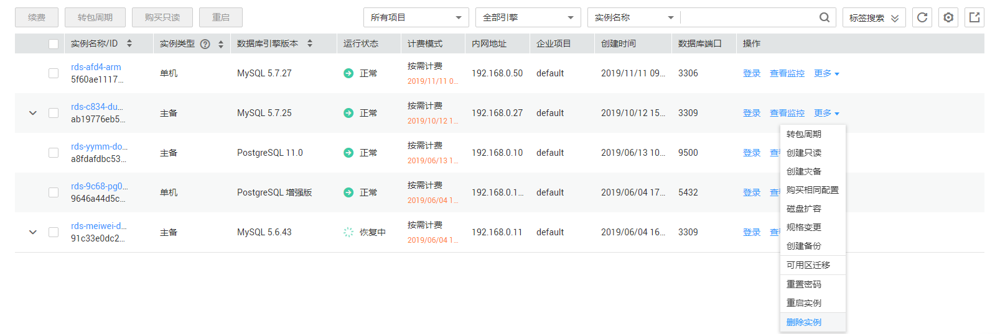
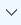
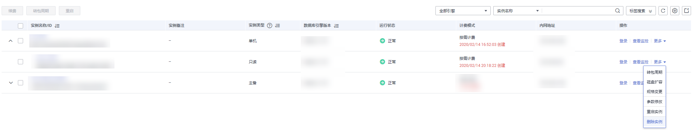

# 删除按需实例

## 操作场景

对于“按需计费”模式的主实例或只读实例，您可根据业务需要，在关系型数据库“实例管理“页面手动删除来释放资源。（对于包年包月的主实例，您需要进行订单退订才可删除实例，详细操作请参见[退订包周期实例](退订包周期实例.md)）。

## 使用限制

删除实例有如下约束：

-   执行操作中的实例不能手动删除，只有在实例操作完成后，才可删除实例。
-   “按需计费“类型的实例删除后将不再产生费用，自动备份会被同步删除，保留的手动备份会继续收取费用。

> **须知：**   
>-   删除主实例时，会同步删除其对应的只读实例，请您谨慎操作。  
>-   实例删除后，不可恢复，请谨慎操作。如需保留数据，请务必确认完成数据备份后再删除实例。  

## 删除按需主实例

1.  登录管理控制台。
2.  单击管理控制台左上角的，选择区域和项目。
3.  选择“数据库  \>  云数据库 RDS“。进入云数据库 RDS信息页面。
4.  在“实例管理“页面的实例列表中，选择需要删除的主实例，在“操作“列，选择“更多  \>  删除实例“。

    **图 1**  删除RDS主实例  
    

5.  在“删除实例“弹框，单击“是“下发请求。
6.  若您已开启高危操作保护，在“身份验证”弹出框中单击“免费获取验证码“，正确输入验证码并单击“确定“，页面自动关闭。

    通过进行二次认证再次确认您的身份，进一步提高帐号安全性，有效保护您安全使用云产品。关于如何开启操作保护，具体请参考《统一身份认证服务用户指南》的内容。

7.  稍后刷新“实例管理“页面，查看删除结果。

## 删除按需只读实例

1.  登录管理控制台。
2.  单击管理控制台左上角的，选择区域和项目。
3.  选择“数据库  \>  云数据库 RDS“。进入云数据库 RDS信息页面。
4.  在“实例管理“页面的实例列表中，选择对应主实例，单击实例名称前的，可查看到该主实例下的全部只读实例。
5.  选择目标只读实例，在“操作“列，选择“更多  \>  删除实例“。

    **图 2**  删除RDS只读实例  
    

6.  在“删除实例“弹框，单击“是“下发请求。
7.  若您已开启高危操作保护，在“身份验证”弹出框中单击“免费获取验证码“，正确输入验证码并单击“确定“，页面自动关闭。

    通过进行二次认证再次确认您的身份，进一步提高帐号安全性，有效保护您安全使用云产品。关于如何开启操作保护，具体请参考《统一身份认证服务用户指南》的内容。

8.  稍后刷新“实例管理“页面，查看删除结果。

