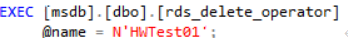

# 删除操作员<a name="rds_09_0021"></a>

## 操作场景<a name="section156451121144014"></a>

使用存储过程删除一位操作员。

## 前提条件<a name="section896853064015"></a>

成功连接RDS for SQL Server实例。通过SQL Server客户端连接目标实例，具体操作请参见[通过公网连接SQL Server实例](https://support.huaweicloud.com/qs-rds/rds_03_0007.html)。

## 操作步骤<a name="section17689183194112"></a>

执行以下命令，删除一位操作员。

**EXEC \[msdb\].\[dbo\].\[rds\_delete\_operator\]**

**@name='name'**

**@reassign\_to\_operator = 'reassign\_operator';**

**表 1**  参数说明

<a name="table139031246194119"></a>
<table><thead align="left"><tr id="row890504634117"><th class="cellrowborder" valign="top" width="24.2%" id="mcps1.2.3.1.1"><p id="p3905204619416"><a name="p3905204619416"></a><a name="p3905204619416"></a>参数</p>
</th>
<th class="cellrowborder" valign="top" width="75.8%" id="mcps1.2.3.1.2"><p id="p119051146184113"><a name="p119051146184113"></a><a name="p119051146184113"></a>说明</p>
</th>
</tr>
</thead>
<tbody><tr id="row290510462415"><td class="cellrowborder" valign="top" width="24.2%" headers="mcps1.2.3.1.1 "><p id="p20905184615419"><a name="p20905184615419"></a><a name="p20905184615419"></a>'name'</p>
</td>
<td class="cellrowborder" valign="top" width="75.8%" headers="mcps1.2.3.1.2 "><p id="p5905104674117"><a name="p5905104674117"></a><a name="p5905104674117"></a>要删除的操作员的名称。名称是sysname，无默认值。</p>
</td>
</tr>
<tr id="row890515466412"><td class="cellrowborder" valign="top" width="24.2%" headers="mcps1.2.3.1.1 "><p id="p1090554614419"><a name="p1090554614419"></a><a name="p1090554614419"></a>'reassign_operator'</p>
</td>
<td class="cellrowborder" valign="top" width="75.8%" headers="mcps1.2.3.1.2 "><p id="p990554634117"><a name="p990554634117"></a><a name="p990554634117"></a>可以向其重新分配指定的操作员的警报的操作员的名称。reassign_operator是sysname，默认值为 NULL。</p>
</td>
</tr>
</tbody>
</table>

执行成功后，系统将会如下提示：

```
Commands completed successfully.
```

## 示例<a name="section631416495429"></a>



回显如下所示：


