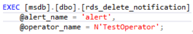

# 删除特定警报和操作员的SQL Server代理通知定义<a name="rds_09_0020"></a>

## 操作场景<a name="section1951313341348"></a>

使用存储过程删除特定警报和操作员的SQL Server代理通知定义。

## 前提条件<a name="section737114491341"></a>

成功连接RDS for SQL Server实例。通过SQL Server客户端连接目标实例，具体操作请参见[通过公网连接SQL Server实例](https://support.huaweicloud.com/qs-rds/rds_03_0007.html)。

## 操作步骤<a name="section7245144433518"></a>

执行以下命令，删除特定警报和操作员的SQL Server代理通知定义。

**EXEC \[msdb\].\[dbo\].\[rds\_delete\_notification\]**

**@alert\_name = 'alert',**

**@operator\_name ='operator';**

**表 1**  参数说明

<a name="table0693204610365"></a>
<table><thead align="left"><tr id="row18694144693612"><th class="cellrowborder" valign="top" width="27.96%" id="mcps1.2.3.1.1"><p id="p36941746143616"><a name="p36941746143616"></a><a name="p36941746143616"></a>参数</p>
</th>
<th class="cellrowborder" valign="top" width="72.04%" id="mcps1.2.3.1.2"><p id="p06941846143614"><a name="p06941846143614"></a><a name="p06941846143614"></a>说明</p>
</th>
</tr>
</thead>
<tbody><tr id="row1869413468369"><td class="cellrowborder" valign="top" width="27.96%" headers="mcps1.2.3.1.1 "><p id="p76943462364"><a name="p76943462364"></a><a name="p76943462364"></a>'alert'</p>
</td>
<td class="cellrowborder" valign="top" width="72.04%" headers="mcps1.2.3.1.2 "><p id="p15694646173610"><a name="p15694646173610"></a><a name="p15694646173610"></a>警报的名称。警报是sysname，无默认值。</p>
</td>
</tr>
<tr id="row10694546123615"><td class="cellrowborder" valign="top" width="27.96%" headers="mcps1.2.3.1.1 "><p id="p9694246133613"><a name="p9694246133613"></a><a name="p9694246133613"></a>'operator'</p>
</td>
<td class="cellrowborder" valign="top" width="72.04%" headers="mcps1.2.3.1.2 "><p id="p769454633615"><a name="p769454633615"></a><a name="p769454633615"></a>操作员的名称。运算符是sysname，无默认值。</p>
</td>
</tr>
</tbody>
</table>

执行成功后，系统将会如下提示：

```
Commands completed successfully.
```

## 示例<a name="section36116480379"></a>



回显如下所示：


