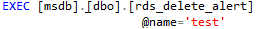

# 删除警报<a name="rds_09_0019"></a>

## 操作场景<a name="section64531522295"></a>

使用存储过程删除警报。

## 前提条件<a name="section116419129295"></a>

成功连接RDS for SQL Server实例。通过SQL Server客户端连接目标实例，具体操作请参见[通过公网连接SQL Server实例](https://support.huaweicloud.com/qs-rds/rds_03_0007.html)。

## 操作步骤<a name="section15150123416297"></a>

执行以下命令，删除警报。

**EXEC \[msdb\].\[dbo\].\[ rds\_delete\_alert\]**

**@name='name'**

**表 1**  参数说明

<a name="table1159120297301"></a>
<table><thead align="left"><tr id="row1859292923020"><th class="cellrowborder" valign="top" width="27.33%" id="mcps1.2.3.1.1"><p id="p1359252914304"><a name="p1359252914304"></a><a name="p1359252914304"></a>参数</p>
</th>
<th class="cellrowborder" valign="top" width="72.67%" id="mcps1.2.3.1.2"><p id="p1359210291302"><a name="p1359210291302"></a><a name="p1359210291302"></a>说明</p>
</th>
</tr>
</thead>
<tbody><tr id="row18592429163018"><td class="cellrowborder" valign="top" width="27.33%" headers="mcps1.2.3.1.1 "><p id="p759272918302"><a name="p759272918302"></a><a name="p759272918302"></a>'name'</p>
</td>
<td class="cellrowborder" valign="top" width="72.67%" headers="mcps1.2.3.1.2 "><p id="p6592152973012"><a name="p6592152973012"></a><a name="p6592152973012"></a>警报的名称。 名称是sysname，无默认值。</p>
</td>
</tr>
</tbody>
</table>

执行成功后，系统将会如下提示：

```
Commands completed successfully.
```

## 示例<a name="section7358133314"></a>



回显如下所示：


