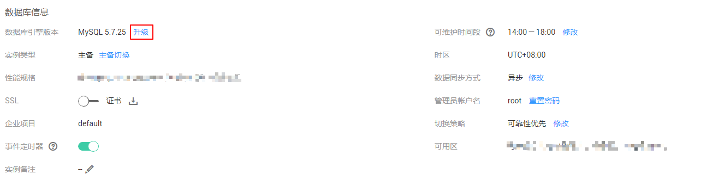

# 升级内核小版本

## 操作场景

云数据库MySQL支持自动或手动升级内核小版本，内核小版本的升级涉及性能提升、新功能或问题修复等。

内核小版本功能详情请参见[华为云MySQL内核版本说明](https://support.huaweicloud.com/zh-cn/productdesc-rds/rds_01_0019.html)。根据升级时间不同，升级内核小版本可以分为以下两种方式。

-   立即升级：您可以根据实际业务情况，在目标实例的“基本信息“页面手动[升级内核小版本](#section2059714272261)。
-   可维护时间段内升级：华为云有新的内核小版本发布时，您可以在您设置的可维护时间段内进行手动升级，详情参见[设置可维护时间段](设置可维护时间段.md)。

## 注意事项

-   升级数据库内核小版本会重启MySQL实例，服务可能会出现闪断，请您尽量在业务低峰期执行该操作，或确保您的应用有自动重连机制。
-   升级主实例小版本时，如有只读实例，也会同步升级只读实例的小版本，升级完成会重启实例，请您选择合适的时间升级（不支持单独升级只读实例的小版本）。
-   升级内核小版本后，实例会升级到新的内核小版本，无法降级。
-   小版本升级过程中禁止event的ddl操作，如create event、drop event和alter event。

## 约束条件

-   MySQL MCS、DEC、灾备和金融版实例不支持升级小版本。
-   对于主备实例，复制延迟大于300秒无法升级小版本。
-   实例中存在异常节点，无法升级小版本。
-   目前MySQL实例最大可支持10万张表，大于10万张表时，可能会导致小版本升级失败。

## 操作步骤

1.  登录管理控制台。
2.  单击管理控制台左上角的，选择区域和项目。
3.  选择“数据库  \>  云数据库 RDS“。进入云数据库 RDS信息页面。
4.  在“实例管理“页面，选择指定的主备实例，单击主实例名称。
5.  在“基本信息”，在“数据库信息“模块的“数据库引擎“处，单击“升级”。

    **图 1**  升级数据库内核小版本  
    

6.  在弹出框中，选择升级方式，单击“确定“。

    -   立即升级：系统会立即升级您的数据库内核版本到当前最新版本。
    -   可维护时间段内升级：系统会在您设置的可维护时间段内，升级您的数据库内核版本到当前最新版本。

    **图 2**  选择升级方式  
    

