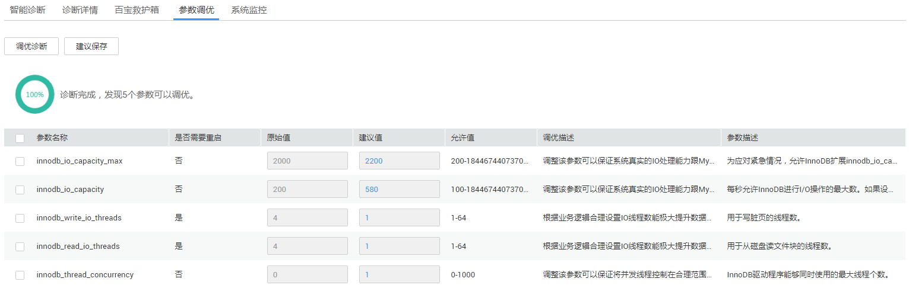

# 参数调优

## 操作场景

对于数据库实例而言，不合适的参数值会导致实例性能问题或应用报错。根据实例性能指标的运行情况，云DBA为您提供了一些重要参数的优化建议，以减少您在设置参数时的疑虑，帮助您提高实例性能。

## 操作步骤

1.  [登录云数据库](https://support.huaweicloud.com/qs-rds/rds_login.html)。
2.  在“实例管理“页面，选择目标实例，单击实例名称，进入实例的“基本信息“页签。
3.  在左侧导航栏选择“云DBA“，在“参数调优“页签下，单击“调优诊断“。

    云DBA会根据实例运行情况，对影响实例性能指标的参数提供建议值。例如，innodb\_io\_capacity的原始值为200，经过调优诊断，建议值为580。

    **图 1**  参数调优  
    

4.  如需按照调优后的建议值修改参数值，勾选目标参数前的复选框，单击“建议保存“。
    -   确定修改，请在弹出框中单击“确定“。

        修改成功后，新的参数值会立即生效，您可在该实例的“参数修改“页面，单击“参数修改历史“，查看参数修改详情。

    -   暂不修改，请在弹出框中单击“取消“。

