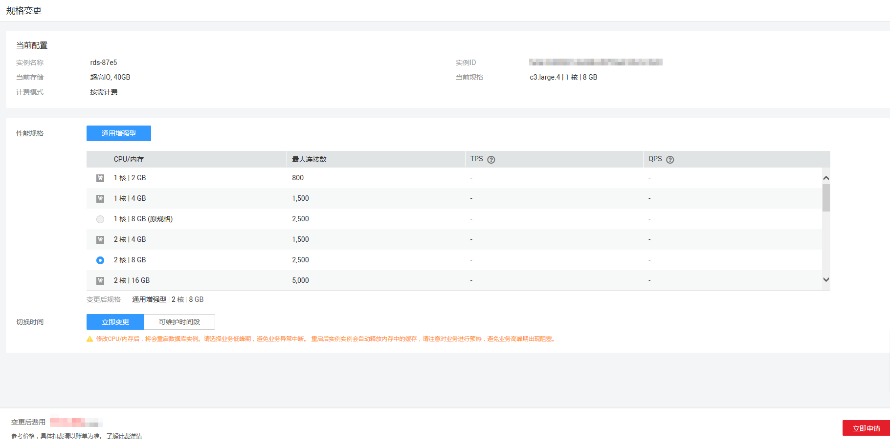

# 变更实例的CPU和内存规格

## 操作场景

CPU/内存规格可根据业务需要进行变更，当实例的状态由“规格变更中“变为“正常“，则说明变更成功。

存储空间扩容，请参见[扩容磁盘](扩容磁盘.md)。

> **说明：**   
>-   账户余额大于等于0元，才可变更规格。  
>-   当实例进行CPU/内存规格变更时，该实例不可被删除。  
>-   超高性能型规格的实例，暂不支持变更实例的CPU和内存规格。  
>-   MySQL金融版数据库实例，暂不支持变更实例的CPU和内存规格。  

## 操作步骤

1.  登录管理控制台。
2.  单击管理控制台左上角的，选择区域和项目。

    您可选择自己的专属计算集群（Dedicated Computing Cluster，简称DCC）。

3.  选择“数据库  \>  关系型数据库“，进入关系型数据库信息页面。
4.  在“实例管理”页面，选择相应的实例，单击“扩容“，进入“服务选型”页面。您也可以通过单击目标实例名称，进入“基本信息”页面，单击“规格变更”，进入“服务选型”页面。
5.  在“服务选型“页面的“CPU/内存扩容“页签，选择所需修改的性能规格，单击“立即申请“。

    **图 1**  规格变更  
    

    用户可以根据自己的需求缩小或扩大规格。

    目前，华为云关系型数据库只支持同类型的规格变更。例如，原实例为标准型，只支持变更为标准型的其他规格。

    规格扩容时会提示“修改CPU/内存后，将会重启数据库实例。请选择业务低峰期，避免业务异常中断”。主备实例进行扩容时，采用主备倒换的方式来进行的。整个过程的中断时间取决于主备倒换的时长，和重启时长没有关系。

    对于在DCC上的实例，性能规格只支持标准型。

6.  进行规格确认。
    -   如需重新选择，单击“上一步”，回到上个页面，修改规格。
    -   按需计费模式的实例，单击“提交“，提交变更。

        由规格变更产生的费用，您可在“费用中心  \>  消费明细“中查看费用详情。

    -   包年/包月模式的实例
        -   如果是缩小规格，单击“提交“，提交变更。

            由缩小规格产生的退款，系统会自动退还至客户账户，您可在“费用中心  \>  我的订单“中查看费用详情。

        -   如果是扩大规格，单击“去支付“，跳转至支付页面，支付成功后，才可进行规格变更。

7.  查看变更结果。

    在实例管理页面，可以看到实例状态为“规格变更中“。稍后在对应的“基本信息“页面，查看实例规格，检查修改是否成功。此过程需要5～15分钟。

    > **注意：**   
    >-   RDS MySQL实例变更成功后，系统将根据新内存大小，调整如下参数的值：“innodb\_buffer\_pool\_size“、“innodb\_log\_buffer\_size“、“innodb\_log\_files\_in\_group“、“max\_connections“、“innodb\_page\_cleaners“、“innodb\_buffer\_pool\_instances“、“threadpool\_size“、“slave\_parallel\_workers“和“back\_log“\(仅5.7版本\)。  
    >-   RDS PostgreSQL实例变更成功后，系统将根据新内存大小，调整如下参数的值：“shared\_buffers、max\_connections“、“maintenance\_work\_mem“和“effective\_cache\_size“。  
    >-   RDS SQL Server规格变更后，数据库参数“max server memory“自动调整。max server memory值建议设置为内存大小-520MB，例如：您的内存为1GB，那么，该值设置为1GB-520MB，即504MB。  

