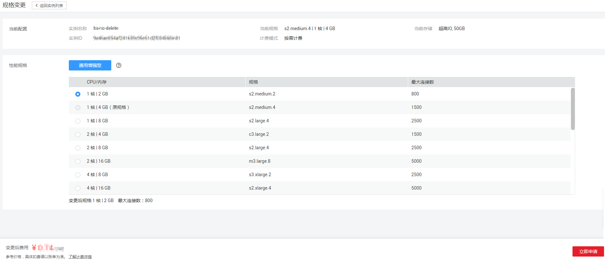

# 变更实例的CPU和内存规格

## 操作场景

CPU/内存规格可根据业务需要进行变更，当实例的状态由“规格变更中“变为“正常“，则说明变更成功。

> **说明：**   
>-   账户余额大于等于0元，才可变更规格。  
>-   当实例进行CPU/内存规格变更时，该实例不可被删除。  

## 操作步骤

1.  登录管理控制台。
2.  单击管理控制台左上角的，选择区域和项目。
3.  选择“数据库  \>  云数据库 RDS“。进入云数据库 RDS信息页面。
4.  在“实例管理”页面，选择目标实例，单击“操作“列的“更多  \>  规格变更“，进入“规格变更”页面。

    您也可以通过单击目标实例名称，进入“基本信息”页面，在“数据库信息“模块的“性能规格“处，单击“规格变更”，进入“规格变更”页面。

5.  在“规格变更“页面，选择所需修改的性能规格，单击“立即申请“。

    **图 1**  规格变更  
    

    规格扩容时会提示“修改CPU/内存后，将会重启数据库实例。请选择业务低峰期，避免业务异常中断。”

    对于在DCC上的实例，性能规格只支持通用增强型。

6.  进行规格确认。
    -   如需重新选择，单击“上一步”，回到上个页面，修改规格。
    -   按需计费模式的实例，单击“提交“，提交变更。

        由规格变更产生的费用，您可在“费用中心  \>  消费明细“中查看费用详情。

    -   包年/包月模式的实例
        -   如果是缩小规格，单击“提交“，提交变更。

            由缩小规格产生的退款，系统会自动退还至客户帐户，您可在“费用中心  \>  我的订单“中查看费用详情。

        -   如果是扩大规格，单击“去支付“，跳转至支付页面，支付成功后，才可进行规格变更。

7.  查看变更结果。

    任务提交成功后，单击“返回实例列表“，在实例管理页面，可以看到实例状态为“规格变更中“。稍后在对应的“基本信息“页面，查看实例规格，检查修改是否成功。此过程需要5～15分钟。

    > **须知：**   
    >RDS SQL Server规格变更后，数据库参数“max server memory“自动调整。max server memory值建议设置为内存大小-520MB，例如：您的内存为1GB，即1024MB，那么，该值设置为1GB-520MB，即504MB。  

