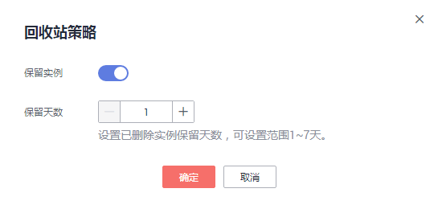

# 回收站

华为云关系型数据库支持将退订后的包年包月实例和删除的按需实例，加入回收站管理。您可以在回收站中重建实例恢复数据。

回收站策略机制默认开启，保留天数为1天，该功能免费。

## 设置回收站策略

> **须知：**   
>修改回收站保留天数，仅对修改后新进入回收站的实例生效，对于修改前已经存在的实例，仍保持原来的回收策略，请您谨慎操作。  

1.  登录管理控制台。
2.  单击管理控制台左上角的，选择区域和项目。
3.  选择“数据库  \>  云数据库 RDS“。进入云数据库 RDS信息页面。
4.  在“回收站”页面，单击“回收站策略”，如需开启回收站策略，单击-15.png)。如[图1](#rds_mysql_recycle_fig116532320123)所示修改回收站策略。设置已删除实例保留天数，可设置范围为1\~7天。单击“确定“，完成设置。

    **图 1**  设置回收站策略  
    

## 关闭回收站策略

> **须知：**   
>若用户关闭回收策略，则回收站中的所有实例数据备份全部释放，不可恢复，请您谨慎操作。  

1.  登录管理控制台。
2.  单击管理控制台左上角的，选择区域和项目。
3.  选择“数据库  \>  云数据库 RDS“。进入云数据库 RDS信息页面。
4.  在“回收站”页面，单击“回收站策略”，单击，关闭回收站策略。

## 重建实例

在回收站保留期限内的实例可以通过重建实例恢复数据。

1.  登录管理控制台。
2.  单击管理控制台左上角的，选择区域和项目。
3.  选择“数据库  \>  云数据库 RDS“。进入云数据库 RDS信息页面。
4.  在“回收站”页面，在实例列表中找到需要恢复的目标实例，单击操作列的“重建“。
5.  在“重建新实例“页面，选填配置后，提交重建任务，具体可参考恢复到新实例操作。

