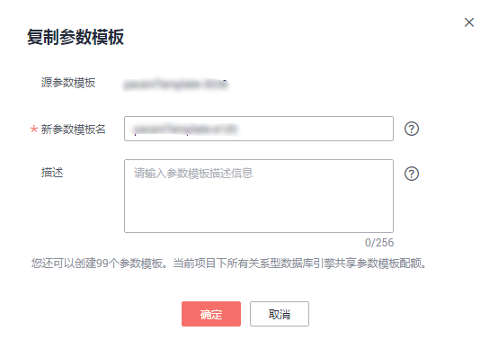

# 复制参数模板

## 操作场景

您可以复制您创建的自定义数据库参数模板。当您已创建一个数据库参数模板，并且想在新的数据库参数模板中包含该组中的大部分自定义参数和值时，复制参数模板是一个方便的解决方案。您还可以导出某数据库实例应用的参数列表，生成一个新的参数模板，供您后期使用。

复制数据库参数模板之后，您应至少等待5分钟，再创建使用该数据库参数模板作为默认参数模板的第一个数据库实例。

您无法复制默认参数模板。不过，您可以创建基于默认参数模板的新参数模板。

## 操作步骤

1.  登录管理控制台。
2.  单击管理控制台左上角的，选择区域和项目。
3.  选择“数据库  \>  云数据库 RDS“。进入云数据库 RDS信息页面。
4.  在“参数模板管理”页面的“自定义”页签，选择需要复制的参数模板，单击“复制“。

    您还可以在“实例管理“页面，单击实例名称，在左侧导航栏，单击“参数修改“，单击“导出“，将该实例对应参数列表导出并生成一个参数模板，供您后期使用。

    > **说明：**   
    >为了使您的参数模板可应用于所有类型的实例，并且保证数据库正常启动，主实例和只读实例导出的参数模板中“innodb\_flush\_log\_at\_trx\_commit“和“sync\_binlog“默认值为1。  

5.  在弹出框中，填写新参数模板名称和描述，单击“确定”。

    **图 1**  复制参数模板  
    

    -   参数模板名称长度在1\~64个字符之间，区分大小写，可包含字母、数字、中划线、下划线或句点，不能包含其他特殊字符。
    -   参数模板的描述长度不能超过256个字符，且不能包含回车和\>!<"&'=特殊字符。

    创建完成后，会生成一个新的参数模板，您可在参数模板列表中对其进行管理。

