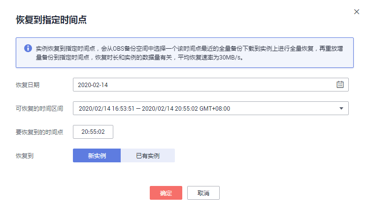

# 将数据库实例恢复到指定时间点

## 操作场景

华为云关系型数据库服务支持使用已有的自动备份，恢复实例数据到指定时间点。

云数据库 MySQL支持将备份恢复到新实例，也支持恢复到已有实例。

您可根据业务需要，对单个实例进行恢复，也可对实例进行批量恢复。

## 限制条件

-   如果您要将数据库备份恢复到新实例：
    -   数据库引擎、数据库版本和数据库端口，与原实例相同，不可修改。
    -   数据库密码需重新设置。

-   账户余额大于等于0元，才可恢复到新实例。

    > **须知：**   
    >请勿在MySQL实例的生命周期内执行“reset master”命令，以免造成恢复到指定时间点功能异常。  

-   RDS for MySQL不支持将备份恢复到原实例，如有需要，请先将备份恢复到新实例或已有实例，然后将该实例的IP修改为原实例的IP。

## 对当前实例恢复操作

1.  登录管理控制台。
2.  单击管理控制台左上角的，选择区域和项目。
3.  选择“数据库  \>  云数据库 RDS“。进入云数据库 RDS信息页面。
4.  在“实例管理“页面，选择指定的实例，单击实例名称。
5.  在左侧导航栏中选择“备份恢复“页签，单击“恢复到指定时间点“。
6.  选择需要恢复的时间区间，选择或输入该恢复时间区间内的一个恢复时间点，选择恢复方式，单击“确定”。

    > **须知：**   
    >RDS for MySQL不支持将备份恢复到原实例，如有需要，请先将备份恢复到新实例或已有实例，然后将该实例的IP修改为原实例的IP。  

    -   恢复到新实例

        跳转到“恢复到新实例”的服务选型页面：

        -   数据库引擎、数据库版本和数据库端口，与原实例相同，不可修改。
        -   数据库密码需重新设置。
        -   其他参数，用户可修改。

    -   恢复到已有实例

        > **须知：**   
        >-   恢复到已有实例会导致实例数据被覆盖，且恢复过程中实例将不可用。  
        >-   只可选择与原实例相同VPC，相同引擎，相同版本或高版本的实例。金融版实例只能恢复到金融版实例。  
        >-   请确保目标实例的存储空间大于或等于当前实例的存储空间，否则会导致任务下发失败。  

        选择目标实例，单击“确定“。

        若您已开启高危操作保护，在“身份验证”弹出框中单击“免费获取验证码“，正确输入验证码并单击“确定“，页面自动关闭。

        通过进行二次认证再次确认您的身份，进一步提高帐号安全性，有效保护您安全使用云产品。关于如何开启操作保护，具体请参考《统一身份认证服务用户指南》的内容。

        **图 1**  恢复到已有实例  
        

7.  查看恢复结果。

    -   恢复到新实例

        为用户重新创建一个和该备份数据相同的实例。可看到实例由“创建中“变为“正常“，说明恢复成功。

        恢复成功的新实例是一个独立的实例，与原有实例没有关联。如需使用只读实例，请重新在该实例上进行创建。

    -   恢复到已有实例

        在“实例管理”页面，可查看该实例下所有实例状态为“恢复中”，恢复完成后，实例状态由“恢复中”变为“正常”。

    创建或恢复完成后，系统会自动执行一次全量备份。

## 批量恢复

> **说明：**   
>具有批量还原操作权限的用户，才可以批量恢复到指定时间点。您可联系华为云客服人员申请。  

1.  登录管理控制台。
2.  单击管理控制台左上角的，选择区域和项目。
3.  选择“数据库  \>  云数据库 RDS“。进入云数据库 RDS信息页面。
4.  在“实例管理“页面，勾选目标实例，单击实例列表上方的“恢复“。

    > **说明：**   
    >仅RDS for MySQL实例支持批量恢复。如果您选择了非MySQL引擎的实例，不能进行该操作。  

5.  在弹出框中确认需要恢复的实例，设置恢复时间点，您可以设置统一恢复时间，也可以单独设置每个实例的恢复时间点。

    **图 2**  批量恢复  
    

6.  单击“确定“，提交批量恢复任务。
7.  若您已开启高危操作保护，在“身份验证”弹出框中单击“免费获取验证码“，正确输入验证码并单击“确定“，页面自动关闭。

    通过进行二次认证再次确认您的身份，进一步提高帐号安全性，有效保护您安全使用云产品。关于如何开启操作保护，具体请参考《统一身份认证服务用户指南》的内容。

