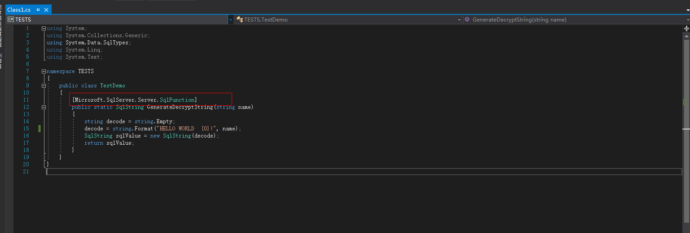
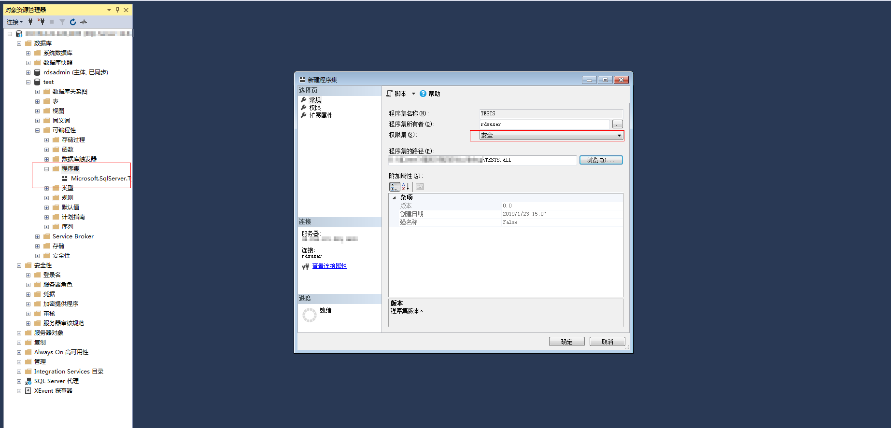
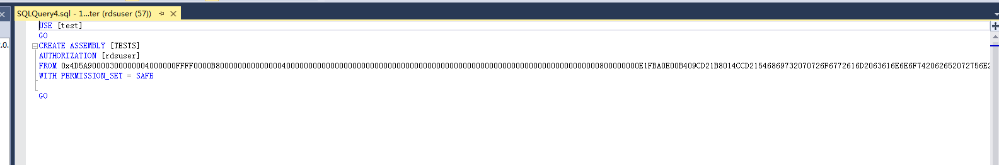
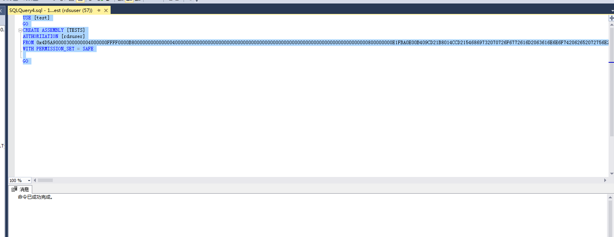
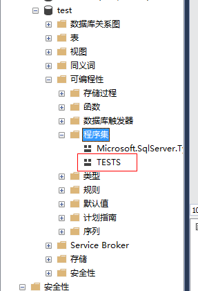

# 开启CLR集成功能

## 操作背景

公共语言运行库（CLR）是Microsoft .NET Framework 的核心，为所有**.NET Framework**代码提供执行环境。在CLR中运行的代码称为托管代码。CLR提供执行程序所需的各种函数和服务，包括实时\(JIT\)编译、分配和管理内存、强制类型安全性、异常处理、线程管理和安全性。

SQL CLR（SQL Common Language Runtime）是自SQL Server 2005才出现的新功能，它将**.NET Framework**中的CLR服务注入到SQL Server中，让SQL Server的部分数据库对象可以使用**.NET Framework**的编程语言开发（当前只支持VB.NET和C\#），包括预存程序、用户自定义函数、触发程序、用户自定义类型以及用户自定义汇总函数等功能。但是要想执行CLR代码，首先要开启CLR特性。

更多介绍请参见[Microsoft SQL Server官网公共语言运行时 \(CLR\) 集成编程概念](https://docs.microsoft.com/zh-cn/sql/relational-databases/clr-integration/common-language-runtime-clr-integration-programming-concepts?view=sql-server-2014)。

CLR集成安全性相关内容请参见[Microsoft SQL Server官网CLR 集成安全性](https://docs.microsoft.com/zh-cn/sql/relational-databases/clr-integration/security/clr-integration-security?view=sql-server-2014)。

## 前提条件

云数据库SQL Server仅支持创建安全模式的程序集。

## 启用CLR操作步骤

1.  登录管理控制台。
2.  单击管理控制台左上角的，选择区域和项目。
3.  选择“数据库  \>  云数据库 RDS“。进入云数据库 RDS信息页面。
4.  在“实例管理“页面，选择指定的实例，单击实例名称，进入实例的基本信息页面。
5.  在左侧导航栏中选择“参数修改“，在“参数“页签搜索框中输入“clr enabled“和“clr strict security“进行搜索。

    > **说明：**   
    >-   “clr enabled“选项。可以使用“clr enabled“选项指定SQL Server是否可以运行用户程序集。  
    >-   “clr strict security“为SQL Server 2017特有参数。该选项控制 SQL Server中SAFE、EXTERNAL ACCESS、UNSAFE 权限的解释。当值为1时，导致数据库引擎忽略程序集上的 PERMISSION\_SET 信息，并始终将其解释为 UNSAFE。有关详细信息，请参阅[MicrosoftSQL Server官网CLR严格安全性](https://docs.microsoft.com/zh-cn/sql/database-engine/configure-windows/clr-strict-security?view=sql-server-2017)。  

6.  设置“clr enabled“参数值。

    将参数值设置为“1”，单击“保存“，在弹出框中单击“是“保存本次修改，开启CLR功能。

    > **说明：**   
    >-   “clr enabled“参数值为“1”，表示开启CLR功能；参数值为“0”，表示关闭CLR功能。  
    >-   “clr strict security“参数值默认为“1”，无需设置。SQL Server 2017只需要设置“clr enabled“参数值，开启CLR功能。  

7.  修改完成后可以在“参数修改历史“页签下查看“clr enabled“  参数已经修改成功。

## 创建安全模式CLR程序集

设计程序集时应考虑的下列因素：

-   打包程序集
-   管理程序集安全性
-   对程序集的限制

使用数据库实例创建安全模式CLR程序集可参见[官方文档设计程序集](https://docs.microsoft.com/zh-cn/sql/relational-databases/clr-integration/assemblies-designing?view=sql-server-2014)。

## 示例：SQL Server添加c\#CLR程序集的使用方法

SQL Server提供程序集，可以更加便捷的操作数据库数据。

> **说明：**   
>当您将数据库实例恢复到新实例或已有实例，“clr enabled“参数默认不开启，需要重新开启，才可以正常使用CLR集成功能。  

## 操作步骤

1.  创建c\#函数，编译出一个SQL Server的dll。

    **图 1**  c\#函数代码  
    

    > **须知：**   
    >创建函数详细说明请参见[官方文档](https://docs.microsoft.com/zh-cn/sql/relational-databases/clr-integration-database-objects-user-defined-functions/clr-user-defined-functions?view=sql-server-2014)。  

2.  使用**SSMS**等工具连接数据库。

    **图 2**  连接数据库  
    

3.  选择需要创建程序集的数据库，添加对应的程序集。

    > **说明：**   
    >-   只能创建safe模式（权限集显示为安全），不能创建其他模式。  
    >-   **dll**文件会以十六进制的形式存入。如[图4](#fig92191121274)所示。  

    **图 3**  新建程序集  
    

    **图 4**  dll文件  
    

4.  执行程序，如[图5](#fig1780316197333)所示表示执行成功。程序集中新增一个TESTS程序集，如[图6](#fig17182124911387)所示。

    **图 5**  执行结果  
    

    **图 6**  TESTS程序集  
    

