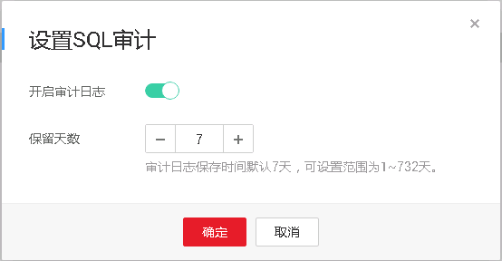

# 开启SQL审计日志

当您开通SQL审计功能，系统会将所有的SQL操作记录下来存入日志文件，方便用户[下载](下载SQL审计日志.md)并查询。

RDS for MySQL默认关闭SQL审计功能，打开可能会有一定的性能影响，本章节指导您如何打开、修改或关闭SQL审计日志。

> **说明：**   
>仅如下版本支持SQL审计功能，如果您的数据库引擎版本较低，请提交工单申请升级到最新版本：  
>-   MySQL 5.6.43及其以上版本  
>-   MySQL 5.7.23及其以上版本  
>-   MySQL  8.0版本  

## 操作步骤

1.  登录管理控制台。
2.  单击管理控制台左上角的，选择区域和项目。
3.  选择“数据库  \>  云数据库 RDS“。进入云数据库 RDS信息页面。
4.  在“实例管理”页面，选择目标实例，单击实例名称，进入实例的“基本信息“页签。
5.  在左侧导航栏单击“SQL审计“，单击“设置SQL审计“，在弹出框中设置SQL审计日志保留策略，单击“确定“，保存设置策略。

    **开启或修改SQL审计**：

    -   单击，开启SQL审计日志保留策略。
    -   保留天数默认为7天，可设置范围为1\~732天。

        

    **关闭SQL审计：**

    单击，关闭该SQL审计。

    -   勾选同意删除审计日志。

        > **须知：**   
        >SQL审计关闭后，所有审计日志都会被立即删除，不可恢复，请您谨慎操作。  

    -   不勾选，SQL审计关闭前的审计日志会被继续保留，同时会继续收取一定的费用。

