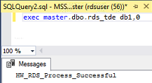

# 开启TDE加密功能

透明数据加密（Transparent Data Encryption，简称TDE），通过证书加密数据文件和备份文件，可进行实时的io加密/解密，能有效保护数据库及数据文件的安全。

> **说明：**   
>目前，TDE功能仅支持以下版本的主备实例：  
>-   2008 R2 企业版  
>-   2012企业版  
>-   2014企业版  
>-   2016企业版  

## 使用限制

1.  如果需要通过加密的bak文件在线下恢复数据，请先关闭该数据库的TDE加密功能，然后创建该数据库的手动备份，获取备份文件并通过备份文件恢复数据。云数据库RDS服务暂不提供TDE证书下载。
2.  开启TDE功能后，可提高数据安全性，但同时会影响访问加密数据库的读写性能。请谨慎选择开启TDE功能。
3.  线下加密的数据库无法直接迁移上云数据库SQL Server实例，需要先关闭线下数据库的TDE功能，再进行迁移。
4.  已开启实例级别TDE功能的实例无法使用“恢复到已有实例”功能。
5.  在开启实例级别TDE功能、执行存储过程rds\_tde、开启/关闭数据库级别TDE功能的过程中，**不允许**进行以下操作：
    -   从数据库中的文件组中删除文件
    -   删除数据库
    -   使数据库脱机
    -   分离数据库
    -   将数据库或文件组转换为READ ONLY状态
    -   使用ALTER DATABASE命令
    -   创建快照
    -   启动数据库或数据库文件备份
    -   启动数据库或数据库文件还原

## 开启实例级别的TDE功能

1.  [登录云数据库](https://support.huaweicloud.com/qs-rds/rds_login.html)。
2.  在“实例管理“页面，单击目标实例名称，进入实例的“基本信息“页面。
3.  在“数据库信息“模块，单击“TDE状态“后的，开启TDE功能。

    > **说明：**   
    >实例级别的TDE功能一旦开启，将不允许关闭。  

    **图 1**  开启实例级别的TDE功能  
    

## 开启数据库级别的TDE功能

> **说明：**   
>在开启数据库级别的TDE功能之前，请确保已成功开启实例级别的TDE功能。  

1.  连接目标实例。

    可参考[通过公网连接SQL Server实例](https://support.huaweicloud.com/qs-rds/rds_03_0007.html)、[通过内网连接SQL Server实例](https://support.huaweicloud.com/qs-rds/rds_03_0013.html)及[通过DAS连接SQL Server实例](https://support.huaweicloud.com/qs-rds/rds_03_0014.html)。

2.  通过**rds\_tde**存储过程开启、关闭或查询TDE加密功能。

    **exec master.dbo.rds\_tde** _DatabaseName_,_TDE\_Action_

    -   _DatabaseName_：目标数据库名，取值可为null。
    -   _TDE\_Action_：
        -   取值为“-1”，表示查询目标库加密信息。

            如果“_DatabaseName_”取值为null，则返回所有库的加密状态。

        -   取值为“0”，表示关闭目标库TDE加密功能。
        -   取值为“1”，表示开启目标库TDE加密功能。

    1.  开启数据库db1的TDE加密功能：

        **exec master.dbo.rds\_tde db1, 1**

        **图 2**  开启数据库TDE加密  
        

    2.  关闭数据库db1的TDE加密功能：

        **exec master.dbo.rds\_tde db1, 0**

        **图 3**  关闭数据库TDE加密  
        

    3.  查询数据库db1的TDE加密状态：

        **exec master.dbo.rds\_tde db1, -1**

        **图 4**  开启状态  
        

        **图 5**  关闭状态  
        

    4.  查询所有数据库的TDE加密状态：

        **exec master.dbo.rds\_tde null, -1**

        **图 6**  查询所有库状态  
        

