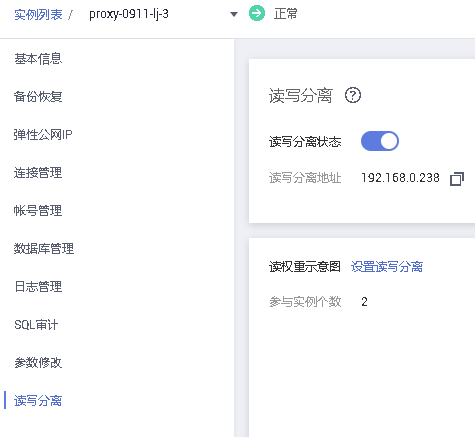

# 开通读写分离

读写分离是指通过一个读写分离的连接地址实现读写请求的自动转发。通过RDS的读写分离连接地址，写请求自动访问主实例，应用直连即可实现自动读写分离。本文将介绍如何开通读写分离功能。

## 前提条件

-   如需开通读写分离权限，请提交工单申请，工作人员会为您添加权限。
-   仅支持MySQL主备实例（DEC除外），且该主备实例至少存在一个只读实例开启读写分离。

## 操作步骤

1.  登录管理控制台。
2.  单击管理控制台左上角的，选择区域和项目。
3.  选择“数据库  \>  云数据库 RDS“。进入云数据库 RDS信息页面。
4.  在实例列表中，单击目标实例的名称，进入实例的“基本信息“页面。
5.  在左侧导航栏中，单击“读写分离“。

    您还可以在实例的“基本信息“页面，单击“连接信息“模块“读写分离地址“后的“申请“，跳转到“读写分离“页面。

    **图 1**  开启读写分离入口  
    

6.  在“读写分离“页面单击“读写分离状态“后的。
7.  在“开启读写分离“弹出框中，单击“是“，开启实例的读写分离功能。
    -   读写分离具备连接保持、读写分离能力，响应延时会增加20%以上。开启读写分离后，将新增1个读写分离连接地址，请将应用连接切换到新地址。
    -   读写分离地址：通过读写分离地址连接数据库，可实现读写分离功能。

        该读写分离地址与实例的内网IP地址处于同一VPC和子网，且与实例的内网IP地址并存，互不影响。

    -   延时阈值：对于成功开启读写分离功能的实例，您可以设置其延时阈值。具体操作请参见[设置延时阈值和读权重分配](设置延时阈值和读权重分配.md)。
    -   读权重分配：对于成功开启读写分离功能的实例，您可以设置其主实例和只读实例的权重。具体操作请参见[设置延时阈值和读权重分配](设置延时阈值和读权重分配.md)。

        **图 2**  读写分离开启状态  
        

