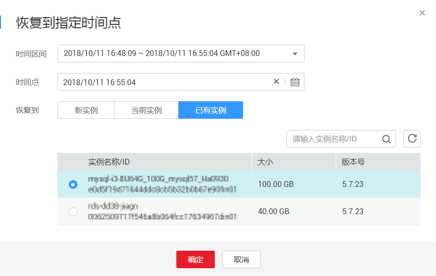

# 恢复备份

## 操作场景

华为云关系型数据库服务支持使用已有的自动和手动备份恢复实例数据，可选择恢复到当前实例或恢复到新实例，将实例恢复到备份被创建时的状态。

账户余额大于等于0元，才可恢复到新实例。

## 操作步骤

1.  登录管理控制台。
2.  单击管理控制台左上角的，选择区域和项目。

    您可选择自己的专属计算集群（Dedicated Computing Cluster，简称DCC）。

3.  选择“数据库  \>  关系型数据库“，进入关系型数据库信息页面。
4.  在“备份管理”页面，选择需要恢复的备份，单击“恢复“。

    您也可以在“备份管理  \>  \>全量备份“页签下，单击操作列中的“恢复“。

    根据该手动备份所在实例是否存在，进行操作：

    -   存在，继续[5](#l02b85d494b33478aa0354867be338dda)。
    -   不存在，则不可恢复到当前实例，需跳过[5](#l02b85d494b33478aa0354867be338dda)，执行[6](#li24665924155622)。

5.  选择需要的恢复方式，单击“确定”。
    -   新实例

        跳转到“恢复到新实例”的服务选型页面，为用户重新创建一个和该备份数据相同的实例。恢复成功的新实例是一个独立的实例，与原有实例没有关联。如果需要使用只读实例，请重新创建。

        -   数据库引擎和数据库版本，与原实例相同，数据库端口默认为3306，以上参数皆不可重置。
        -   其他参数默认，用户需设置，请参见[购买实例](https://support.huaweicloud.com/qs-rds/zh-cn_topic_0046585334.md)。
        -   新实例创建成功后，系统会自动执行一次全量备份。

    -   当前实例

        > **注意：**   
        >恢复到当前实例会导致实例数据被覆盖，且恢复过程中实例将不可用。  

        在“实例管理”页面，可查看该实例状态为“恢复中”。无需执行[6](#li24665924155622)。

        对于开启自动备份策略的实例，恢复成功后，会执行一次全量备份。 反之则不会执行全量备份。

    -   已有实例

        > **注意：**   
        >-   恢复到已有实例会导致实例数据被覆盖，且恢复过程中实例将不可用。  
        >-   请确保目标实例的存储空间不小于当前实例，否则会导致任务下发失败。  

        选择目标实例，单击“确定“。

        **图 1**  恢复到已有实例  
        

        对于开启自动备份策略的实例，恢复成功后，会执行一次全量备份。 反之则不会执行全量备份。

6.  恢复到新实例。

    跳转到“恢复到新实例”的服务选型页面，为用户重新创建一个和该备份数据相同的实例。恢复成功的新实例是一个独立的实例，与原有实例没有关联。如果需要使用只读实例，请在新实例上重新创建。

    -   数据库引擎和数据库版本，与原实例相同，数据库端口默认为3306，以上参数皆不可重置。
    -   其他参数默认，用户需设置，请参见[购买实例](https://support.huaweicloud.com/qs-rds/zh-cn_topic_0046585334.md)。

    新实例创建成功后，系统会自动执行一次全量备份。

