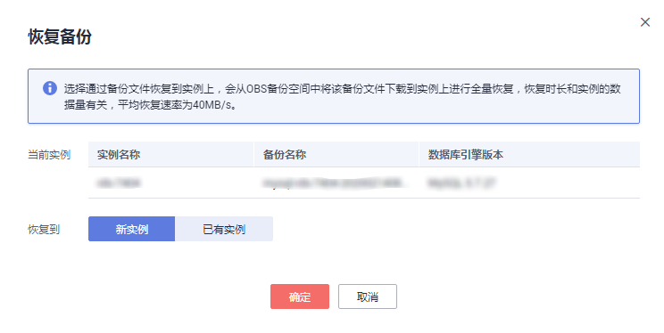

# 恢复备份

## 操作场景

华为云关系型数据库服务支持使用已有的自动和手动备份恢复实例数据，可选择恢复到当前实例或恢复到新实例，将实例恢复到备份被创建时的状态。

账户余额大于等于0元，才可恢复到新实例。

## 操作步骤

1.  [登录云数据库](https://support.huaweicloud.com/qs-rds/rds_login.html)。
2.  在左侧导航栏单击“备份管理”，选择需要恢复的备份，单击操作列的“恢复“。

    您也可在“实例管理“页面，单击指定的实例名称，在左侧导航栏单击“备份恢复“，在“全量备份”页签下单击目标备份对应的操作列中的“恢复“。

3.  选择需要的恢复方式，单击“确定”。
    -   新实例

        跳转到“恢复到新实例”的服务选型页面：

        -   数据库引擎和数据库版本，与原实例相同，数据库端口为默认值3306，以上参数皆不可重置。
        -   存储空间大小默认和原实例相同，且必须大于或等于原实例存储空间大小，数据库密码需重新设置。
        -   其他参数默认，用户需设置，请参见[购买实例](https://support.huaweicloud.com/qs-rds/zh-cn_topic_0046585334.md)。
        -           -           -   
    -   当前实例

        > **注意：**   
        >-   如果备份所在的数据库实例已被删除，则不可恢复到当前实例。  
        >-   恢复到当前实例会导致实例数据被覆盖，且恢复过程中实例将不可用。  

    -   已有实例

        > **注意：**   
        >-   如果备份所在的数据库实例已被删除，则不可恢复到已有实例。  
        >-   恢复到已有实例会导致实例数据被覆盖，且恢复过程中实例将不可用。  
        >-   请确保目标实例的存储空间不小于当前实例，否则会导致任务下发失败。  

        选择目标实例，单击“确定“。

        **图 1**  恢复到已有MySQL实例  
        

        对于开启自动备份策略的实例，恢复成功后，会执行一次全量备份。 反之则不会执行全量备份。

4.  查看恢复结果。
    -   恢复到新实例

        为用户重新创建一个和该备份数据相同的实例。可看到实例由“创建中“变为“正常“，说明恢复成功。

        恢复成功的新实例是一个独立的实例，与原有实例没有关联。如需使用只读实例，请重新在该实例上进行创建。

        新实例创建成功后，系统会自动执行一次全量备份。

    -   恢复到当前实例

        在“实例管理”页面，可查看该实例下所有实例状态为“恢复中”，恢复完成后，实例状态由“恢复中”变为“正常”。

        对于开启自动备份策略的实例，恢复成功后，会执行一次全量备份。 反之则不会执行全量备份。

    -   恢复到已有实例

        在“实例管理”页面，可查看该实例下所有实例状态为“恢复中”，恢复完成后，实例状态由“恢复中”变为“正常”。

        对于开启自动备份策略的实例，恢复成功后，会执行一次全量备份。 反之则不会执行全量备份。

