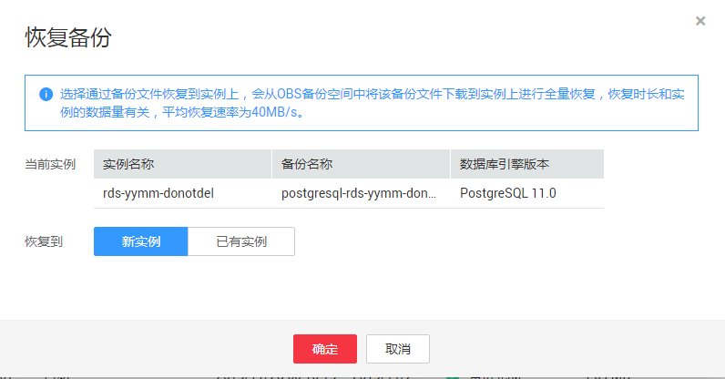

# 恢复备份

## 操作场景

华为云关系型数据库服务支持使用已有的自动备份和手动备份，将实例数据恢复到备份被创建时的状态。该操作恢复的为整个实例的数据。

账户余额大于等于0元，才可恢复到新实例。

## 操作步骤

1.  [登录云数据库](https://support.huaweicloud.com/qs-rds/rds_login.html)。
2.  在“实例管理“页面，选择目标实例，单击实例名称，进入实例的“基本信息“页签。
3.  在左侧导航栏单击“备份管理”，选择需要恢复的备份，单击操作列的“恢复“。

    您也可在“实例管理“页面，单击指定的实例名称，在左侧导航栏单击“备份恢复“，在“全量备份”页签下单击目标备份对应的操作列中的“恢复“。

4.  选择需要的恢复方式，单击“确定”。
    -   新实例

        跳转到“恢复到新实例”的服务选型页面：

        -   数据库引擎和数据库版本，与原实例相同，数据库端口默认为5432，以上参数皆不可重置。
        -   存储空间大小默认和原实例相同，且必须大于或等于原实例存储空间大小，数据库密码需重新设置。
        -   其他参数，用户需设置，请参见[购买实例](https://support.huaweicloud.com/qs-rds/zh-cn_topic_0046585384.html)。

    -   当前实例

        > **注意：**   
        >-   如果备份所在的数据库实例已被删除，则不可恢复到当前实例。  
        >-   恢复到当前实例会导致实例数据被覆盖，且恢复过程中实例将不可用。  

    -   已有实例

        > **注意：**   
        >-   如果目标数据库实例已被删除，则不可恢复到已有实例。  
        >-   恢复到已有实例会导致实例数据被覆盖，且恢复过程中实例将不可用。  
        >-   请确保目标实例的存储空间不小于当前实例，否则会导致任务下发失败。  

        选择目标实例，单击“确定“。

        **图 1**  恢复到PostgreSQL已有实例  
        

        对于开启自动备份策略的实例，恢复成功后，会执行一次全量备份。 反之则不会执行全量备份。

5.  查看恢复结果。
    -   恢复到新实例

        为用户重新创建一个和该备份数据相同的实例。可看到实例由“创建中“变为“正常“，说明恢复成功。

        恢复成功的新实例是一个独立的实例，与原有实例没有关联。如需使用只读实例，请重新在该实例上进行创建。

        新实例创建成功后，系统会自动执行一次全量备份。

    -   恢复到当前实例

        在“实例管理”页面，可查看目标实例状态为“恢复中”，恢复完成后，实例状态由“恢复中”变为“正常”。如果目标实例下存在只读实例，只读实例的状态与目标实例一致。

        对于开启自动备份策略的实例，恢复成功后，会执行一次全量备份。 反之则不会执行全量备份。

    -   恢复到已有实例

        在“实例管理”页面，可查看目标实例状态为“恢复中”，恢复完成后，实例状态由“恢复中”变为“正常”。如果目标实例下存在只读实例，只读实例的状态与目标实例一致。

        对于开启自动备份策略的实例，恢复成功后，会执行一次全量备份。 反之则不会执行全量备份。

