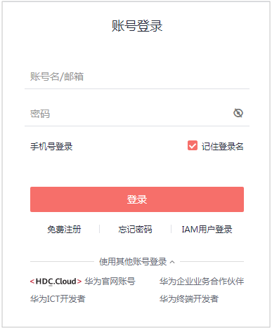

# 手动切换主备实例

## 操作场景

当华为云关系型数据库主备类型的实例创建成功后，系统会在同一区域内为该实例创建一个备实例。主备实例的数据会实时同步，用户仅能访问主实例数据，备实例仅作为备份形式存在。但当主实例出现故障时，可进行主备实例的切换，切换后原来的主实例会变成备实例，可实现机架级别的容灾。

> **说明：**   
>MySQL引擎的金融版实例暂不支持手动切换主备实例，仅支持故障导致的被动主备切换。  

## 前提条件

1.  实例运行正常。
2.  主备实例复制关系正常。
3.  开启操作保护的用户，在进行敏感操作时，通过进行二次认证再次确认您的身份，进一步提高帐号安全性，有效保护您安全使用云产品。关于如何开启操作保护，具体请参考《统一身份认证服务用户指南》的内容。

## 操作步骤

1.  [登录云数据库](https://support.huaweicloud.com/qs-rds/rds_login.html)。
2.  在“实例管理“页面，选择指定的主备实例，单击实例名称，进入实例的“基本信息“页面。
3.  在“基本信息”页面中“数据库信息“模块的“实例类型“处，单击。

    您也可以在“基本信息“页面，单击“实例拓扑图“模块的。进行主备切换。

4.  若您已开启操作保护，在“主备切换“弹框，单击“去验证“，跳转至验证页面，单击“免费获取验证码“，正确输入验证码并单击“认证“，页面自动关闭。
5.  在“主备切换“弹框，单击“确定“进行主备实例的切换。

    在“复制状态“为“正常“的情况下，复制时延大于300s，主备切换任务无法下发。

6.  单机转主备创建成功后，单击“返回实例列表”，用户可以在“实例管理“页面对其进行查看和管理。
    -   创建过程中，状态显示为“转主备中”。您可以通过“任务中心“查看详细进度。具体请参见[任务中心](null.md)。
    -   在实例列表的右上角，单击刷新列表，可查看到单机转主备完成后，实例状态显示为“正常“。“实例类型“显示为“主备“。

