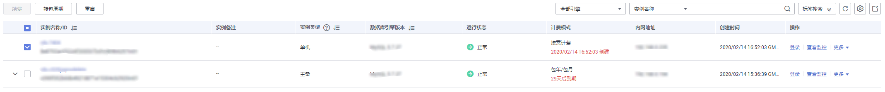

# 按需实例转包周期

## 操作场景

华为云关系型数据库服务支持单个按需实例转为包周期（包年/包月）实例，也支持批量按需实例转为包周期实例。由于按需资源费用较高，需要长期使用资源的按需用户可以选择对按需资源进行转包周期，继续使用这些资源的同时，享受包周期的优惠资费。

> **说明：**   
>运行状态为冻结、创建失败、规格变更中、扩容中的实例不支持按需实例转包周期。  

## 单个按需实例转包周期

1.  登录管理控制台。
2.  单击管理控制台左上角的，选择区域和项目。
3.  选择“数据库  \>  云数据库 RDS“。进入云数据库 RDS信息页面。
4.  在“实例管理”页面，选择目标实例，单击“操作“列的“更多  \>  转包周期“，进入“按需转包周期”页面。

    您也可以单击目标实例名称，进入实例的“基本信息”页面，在“计费信息“模块的“计费模式“处，单击“转包周期“，进入“按需转包周期”页面。

5.  选择续费规格，以月为单位，最小包周期时长为一个月。
    -   如果订单确认无误，单击“提交”，进入“支付”页面。
    -   如果暂不确定实例规格，单击“确认订单，暂不付款”，系统将保留您的订单，稍后可在“费用 \> 我的订单”中支付或取消订单。

6.  选择支付方式，单击“确认付款“。
7.  按需转包周期创建成功后，用户可以在“实例管理“页面对其进行查看和管理。

    在实例列表的右上角，单击刷新列表，可查看到按需转包周期完成后，实例状态显示为“正常“。“计费模式“显示为“包年/包月“。

## 按需实例批量转包周期

> **说明：**   
>仅“按需计费“模式的实例支持转包周期。  
>运行状态为“正常“或“异常“的实例才可转包周期。  

1.  登录管理控制台。
2.  单击管理控制台左上角的，选择区域和项目。
3.  选择“数据库  \>  云数据库 RDS“。进入云数据库 RDS信息页面。
4.  在“实例管理”页面，勾选目标实例，单击实例列表上方的“转包周期“，进入“按需转包周期”页面。

    **图 1**  批量转包周期  
    

5.  选择续费规格，以月为单位，最小包周期时长为一个月。
    -   如果订单确认无误，单击“提交”，进入“支付”页面。
    -   如果暂不确定实例规格，单击“确认订单，暂不付款”，系统将保留您的订单，稍后可在“费用 \> 我的订单”中支付或取消订单。

6.  选择支付方式，单击“确认付款“。
7.  按需转包周期创建成功后，用户可以在“实例管理“页面对其进行查看和管理。

    在实例列表的右上角，单击刷新列表，可查看到按需转包周期完成后，实例状态显示为“正常“。“计费模式“显示为“包年/包月“。

