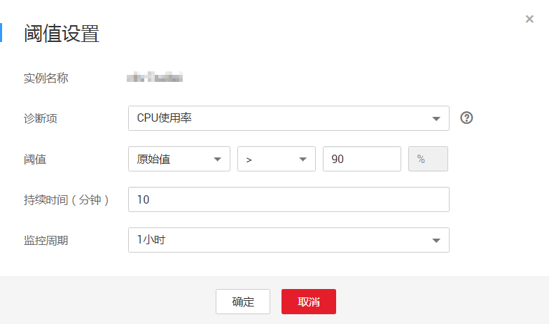

# 智能诊断

## 操作场景

云DBA的智能诊断综合了对近20项指标的诊断，诊断的过程中会实时跟进诊断的进度。

## 操作步骤

1.  登录管理控制台。
2.  单击管理控制台左上角的，选择区域和项目。

    您可选择自己的专属计算集群（Dedicated Computing Cluster，简称DCC）。

3.  选择“数据库  \>  关系型数据库“，进入关系型数据库信息页面。
4.  在“实例管理“页面，选择目标实例，单击实例名称，进入实例的“基本信息“页签。
5.  选择“云DBA  \>  智能诊断“页签，单击“智能诊断“，对您的实例进行全面诊断。

    智能诊断默认诊断该实例类型对应的所有指标，您可以根据需要选择诊断指标。

    **图 1**  智能诊断  
    

    不同类型的实例支持的智能诊断指标不同，详见[表1](#table123744065213)。

    **表 1**  诊断指标

    
    <table><thead align="left"><tr id="row023704065218"><th class="cellrowborder" valign="top" width="19.42%" id="mcps1.2.6.1.1">
实例类型

    </th>
    <th class="cellrowborder" valign="top" width="20.14%" id="mcps1.2.6.1.2">
单实例

    </th>
    <th class="cellrowborder" valign="top" width="20.79%" id="mcps1.2.6.1.3">
主备实例

    </th>
    <th class="cellrowborder" valign="top" width="19.89%" id="mcps1.2.6.1.4">
只读实例

    </th>
    <th class="cellrowborder" valign="top" width="19.759999999999998%" id="mcps1.2.6.1.5">
金融版实例

    </th>
    </tr>
    </thead>
    <tbody><tr id="row623718406522"><td class="cellrowborder" valign="top" headers="mcps1.2.6.1.1 ">
系统指标

    </td>
    <td class="cellrowborder" colspan="4" valign="top" headers="mcps1.2.6.1.2 mcps1.2.6.1.3 mcps1.2.6.1.4 mcps1.2.6.1.5 ">
内存使用率、网络使用率、CPU使用率、磁盘使用率

    </td>
    </tr>
    <tr id="row623744015528"><td class="cellrowborder" valign="top" width="19.42%" headers="mcps1.2.6.1.1 ">
数据库指标

    </td>
    <td class="cellrowborder" valign="top" width="20.14%" headers="mcps1.2.6.1.2 ">
引擎检查

    
密码过期

    
表状态

    
慢日志

    
死锁

    
缓存命中率

    
连接使用率

    
表碎片

    
自增检查

    </td>
    <td class="cellrowborder" valign="top" width="20.79%" headers="mcps1.2.6.1.3 ">
引擎检查

    
密码过期

    
表状态

    
慢日志

    
死锁

    
缓存命中率

    
连接使用率

    
表碎片

    
自增检查

    </td>
    <td class="cellrowborder" valign="top" width="19.89%" headers="mcps1.2.6.1.4 ">
引擎检查

    
表状态

    
慢日志

    
缓存命中率

    
连接使用率

    
表碎片

    
复制延迟

    </td>
    <td class="cellrowborder" valign="top" width="19.759999999999998%" headers="mcps1.2.6.1.5 ">
引擎检查

    
密码过期

    
表状态

    
慢日志

    
死锁

    
缓存命中率

    
连接使用率

    
表碎片

    
自增检查

    
切换日志

    </td>
    </tr>
    </tbody>
    </table>

6.  如果需要自定义设置诊断项的阈值，您可以单击“诊断设置“对诊断项的阈值进行设置。

    **图 2**  阈值设置  
    

    请参照[表2](#table1541614306561)对阈值参数进行设置：

    **表 2**  阈值设置

    
    <table><thead align="left"><tr id="row18400173019561"><th class="cellrowborder" valign="top" width="6.6293370662933695%" id="mcps1.2.8.1.1">
序号

    </th>
    <th class="cellrowborder" valign="top" width="13.17868213178682%" id="mcps1.2.8.1.2">
诊断项

    </th>
    <th class="cellrowborder" valign="top" width="34.17658234176582%" id="mcps1.2.8.1.3">
说明

    </th>
    <th class="cellrowborder" valign="top" width="13.408659134086593%" id="mcps1.2.8.1.4">
阈值范围

    </th>
    <th class="cellrowborder" valign="top" width="7.889211078892111%" id="mcps1.2.8.1.5">
单位

    </th>
    <th class="cellrowborder" valign="top" width="13.268673132686734%" id="mcps1.2.8.1.6">
持续出现时间

    </th>
    <th class="cellrowborder" valign="top" width="11.448855114488552%" id="mcps1.2.8.1.7">
诊断周期（分钟）

    </th>
    </tr>
    </thead>
    <tbody>
    <tr id="row24004305561"><td class="cellrowborder" valign="top" width="6.6293370662933695%" headers="mcps1.2.8.1.1 ">
1

    </td>
    <td class="cellrowborder" valign="top" width="13.17868213178682%" headers="mcps1.2.8.1.2 ">
死锁

    </td>
    <td class="cellrowborder" valign="top" width="34.17658234176582%" headers="mcps1.2.8.1.3 ">
达到指定阈值的死锁的数量。

    </td>
    <td class="cellrowborder" valign="top" width="13.408659134086593%" headers="mcps1.2.8.1.4 ">
0~500

    </td>
    <td class="cellrowborder" valign="top" width="7.889211078892111%" headers="mcps1.2.8.1.5 ">
次

    </td>
    <td class="cellrowborder" valign="top" width="13.268673132686734%" headers="mcps1.2.8.1.6 ">
/

    </td>
    <td class="cellrowborder" valign="top" width="11.448855114488552%" headers="mcps1.2.8.1.7 ">
60

    </td>
    </tr>
    <tr id="row5400153035611"><td class="cellrowborder" valign="top" width="6.6293370662933695%" headers="mcps1.2.8.1.1 ">
2

    </td>
    <td class="cellrowborder" valign="top" width="13.17868213178682%" headers="mcps1.2.8.1.2 ">
磁盘使用率

    </td>
    <td class="cellrowborder" valign="top" width="34.17658234176582%" headers="mcps1.2.8.1.3 ">
已使用磁盘空间占总磁盘空间指定阈值的比率。

    </td>
    <td class="cellrowborder" valign="top" width="13.408659134086593%" headers="mcps1.2.8.1.4 ">
0~100

    </td>
    <td class="cellrowborder" valign="top" width="7.889211078892111%" headers="mcps1.2.8.1.5 ">
%

    </td>
    <td class="cellrowborder" valign="top" width="13.268673132686734%" headers="mcps1.2.8.1.6 ">
1次

    </td>
    <td class="cellrowborder" valign="top" width="11.448855114488552%" headers="mcps1.2.8.1.7 ">
60

    </td>
    </tr>
    <tr id="row640013020568"><td class="cellrowborder" valign="top" width="6.6293370662933695%" headers="mcps1.2.8.1.1 ">
3

    </td>
    <td class="cellrowborder" valign="top" width="13.17868213178682%" headers="mcps1.2.8.1.2 ">
表碎片

    </td>
    <td class="cellrowborder" valign="top" width="34.17658234176582%" headers="mcps1.2.8.1.3 ">
表碎片空间占总磁盘空间指定阈值的比率。

    </td>
    <td class="cellrowborder" valign="top" width="13.408659134086593%" headers="mcps1.2.8.1.4 ">
0~100

    </td>
    <td class="cellrowborder" valign="top" width="7.889211078892111%" headers="mcps1.2.8.1.5 ">
%

    </td>
    <td class="cellrowborder" valign="top" width="13.268673132686734%" headers="mcps1.2.8.1.6 ">
1次

    </td>
    <td class="cellrowborder" valign="top" width="11.448855114488552%" headers="mcps1.2.8.1.7 ">
60

    </td>
    </tr>
    <tr id="row54001530115616"><td class="cellrowborder" valign="top" width="6.6293370662933695%" headers="mcps1.2.8.1.1 ">
4

    </td>
    <td class="cellrowborder" valign="top" width="13.17868213178682%" headers="mcps1.2.8.1.2 ">
CPU使用率

    </td>
    <td class="cellrowborder" valign="top" width="34.17658234176582%" headers="mcps1.2.8.1.3 ">
已使用CPU资源占总CPU资源的比率。

    </td>
    <td class="cellrowborder" valign="top" width="13.408659134086593%" headers="mcps1.2.8.1.4 ">
0~100

    </td>
    <td class="cellrowborder" valign="top" width="7.889211078892111%" headers="mcps1.2.8.1.5 ">
%

    </td>
    <td class="cellrowborder" valign="top" width="13.268673132686734%" headers="mcps1.2.8.1.6 ">
持续10分钟

    </td>
    <td class="cellrowborder" valign="top" width="11.448855114488552%" headers="mcps1.2.8.1.7 ">
60

    </td>
    </tr>
    <tr id="row184006301566"><td class="cellrowborder" valign="top" width="6.6293370662933695%" headers="mcps1.2.8.1.1 ">
5

    </td>
    <td class="cellrowborder" valign="top" width="13.17868213178682%" headers="mcps1.2.8.1.2 ">
内存使用率

    </td>
    <td class="cellrowborder" valign="top" width="34.17658234176582%" headers="mcps1.2.8.1.3 ">
已使用内存占物理内存的比率。

    </td>
    <td class="cellrowborder" valign="top" width="13.408659134086593%" headers="mcps1.2.8.1.4 ">
0~100

    </td>
    <td class="cellrowborder" valign="top" width="7.889211078892111%" headers="mcps1.2.8.1.5 ">
%

    </td>
    <td class="cellrowborder" valign="top" width="13.268673132686734%" headers="mcps1.2.8.1.6 ">
持续10分钟

    </td>
    <td class="cellrowborder" valign="top" width="11.448855114488552%" headers="mcps1.2.8.1.7 ">
60

    </td>
    </tr>
    <tr id="row1400163016561"><td class="cellrowborder" valign="top" width="6.6293370662933695%" headers="mcps1.2.8.1.1 ">
6

    </td>
    <td class="cellrowborder" valign="top" width="13.17868213178682%" headers="mcps1.2.8.1.2 ">
连接使用率

    </td>
    <td class="cellrowborder" valign="top" width="34.17658234176582%" headers="mcps1.2.8.1.3 ">
已使用连接数占总连接数的比率。

    </td>
    <td class="cellrowborder" valign="top" width="13.408659134086593%" headers="mcps1.2.8.1.4 ">
0~100

    </td>
    <td class="cellrowborder" valign="top" width="7.889211078892111%" headers="mcps1.2.8.1.5 ">
%

    </td>
    <td class="cellrowborder" valign="top" width="13.268673132686734%" headers="mcps1.2.8.1.6 ">
持续5分钟

    </td>
    <td class="cellrowborder" valign="top" width="11.448855114488552%" headers="mcps1.2.8.1.7 ">
60

    </td>
    </tr>
    <tr id="row3400630175611"><td class="cellrowborder" valign="top" width="6.6293370662933695%" headers="mcps1.2.8.1.1 ">
7

    </td>
    <td class="cellrowborder" valign="top" width="13.17868213178682%" headers="mcps1.2.8.1.2 ">
慢日志

    </td>
    <td class="cellrowborder" valign="top" width="34.17658234176582%" headers="mcps1.2.8.1.3 ">
达到指定阈值的慢日志的数量。

    </td>
    <td class="cellrowborder" valign="top" width="13.408659134086593%" headers="mcps1.2.8.1.4 ">
0~500

    </td>
    <td class="cellrowborder" valign="top" width="7.889211078892111%" headers="mcps1.2.8.1.5 ">
条

    </td>
    <td class="cellrowborder" valign="top" width="13.268673132686734%" headers="mcps1.2.8.1.6 ">
/

    </td>
    <td class="cellrowborder" valign="top" width="11.448855114488552%" headers="mcps1.2.8.1.7 ">
60

    </td>
    </tr>
    <tr id="row1400193025619"><td class="cellrowborder" valign="top" width="6.6293370662933695%" headers="mcps1.2.8.1.1 ">
8

    </td>
    <td class="cellrowborder" valign="top" width="13.17868213178682%" headers="mcps1.2.8.1.2 ">
网络使用率

    </td>
    <td class="cellrowborder" valign="top" width="34.17658234176582%" headers="mcps1.2.8.1.3 ">
网络读写流量（内网流量）之和占总带宽的比率。

    </td>
    <td class="cellrowborder" valign="top" width="13.408659134086593%" headers="mcps1.2.8.1.4 ">
0~100

    </td>
    <td class="cellrowborder" valign="top" width="7.889211078892111%" headers="mcps1.2.8.1.5 ">
%

    </td>
    <td class="cellrowborder" valign="top" width="13.268673132686734%" headers="mcps1.2.8.1.6 ">
持续10分钟

    </td>
    <td class="cellrowborder" valign="top" width="11.448855114488552%" headers="mcps1.2.8.1.7 ">
60

    </td>
    </tr>
    <tr id="row2400193018562"><td class="cellrowborder" valign="top" width="6.6293370662933695%" headers="mcps1.2.8.1.1 ">
9

    </td>
    <td class="cellrowborder" valign="top" width="13.17868213178682%" headers="mcps1.2.8.1.2 ">
缓存命中率

    </td>
    <td class="cellrowborder" valign="top" width="34.17658234176582%" headers="mcps1.2.8.1.3 ">
数据在缓存中命中的比率。

    </td>
    <td class="cellrowborder" valign="top" width="13.408659134086593%" headers="mcps1.2.8.1.4 ">
0~100

    </td>
    <td class="cellrowborder" valign="top" width="7.889211078892111%" headers="mcps1.2.8.1.5 ">
%

    </td>
    <td class="cellrowborder" valign="top" width="13.268673132686734%" headers="mcps1.2.8.1.6 ">
持续10分钟

    </td>
    <td class="cellrowborder" valign="top" width="11.448855114488552%" headers="mcps1.2.8.1.7 ">
60

    </td>
    </tr>
    <tr id="row17400153010567"><td class="cellrowborder" valign="top" width="6.6293370662933695%" headers="mcps1.2.8.1.1 ">
10

    </td>
    <td class="cellrowborder" valign="top" width="13.17868213178682%" headers="mcps1.2.8.1.2 ">
复制延迟

    </td>
    <td class="cellrowborder" valign="top" width="34.17658234176582%" headers="mcps1.2.8.1.3 ">
复制状态异常或者主备延迟时间达到指定阈值。

    </td>
    <td class="cellrowborder" valign="top" width="13.408659134086593%" headers="mcps1.2.8.1.4 ">
600~7200

    </td>
    <td class="cellrowborder" valign="top" width="7.889211078892111%" headers="mcps1.2.8.1.5 ">
秒

    </td>
    <td class="cellrowborder" valign="top" width="13.268673132686734%" headers="mcps1.2.8.1.6 ">
/

    </td>
    <td class="cellrowborder" valign="top" width="11.448855114488552%" headers="mcps1.2.8.1.7 ">
60

    </td>
    </tr>
    <tr id="row240023015616"><td class="cellrowborder" valign="top" width="6.6293370662933695%" headers="mcps1.2.8.1.1 ">
11

    </td>
    <td class="cellrowborder" valign="top" width="13.17868213178682%" headers="mcps1.2.8.1.2 ">
切换日志

    </td>
    <td class="cellrowborder" valign="top" width="34.17658234176582%" headers="mcps1.2.8.1.3 ">
主备切换的次数。

    </td>
    <td class="cellrowborder" valign="top" width="13.408659134086593%" headers="mcps1.2.8.1.4 ">
0~500

    </td>
    <td class="cellrowborder" valign="top" width="7.889211078892111%" headers="mcps1.2.8.1.5 ">
次

    </td>
    <td class="cellrowborder" valign="top" width="13.268673132686734%" headers="mcps1.2.8.1.6 ">
/

    </td>
    <td class="cellrowborder" valign="top" width="11.448855114488552%" headers="mcps1.2.8.1.7 ">
60

    </td>
    </tr>
    <tr id="row2040016305564"><td class="cellrowborder" valign="top" width="6.6293370662933695%" headers="mcps1.2.8.1.1 ">
12

    </td>
    <td class="cellrowborder" valign="top" width="13.17868213178682%" headers="mcps1.2.8.1.2 ">
引擎检查

    </td>
    <td class="cellrowborder" valign="top" width="34.17658234176582%" headers="mcps1.2.8.1.3 ">
非InnoDB表的数量。

    </td>
    <td class="cellrowborder" valign="top" width="13.408659134086593%" headers="mcps1.2.8.1.4 ">
0~500

    </td>
    <td class="cellrowborder" valign="top" width="7.889211078892111%" headers="mcps1.2.8.1.5 ">
次

    </td>
    <td class="cellrowborder" valign="top" width="13.268673132686734%" headers="mcps1.2.8.1.6 ">
/

    </td>
    <td class="cellrowborder" valign="top" width="11.448855114488552%" headers="mcps1.2.8.1.7 ">
60

    </td>
    </tr>
    <tr id="row144161430175620"><td class="cellrowborder" valign="top" width="6.6293370662933695%" headers="mcps1.2.8.1.1 ">
13

    </td>
    <td class="cellrowborder" valign="top" width="13.17868213178682%" headers="mcps1.2.8.1.2 ">
表状态

    </td>
    <td class="cellrowborder" valign="top" width="34.17658234176582%" headers="mcps1.2.8.1.3 ">
表损坏的数量。

    </td>
    <td class="cellrowborder" valign="top" width="13.408659134086593%" headers="mcps1.2.8.1.4 ">
0~500

    </td>
    <td class="cellrowborder" valign="top" width="7.889211078892111%" headers="mcps1.2.8.1.5 ">
次

    </td>
    <td class="cellrowborder" valign="top" width="13.268673132686734%" headers="mcps1.2.8.1.6 ">
/

    </td>
    <td class="cellrowborder" valign="top" width="11.448855114488552%" headers="mcps1.2.8.1.7 ">
60

    </td>
    </tr>
    <tr id="row1241673015563"><td class="cellrowborder" valign="top" width="6.6293370662933695%" headers="mcps1.2.8.1.1 ">
14

    </td>
    <td class="cellrowborder" valign="top" width="13.17868213178682%" headers="mcps1.2.8.1.2 ">
自增检查

    </td>
    <td class="cellrowborder" valign="top" width="34.17658234176582%" headers="mcps1.2.8.1.3 ">
自增字段接近自增列类型最大值的数据表的数量。

    </td>
    <td class="cellrowborder" valign="top" width="13.408659134086593%" headers="mcps1.2.8.1.4 ">
0~500

    </td>
    <td class="cellrowborder" valign="top" width="7.889211078892111%" headers="mcps1.2.8.1.5 ">
个

    </td>
    <td class="cellrowborder" valign="top" width="13.268673132686734%" headers="mcps1.2.8.1.6 ">
/

    </td>
    <td class="cellrowborder" valign="top" width="11.448855114488552%" headers="mcps1.2.8.1.7 ">
60

    </td>
    </tr>
    <tr id="row94161830165619"><td class="cellrowborder" valign="top" width="6.6293370662933695%" headers="mcps1.2.8.1.1 ">
15

    </td>
    <td class="cellrowborder" valign="top" width="13.17868213178682%" headers="mcps1.2.8.1.2 ">
密码过期

    </td>
    <td class="cellrowborder" valign="top" width="34.17658234176582%" headers="mcps1.2.8.1.3 ">
当前系统时间距离指定帐号密码过期的天数。

    </td>
    <td class="cellrowborder" valign="top" width="13.408659134086593%" headers="mcps1.2.8.1.4 ">
3~300

    </td>
    <td class="cellrowborder" valign="top" width="7.889211078892111%" headers="mcps1.2.8.1.5 ">
天

    </td>
    <td class="cellrowborder" valign="top" width="13.268673132686734%" headers="mcps1.2.8.1.6 ">
/

    </td>
    <td class="cellrowborder" valign="top" width="11.448855114488552%" headers="mcps1.2.8.1.7 ">
60

    </td>
    </tr>
    </tbody>
    </table>

    诊断过程中，界面显示“诊断中，请稍候“。所选的诊断项右侧显示。

    诊断完成后，根据本次诊断情况显示诊断结果。

    -   诊断完成，共发现N个异常项目，请到诊断详情页面进行处理。

        如果存在异常项目，对应异常诊断项右侧显示，其余正常诊断项右侧显示。

        您可以在“诊断详情“页签，查看异常项的诊断详情或导出诊断报告。

    -   恭喜，本次诊断未发现任何异常项目。

        如果不存在异常项目，所有正常诊断项右侧显示。

    -   诊断失败，请稍后再试。

