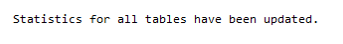

# 更新数据库统计信息

## 操作场景

使用存储过程更新统计信息，提高查询性能。

## 前提条件

成功连接RDS for SQL Server实例。关于连接华为云关系型数据库实例，请参考[连接实例](https://support.huaweicloud.com/qs-rds/rds_03_0007.html)。

## 操作步骤

执行以下命令，默认对所有库更新统计信息。

**EXEC rdsadmin.dbo.rds\_updatestats**  ;

执行以下命令，更新指定库的统计信息。

**EXEC rdsadmin.dbo.rds\_updatestats**   ‘_@DBname'_   ；

其中，_“@DBname'“_为需要更新统计信息的库名；

示例如下：

**EXEC rdsadmin.dbo.rds\_updatestats**   ‘_MyTestDb'_   ；

统计信息更新成功后，系统将会如下提示：

