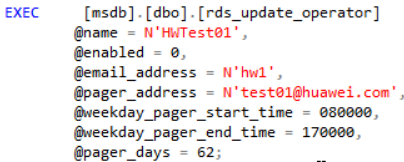

# 更新警报和作业所用的操作员信息<a name="rds_09_0018"></a>

## 操作场景<a name="section83303631312"></a>

使用存储过程更新警报和作业所用的操作员（通知收件人）信息。

## 前提条件<a name="section15268253151313"></a>

成功连接RDS for SQL Server实例。通过SQL Server客户端连接目标实例，具体操作请参见[通过公网连接SQL Server实例](https://support.huaweicloud.com/qs-rds/rds_03_0007.html)。

## 操作步骤<a name="section13821144618144"></a>

执行以下命令，更新警报和作业所用的操作员信息。

**EXEC \[msdb\].\[dbo\].\[rds\_update\_operator\]**

**@name ='name'**

**@new\_name = 'new\_name'**

**@enabled=enabled**

**@email\_address='email\_address'**

**@pager\_address= 'pager\_number'**

**@weekday\_pager\_start\_time= weekday\_pager\_start\_time**

**@weekday\_pager\_end\_time= weekday\_pager\_end\_time**

**@saturday\_pager\_start\_time= saturday\_pager\_start\_time**

**@saturday\_pager\_end\_time= saturday\_pager\_end\_time**

**@sunday\_pager\_start\_time= sunday\_pager\_start\_time**

**@sunday\_pager\_end\_time= sunday\_pager\_end\_time**

**@pager\_days= pager\_days**

**@netsend\_address ='netsend\_address'**

**@category\_name='category'**

**表 1**  参数说明

<a name="table132587163153"></a>
<table><thead align="left"><tr id="row725971681519"><th class="cellrowborder" valign="top" width="23.77%" id="mcps1.2.3.1.1"><p id="p4259216161517"><a name="p4259216161517"></a><a name="p4259216161517"></a>参数</p>
</th>
<th class="cellrowborder" valign="top" width="76.23%" id="mcps1.2.3.1.2"><p id="p14259111621518"><a name="p14259111621518"></a><a name="p14259111621518"></a>说明</p>
</th>
</tr>
</thead>
<tbody><tr id="row5259141620157"><td class="cellrowborder" valign="top" width="23.77%" headers="mcps1.2.3.1.1 "><p id="p18260201613158"><a name="p18260201613158"></a><a name="p18260201613158"></a>'name'</p>
</td>
<td class="cellrowborder" valign="top" width="76.23%" headers="mcps1.2.3.1.2 "><p id="p19260161621512"><a name="p19260161621512"></a><a name="p19260161621512"></a>操作员（通知收件人）的名称。此名称必须唯一，并且不能包含百分号（%）字符。名称为sysname，无默认值。</p>
</td>
</tr>
<tr id="row162601916121513"><td class="cellrowborder" valign="top" width="23.77%" headers="mcps1.2.3.1.1 "><p id="p17260121615155"><a name="p17260121615155"></a><a name="p17260121615155"></a>'new_name'</p>
</td>
<td class="cellrowborder" valign="top" width="76.23%" headers="mcps1.2.3.1.2 "><p id="p20260416171511"><a name="p20260416171511"></a><a name="p20260416171511"></a>操作员的新名称。此名称必须唯一。new_name是sysname，默认值为NULL。</p>
</td>
</tr>
<tr id="row1226014169155"><td class="cellrowborder" valign="top" width="23.77%" headers="mcps1.2.3.1.1 "><p id="p1226091611155"><a name="p1226091611155"></a><a name="p1226091611155"></a>enabled</p>
</td>
<td class="cellrowborder" valign="top" width="76.23%" headers="mcps1.2.3.1.2 "><p id="p13260916141510"><a name="p13260916141510"></a><a name="p13260916141510"></a>指示操作员的当前状态。enabled为tinyint，默认值为1（已启用）。如果为0，则不启用操作员且不会收到通知。</p>
</td>
</tr>
<tr id="row626021601519"><td class="cellrowborder" valign="top" width="23.77%" headers="mcps1.2.3.1.1 "><p id="p1826010169151"><a name="p1826010169151"></a><a name="p1826010169151"></a>'email_address'</p>
</td>
<td class="cellrowborder" valign="top" width="76.23%" headers="mcps1.2.3.1.2 "><p id="p1526081617155"><a name="p1526081617155"></a><a name="p1526081617155"></a>操作员的电子邮件地址。此字符串将直接传递到电子邮件系统。email_address为nvarchar（100），默认值为 NULL。</p>
</td>
</tr>
<tr id="row1626081614153"><td class="cellrowborder" valign="top" width="23.77%" headers="mcps1.2.3.1.1 "><p id="p526019169151"><a name="p526019169151"></a><a name="p526019169151"></a>'pager_number'</p>
</td>
<td class="cellrowborder" valign="top" width="76.23%" headers="mcps1.2.3.1.2 "><p id="p2023015119331"><a name="p2023015119331"></a><a name="p2023015119331"></a><span>操作员的寻呼地址。此字符串将直接传递到电子邮件系统。pager_number的数据类型为 nvarchar(100)，默认值为 NULL。</span></p>
</td>
</tr>
<tr id="row1226013162156"><td class="cellrowborder" valign="top" width="23.77%" headers="mcps1.2.3.1.1 "><p id="p15260161615159"><a name="p15260161615159"></a><a name="p15260161615159"></a>weekday_pager_start_time</p>
</td>
<td class="cellrowborder" valign="top" width="76.23%" headers="mcps1.2.3.1.2 "><p id="p826017165155"><a name="p826017165155"></a><a name="p826017165155"></a>时间，在该时间之后 SQL Server代理将寻呼通知发送到工作日的指定操作员，从星期一到星期五。weekday_pager_start_time的值为int，默认值为090000，指示 9:00 A.M。 并且必须使用HHMMSS格式输入。</p>
</td>
</tr>
<tr id="row4260151613152"><td class="cellrowborder" valign="top" width="23.77%" headers="mcps1.2.3.1.1 "><p id="p17260191619155"><a name="p17260191619155"></a><a name="p17260191619155"></a>weekday_pager_end_time</p>
</td>
<td class="cellrowborder" valign="top" width="76.23%" headers="mcps1.2.3.1.2 "><p id="p16260131621512"><a name="p16260131621512"></a><a name="p16260131621512"></a>一个时间，在此时间之后，SQLServerAgent服务不再向星期一到星期五的工作日发送寻呼通知。<span class="parmname" id="parmname15381192945518"><a name="parmname15381192945518"></a><a name="parmname15381192945518"></a>“weekday_pager_end_time”</span>的值为<span class="parmvalue" id="parmvalue101413355511"><a name="parmvalue101413355511"></a><a name="parmvalue101413355511"></a>“int”</span>，默认值为180000，表示6:00 P.M.并且必须使用HHMMSS格式输入。</p>
</td>
</tr>
<tr id="row185686112111"><td class="cellrowborder" valign="top" width="23.77%" headers="mcps1.2.3.1.1 "><p id="p7561663218"><a name="p7561663218"></a><a name="p7561663218"></a>saturday_pager_start_time</p>
</td>
<td class="cellrowborder" valign="top" width="76.23%" headers="mcps1.2.3.1.2 "><p id="p125612615219"><a name="p125612615219"></a><a name="p125612615219"></a>SQLServerAgent服务在星期六向指定操作员发送寻呼通知的时间。 <span class="parmname" id="parmname1344418055619"><a name="parmname1344418055619"></a><a name="parmname1344418055619"></a>“saturday_pager_start_time”</span>的值为<span class="parmvalue" id="parmvalue14865114165620"><a name="parmvalue14865114165620"></a><a name="parmvalue14865114165620"></a>“int”</span>，默认值为090000，指示9:00 A.M。并且必须使用HHMMSS格式输入。</p>
</td>
</tr>
<tr id="row172181823214"><td class="cellrowborder" valign="top" width="23.77%" headers="mcps1.2.3.1.1 "><p id="p621817217216"><a name="p621817217216"></a><a name="p621817217216"></a>saturday_pager_end_time</p>
</td>
<td class="cellrowborder" valign="top" width="76.23%" headers="mcps1.2.3.1.2 "><p id="p721832192118"><a name="p721832192118"></a><a name="p721832192118"></a>一个时间，在此时间之后，SQLServerAgent服务不再向周六的指定操作员发送寻呼通知。 <span class="parmname" id="parmname114851514185611"><a name="parmname114851514185611"></a><a name="parmname114851514185611"></a>“saturday_pager_end_time”</span>的值为<span class="parmvalue" id="parmvalue151814181561"><a name="parmvalue151814181561"></a><a name="parmvalue151814181561"></a>“int”</span>，默认值为180000，表示6:00 P.M.并且必须使用HHMMSS格式输入。</p>
</td>
</tr>
<tr id="row17917659192016"><td class="cellrowborder" valign="top" width="23.77%" headers="mcps1.2.3.1.1 "><p id="p7917165992014"><a name="p7917165992014"></a><a name="p7917165992014"></a>sunday_pager_start_time</p>
</td>
<td class="cellrowborder" valign="top" width="76.23%" headers="mcps1.2.3.1.2 "><p id="p20917659202013"><a name="p20917659202013"></a><a name="p20917659202013"></a>SQLServerAgent服务在星期日向指定操作员发送寻呼通知的时间。 <span class="parmname" id="parmname17990182618564"><a name="parmname17990182618564"></a><a name="parmname17990182618564"></a>“sunday_pager_start_time”</span>的值为<span class="parmname" id="parmname1812663045619"><a name="parmname1812663045619"></a><a name="parmname1812663045619"></a>“int”</span>，默认值为090000，指示9:00 A.M。并且必须使用HHMMSS格式输入。</p>
</td>
</tr>
<tr id="row14345657132014"><td class="cellrowborder" valign="top" width="23.77%" headers="mcps1.2.3.1.1 "><p id="p193451757132012"><a name="p193451757132012"></a><a name="p193451757132012"></a>sunday_pager_end_time</p>
</td>
<td class="cellrowborder" valign="top" width="76.23%" headers="mcps1.2.3.1.2 "><p id="p18345205720206"><a name="p18345205720206"></a><a name="p18345205720206"></a>在星期日上，SQLServerAgent服务不再向指定操作员发送寻呼通知的时间。 <span class="parmname" id="parmname652833918564"><a name="parmname652833918564"></a><a name="parmname652833918564"></a>“sunday_pager_end_time”</span>的值为<span class="parmvalue" id="parmvalue1029219428568"><a name="parmvalue1029219428568"></a><a name="parmvalue1029219428568"></a>“int”</span>，默认值为180000，表示6:00 P.M.并且必须使用HHMMSS格式输入。</p>
</td>
</tr>
<tr id="row2276195472019"><td class="cellrowborder" valign="top" width="23.77%" headers="mcps1.2.3.1.1 "><p id="p12277185412018"><a name="p12277185412018"></a><a name="p12277185412018"></a>pager_days</p>
</td>
<td class="cellrowborder" valign="top" width="76.23%" headers="mcps1.2.3.1.2 "><p id="p8916130172316"><a name="p8916130172316"></a><a name="p8916130172316"></a>是一个数字，指示操作员可用于页面的日期（受限于指定的开始/结束时间）。pager_days为tinyint，默认值为0，表示运算符从不可用于接收页面。有效值为0至127。 pager_days是通过添加所需日期的各个值来计算的。例如，从星期一到星期五是2+4+8+16+32 = 62。下表列出了一周中每天的值。</p>
<a name="ul15484486474"></a><a name="ul15484486474"></a><ul id="ul15484486474"><li>值为1，表示星期日。</li><li>值为2，表示星期一。</li><li>值为4，表示星期二。</li><li>值为8，表示星期三。</li><li>值为16，表示星期四。</li><li>值为32，表示星期五。</li><li>值为64，表示星期六。</li></ul>
</td>
</tr>
<tr id="row1773934922010"><td class="cellrowborder" valign="top" width="23.77%" headers="mcps1.2.3.1.1 "><p id="p197391249112016"><a name="p197391249112016"></a><a name="p197391249112016"></a>'netsend_address'</p>
</td>
<td class="cellrowborder" valign="top" width="76.23%" headers="mcps1.2.3.1.2 "><p id="p11739184917204"><a name="p11739184917204"></a><a name="p11739184917204"></a>要向其发送网络消息的操作员的网络地址。netsend_address为nvarchar（100），默认值为NULL。</p>
</td>
</tr>
<tr id="row779843922011"><td class="cellrowborder" valign="top" width="23.77%" headers="mcps1.2.3.1.1 "><p id="p1679853952017"><a name="p1679853952017"></a><a name="p1679853952017"></a>'category'</p>
</td>
<td class="cellrowborder" valign="top" width="76.23%" headers="mcps1.2.3.1.2 "><p id="p579813393207"><a name="p579813393207"></a><a name="p579813393207"></a>此操作员的类别名称。category的类型为sysname，默认值为NULL。</p>
</td>
</tr>
</tbody>
</table>

执行成功后，系统将会如下提示：

```
Commands completed successfully.
```

## 示例<a name="section197409416261"></a>



回显如下所示：


