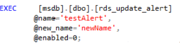

# 更新警报设置

## 操作场景

使用存储过程更新现有警报的设置。

## 前提条件

成功连接RDS for SQL Server实例。通过SQL Server客户端连接目标实例，具体操作请参见[通过公网连接SQL Server实例](https://support.huaweicloud.com/qs-rds/rds_03_0007.html)。成功连接RDS for SQL Server实例。

## 操作步骤

执行以下命令，更新现有警报的设置。

**EXEC \[msdb\].\[dbo\].\[rds\_update\_alert\]**

**@name='name'**

**@new\_name = 'new\_name'**

**@message\_id=message\_id**

**@severity=severity**

**@enabled=enabled**

**@delay\_between\_responses= delay\_between\_responses**

**@notification\_message='notification\_message'**

**@include\_event\_description\_in=include\_event\_description\_in**

**@database\_name='database'**

**@event\_description\_keyword= 'event\_description\_keyword'**

**@job\_id=job\_id | @job\_name='job\_name'**

**@occurrence\_count= occurrence\_count**

**@count\_reset\_date= count\_reset\_date**

**@count\_reset\_time= count\_reset\_time**

**@last\_occurrence\_date= last\_occurrence\_date**

**@ last\_occurrence\_time= last\_occurrence\_time**

**@ last\_response\_date= last\_response\_date**

**@ last\_response\_time= last\_response\_time**

**@ raise\_snmp\_trap= raise\_snmp\_trap**

**@ performance\_condition= 'performance\_condition'**

**@category\_name='category'**

**@wmi\_namespace=‘wmi\_namespace’**

**@wmi\_query=‘wmi\_query’**

**表 1**  参数说明

<table><thead align="left"><tr id="row333824282310"><th class="cellrowborder" valign="top" width="23.86%" id="mcps1.2.3.1.1">
参数

</th>
<th class="cellrowborder" valign="top" width="76.14%" id="mcps1.2.3.1.2">
说明

</th>
</tr>
</thead>
<tbody><tr id="row1233864217236"><td class="cellrowborder" valign="top" width="23.86%" headers="mcps1.2.3.1.1 ">
'name'

</td>
<td class="cellrowborder" valign="top" width="76.14%" headers="mcps1.2.3.1.2 ">
更新的警报名称。名称为sysname, 无默认值。

</td>
</tr>
<tr id="row11338164232314"><td class="cellrowborder" valign="top" width="23.86%" headers="mcps1.2.3.1.1 ">
'new_name'

</td>
<td class="cellrowborder" valign="top" width="76.14%" headers="mcps1.2.3.1.2 ">
警报新名称。该名称必须是唯一的。“new_name”的值为“sysname”, 默认值为 NULL。

</td>
</tr>
<tr id="row1933994217236"><td class="cellrowborder" valign="top" width="23.86%" headers="mcps1.2.3.1.1 ">
message_id

</td>
<td class="cellrowborder" valign="top" width="76.14%" headers="mcps1.2.3.1.2 ">
警报定义的新消息或错误号。通常message_id与sysmessages表中的错误号相对应。 message_id的数据类型为int，默认值为NULL。仅当警报的严重级别设置为0时，才能使用消息ID。

</td>
</tr>
<tr id="row4339154219236"><td class="cellrowborder" valign="top" width="23.86%" headers="mcps1.2.3.1.1 ">
severity

</td>
<td class="cellrowborder" valign="top" width="76.14%" headers="mcps1.2.3.1.2 ">
警报定义的新严重级别 (从1到25)。发送Microsoft到具有指定严重性的Windows应用程序日志的任何SQL Server消息都将激活警报。严重性为int, 默认值为 NULL。仅当警报的消息ID设置为0时，才能使用严重性级别。

</td>
</tr>
<tr id="row1133974282314"><td class="cellrowborder" valign="top" width="23.86%" headers="mcps1.2.3.1.1 ">
enabled

</td>
<td class="cellrowborder" valign="top" width="76.14%" headers="mcps1.2.3.1.2 ">
指示警报的当前状态。enabled为tinyint，默认值为1（已启用）。 如果为0，则不启用警报，也不触发警报。

</td>
</tr>
<tr id="row1233916420233"><td class="cellrowborder" valign="top" width="23.86%" headers="mcps1.2.3.1.1 ">
delay_between_responses

</td>
<td class="cellrowborder" valign="top" width="76.14%" headers="mcps1.2.3.1.2 ">
警报响应之间的等待时间（以秒为单位）。“delay_between_responses”的值为“int”，默认值为0，这意味着响应之间不等待（每次出现警报时都生成响应）。响应可以为下面的一种或两种形式：

<ul id="ul1171912239289"><li>通过电子邮件或寻呼发送的一个或多个通知。</li><li>要执行的作业。
例如，当警报在短时间内重复产生时，通过设置该值就有可能避免发送重复的电子邮件。

</li></ul>
</td>
</tr>
<tr id="row10339342182315"><td class="cellrowborder" valign="top" width="23.86%" headers="mcps1.2.3.1.1 ">
'notification_message'

</td>
<td class="cellrowborder" valign="top" width="76.14%" headers="mcps1.2.3.1.2 ">
作为电子邮件、net send或寻呼通知的一部分发送给操作员的可选附加消息。 “notification_message”的值为“nvarchar （512）”，默认值为 NULL。指定notification_message可用于添加特别注释，如补救过程。

</td>
</tr>
<tr id="row19667173718293"><td class="cellrowborder" valign="top" width="23.86%" headers="mcps1.2.3.1.1 ">
include_event_description_in

</td>
<td class="cellrowborder" valign="top" width="76.14%" headers="mcps1.2.3.1.2 ">
指定是否应该在通知消息SQL Server中包含Windows应用程序日志中的错误说明。其数据值为tinyint，默认值为 NULL，可以是下列值中的一个或多个。

<ul id="ul15484486474"><li>值为0，表示无。</li><li>值为1，电子邮件。</li><li>值为2，表示寻呼程序。</li><li>值为4，表示net send。</li><li>值为7，表示All。</li></ul>
</td>
</tr>
<tr id="row17352435152913"><td class="cellrowborder" valign="top" width="23.86%" headers="mcps1.2.3.1.1 ">
'database'

</td>
<td class="cellrowborder" valign="top" width="76.14%" headers="mcps1.2.3.1.2 ">
必须发生错误才能触发警报的数据库。如果未提供数据库，则会触发警报，而不考虑错误发生的位置。数据库为sysname。不允许用方括号 ([ ]) 将名称括起来。 默认值为 NULL。

</td>
</tr>
<tr id="row188322032102915"><td class="cellrowborder" valign="top" width="23.86%" headers="mcps1.2.3.1.1 ">
'event_description_keyword'

</td>
<td class="cellrowborder" valign="top" width="76.14%" headers="mcps1.2.3.1.2 ">
必须在错误消息日志中的错误说明中找到的字符序列。可以使用Transact-SQL LIKE表达式模式匹配字符。“event_description_keyword”的值为“nvarchar (100) ”, 默认值为NULL。此参数适用于筛选对象名称 (例如, % customer_table% )。

</td>
</tr>
<tr id="row7460163018291"><td class="cellrowborder" valign="top" width="23.86%" headers="mcps1.2.3.1.1 ">
job_id

</td>
<td class="cellrowborder" valign="top" width="76.14%" headers="mcps1.2.3.1.2 ">
作业标识号。“job_id”的值为“uniqueidentifier”, 默认值为NULL。如果指定了job_id , 则必须省略job_name。

</td>
</tr>
<tr id="row9774427102919"><td class="cellrowborder" valign="top" width="23.86%" headers="mcps1.2.3.1.1 ">
'job_name'

</td>
<td class="cellrowborder" valign="top" width="76.14%" headers="mcps1.2.3.1.2 ">
为响应此警报而执行的作业的名称。“job_name”的值为“sysname”, 默认值为 NULL。如果指定了job_name , 则必须省略job_id。

</td>
</tr>
<tr id="row16774101832911"><td class="cellrowborder" valign="top" width="23.86%" headers="mcps1.2.3.1.1 ">
occurrence_count

</td>
<td class="cellrowborder" valign="top" width="76.14%" headers="mcps1.2.3.1.2 ">
重置警报发生的次数。“occurrence_count”的值为“int”, 默认值为NULL, 且只能设置为0。

</td>
</tr>
<tr id="row9265621112913"><td class="cellrowborder" valign="top" width="23.86%" headers="mcps1.2.3.1.1 ">
count_reset_date

</td>
<td class="cellrowborder" valign="top" width="76.14%" headers="mcps1.2.3.1.2 ">
重置上一次重置发生计数的日期。“count_reset_date”的值为“int”, 默认值为 NULL。

</td>
</tr>
<tr id="row26611023162917"><td class="cellrowborder" valign="top" width="23.86%" headers="mcps1.2.3.1.1 ">
count_reset_time

</td>
<td class="cellrowborder" valign="top" width="76.14%" headers="mcps1.2.3.1.2 ">
重置上一次重置发生计数的时间。“count_reset_time”的值为“int”, 默认值为 NULL。

</td>
</tr>
<tr id="row278682983810"><td class="cellrowborder" valign="top" width="23.86%" headers="mcps1.2.3.1.1 ">
last_occurrence_date

</td>
<td class="cellrowborder" valign="top" width="76.14%" headers="mcps1.2.3.1.2 ">
重置警报上一次发生的日期。“last_occurrence_date”的值为“int”, 默认值为 NULL，且只能设置为0。

</td>
</tr>
<tr id="row18465132733815"><td class="cellrowborder" valign="top" width="23.86%" headers="mcps1.2.3.1.1 ">
last_occurrence_time

</td>
<td class="cellrowborder" valign="top" width="76.14%" headers="mcps1.2.3.1.2 ">
重置警报上一次发生的时间。“last_occurrence_time”的值为“int”, 默认值为 NULL，且只能设置为0。

</td>
</tr>
<tr id="row139695224380"><td class="cellrowborder" valign="top" width="23.86%" headers="mcps1.2.3.1.1 ">
last_response_date

</td>
<td class="cellrowborder" valign="top" width="76.14%" headers="mcps1.2.3.1.2 ">
重置SQLServerAgent服务上一次响应警报的日期。“last_response_date”的值为“int”，默认值为 NULL，且只能设置为0。

</td>
</tr>
<tr id="row45081625113813"><td class="cellrowborder" valign="top" width="23.86%" headers="mcps1.2.3.1.1 ">
last_response_time

</td>
<td class="cellrowborder" valign="top" width="76.14%" headers="mcps1.2.3.1.2 ">
重置SQLServerAgent服务上一次响应警报的时间。“last_response_time”的值为“int”，默认值为NULL, 且只能设置为0。

</td>
</tr>
<tr id="row5983104464017"><td class="cellrowborder" valign="top" width="23.86%" headers="mcps1.2.3.1.1 ">
raise_snmp_trap

</td>
<td class="cellrowborder" valign="top" width="76.14%" headers="mcps1.2.3.1.2 ">
保护。

</td>
</tr>
<tr id="row6808342114014"><td class="cellrowborder" valign="top" width="23.86%" headers="mcps1.2.3.1.1 ">
'performance_condition'

</td>
<td class="cellrowborder" valign="top" width="76.14%" headers="mcps1.2.3.1.2 ">
以 "itemcomparatorvalue" 格式表示的值。“performance_condition”的默认值为“nvarchar（512）”，默认值为 NULL。其中包含这些元素：

<ul id="ul10141115611427"><li>格式元素为项，表示性能对象、性能计数器或计数器的命名实例</li><li>格式元素为Comparator，表示以下运算符之一: &gt; 、、 &lt; =</li><li>格式元素为ReplTest1，表示计数器的数值</li></ul>
</td>
</tr>
<tr id="row13687154054018"><td class="cellrowborder" valign="top" width="23.86%" headers="mcps1.2.3.1.1 ">
'category'

</td>
<td class="cellrowborder" valign="top" width="76.14%" headers="mcps1.2.3.1.2 ">
警报类别的名称。category的类型为sysname，默认值为NULL。

</td>
</tr>
<tr id="row14471238104010"><td class="cellrowborder" valign="top" width="23.86%" headers="mcps1.2.3.1.1 ">
'wmi_namespace'

</td>
<td class="cellrowborder" valign="top" width="76.14%" headers="mcps1.2.3.1.2 ">
要查询事件的WMI命名空间。“wmi_namespace”的值为“sysname”, 默认值为NULL。

</td>
</tr>
<tr id="row16499163611405"><td class="cellrowborder" valign="top" width="23.86%" headers="mcps1.2.3.1.1 ">
'wmi_query'

</td>
<td class="cellrowborder" valign="top" width="76.14%" headers="mcps1.2.3.1.2 ">
指定警报的WMI事件的查询。“wmi_query”的值为“nvarchar（512）”，默认值为 NULL。

</td>
</tr>
</tbody>
</table>

执行成功后，系统将会如下提示：

## 示例

回显如下所示：

