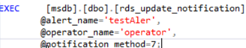
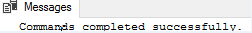

# 更新警报通知<a name="rds_09_0017"></a>

## 操作场景<a name="section20369111037"></a>

使用存储过程更新警报通知的通知方法。

## 前提条件<a name="section16509132213315"></a>

成功连接RDS for SQL Server实例。通过SQL Server客户端连接目标实例，具体操作请参见[通过公网连接SQL Server实例](https://support.huaweicloud.com/qs-rds/rds_03_0007.html)。

## 操作步骤<a name="section1315874410318"></a>

执行以下命令，更新警报通知。

**EXEC \[msdb\].\[dbo\].\[rds\_update\_notification\]**

**@alert\_name = 'alert',**

**@operator\_name ='operator',**

**@notification\_method =notification ;**

**表 1**  参数说明

<a name="table1424415179420"></a>
<table><thead align="left"><tr id="row924519172419"><th class="cellrowborder" valign="top" width="23.18%" id="mcps1.2.3.1.1"><p id="p42453173419"><a name="p42453173419"></a><a name="p42453173419"></a>参数</p>
</th>
<th class="cellrowborder" valign="top" width="76.82%" id="mcps1.2.3.1.2"><p id="p2024513175411"><a name="p2024513175411"></a><a name="p2024513175411"></a>说明</p>
</th>
</tr>
</thead>
<tbody><tr id="row4245117949"><td class="cellrowborder" valign="top" width="23.18%" headers="mcps1.2.3.1.1 "><p id="p524510171245"><a name="p524510171245"></a><a name="p524510171245"></a>'alert'</p>
</td>
<td class="cellrowborder" valign="top" width="76.82%" headers="mcps1.2.3.1.2 "><p id="p1024581719419"><a name="p1024581719419"></a><a name="p1024581719419"></a>与该通知关联的警报的名称。警报是sysname，无默认值。</p>
</td>
</tr>
<tr id="row18245161719419"><td class="cellrowborder" valign="top" width="23.18%" headers="mcps1.2.3.1.1 "><p id="p4245191717413"><a name="p4245191717413"></a><a name="p4245191717413"></a>'operator'</p>
</td>
<td class="cellrowborder" valign="top" width="76.82%" headers="mcps1.2.3.1.2 "><p id="p2245817449"><a name="p2245817449"></a><a name="p2245817449"></a>将出现警报时通知的操作员。运算符是sysname，无默认值。</p>
</td>
</tr>
<tr id="row12245201710411"><td class="cellrowborder" valign="top" width="23.18%" headers="mcps1.2.3.1.1 "><p id="p7245217448"><a name="p7245217448"></a><a name="p7245217448"></a>notification</p>
</td>
<td class="cellrowborder" valign="top" width="76.82%" headers="mcps1.2.3.1.2 "><p id="p224514172413"><a name="p224514172413"></a><a name="p224514172413"></a>依据通知操作员的方法。通知是tinyint，无默认值，并且可以是一个或多个值。</p>
<a name="ul92951739143113"></a><a name="ul92951739143113"></a><ul id="ul92951739143113"><li>值为1，电子邮件。</li><li>值为2，寻呼程序。</li><li>值为4，net send。</li><li>值为7，所有方法。</li></ul>
</td>
</tr>
</tbody>
</table>

执行成功后，系统将会如下提示：

```
Commands completed successfully.
```

## 示例<a name="section18139131712812"></a>



回显如下所示：



