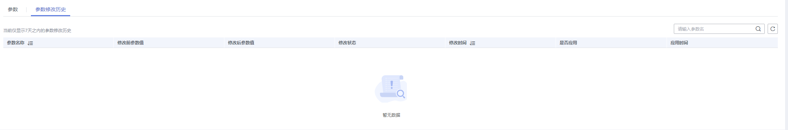

# 查看参数修改历史

## 操作场景

您可以查看当前实例所使用参数模板修改历史，以满足业务需要。

> **说明：**   
>用户创建或导出的新参数模板，在未进行参数修改前，无修改历史。  

## 查看当前实例的参数修改历史

1.  登录管理控制台。
2.  单击管理控制台左上角的，选择区域和项目。
3.  选择“数据库  \>  云数据库 RDS“。进入云数据库 RDS信息页面。
4.  在“实例管理“页面，选择指定的实例，单击实例名称，进入实例的基本信息页面。
5.  在左侧导航栏，单击“参数修改”，单击“参数修改历史“。

    **图 1**  查看参数修改历史  
    

    您可查看参数对应的参数名称、修改前参数值、修改后参数值、修改状态、修改时间、是否应用以及应用时间。

    如修改后参数模板未应用，请根据业务需要，参考[应用参数模板](应用参数模板.md)，将其应用到对应实例。

## 查看目标参数模板的参数修改历史

1.  登录管理控制台。
2.  单击管理控制台左上角的，选择区域和项目。
3.  选择“数据库  \>  云数据库 RDS“。进入云数据库 RDS信息页面。
4.  在“参数模板管理”页面的“自定义”页签，单击目标参数模板名称。
5.  单击“参数修改历史“。

    **图 2**  查看参数修改历史  
    

    您可查看参数对应的参数名称、修改前参数值、修改后参数值、修改状态和修改时间。

