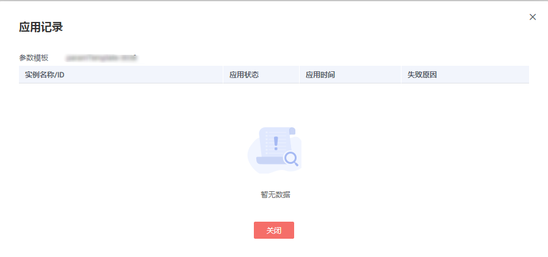

# 查看参数模板应用记录

## 操作场景

参数模板编辑修改后，您可根据业务需要将其应用到对应实例中，RDS支持查看参数模板所应用到实例的记录。

## 操作步骤

1.  登录管理控制台。
2.  单击管理控制台左上角的，选择区域和项目。
3.  选择“数据库  \>  云数据库 RDS“。进入云数据库 RDS信息页面。
4.  在“参数模板管理”页面，“系统默认“页签或“自定义“页签，选择目标参数模板，单击“更多\>应用记录”，查看应用记录。

    您可查看参数模板所应用到的实例名称/ID、应用状态、应用时间、失败原因。

    **图 1**  查看应用记录  
    

