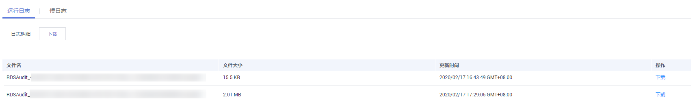

# 查看或下载审计日志

RDS for SQL Server实例将默认开启SQL审计功能，并且不支持关闭。SQL审计功能会将对服务级、数据库级、表级的主要变更操作记录进审计日志文件，方便用户查看并下载。

使用 SQL Server Audit 功能，你可以对服务器级别和数据库级别事件组以及各个事件进行审核，SQL Server 审核包括零个或多个审核操作项目。[表1](#table1327315443612)介绍了服务器级审核操作组，并提供了适用的等效 SQL Server 事件类。有关详细信息，请参阅[SQL Server 审核操作组官方说明](https://docs.microsoft.com/zh-cn/sql/relational-databases/security/auditing/sql-server-audit-action-groups-and-actions?view=sql-server-2017)。

> **说明：**   
>-   SQL Server 2008 web版和SQL Server 2008 标准版不支持SQL审计功能。  
>-   创建job，修改参数，修改服务器属性参数，sql agent属性参数，数据库扩展属性等暂无审计。  
>-   审计日志中出现“succeeded”字段，表示触发事件的操作是否成功。 该字段不可为 null。 对于除登录事件之外的所有事件，它仅报告权限检查（而不是操作）成功或失败。  
>-   表级、列级架构变化审计描述请以SQL Server引擎审计结果为准。  

**表 1**  审计包含的操作组

<table><thead align="left"><tr id="row182752541363"><th class="cellrowborder" valign="top" width="50%" id="mcps1.2.3.1.1">
操作组名称

</th>
<th class="cellrowborder" valign="top" width="50%" id="mcps1.2.3.1.2">
描述

</th>
</tr>
</thead>
<tbody><tr id="row82752545369"><td class="cellrowborder" valign="top" width="50%" headers="mcps1.2.3.1.1 ">
APPLICATION_ROLE_CHANGE_PASSWORD_GROUP

</td>
<td class="cellrowborder" valign="top" width="50%" headers="mcps1.2.3.1.2 ">
更改应用程序角色的密码引发事件。

</td>
</tr>
<tr id="row16275154193619"><td class="cellrowborder" valign="top" width="50%" headers="mcps1.2.3.1.1 ">
DATABASE_CHANGE_GROUP

</td>
<td class="cellrowborder" valign="top" width="50%" headers="mcps1.2.3.1.2 ">
创建、更改、删除数据库。

</td>
</tr>
<tr id="row1727525423612"><td class="cellrowborder" valign="top" width="50%" headers="mcps1.2.3.1.1 ">
DATABASE_OBJECT_CHANGE_GROUP

</td>
<td class="cellrowborder" valign="top" width="50%" headers="mcps1.2.3.1.2 ">
针对数据库对象（如架构）执行create/alter/drop语句时将引发此事件。

</td>
</tr>
<tr id="row62751354173614"><td class="cellrowborder" valign="top" width="50%" headers="mcps1.2.3.1.1 ">
DATABASE_OBJECT_OWNERSHIP_CHANGE_GROUP

</td>
<td class="cellrowborder" valign="top" width="50%" headers="mcps1.2.3.1.2 ">
在数据库范围内更改对象所有者时，将触发此事件。

</td>
</tr>
<tr id="row17275554153619"><td class="cellrowborder" valign="top" width="50%" headers="mcps1.2.3.1.1 ">
DATABASE_OBJECT_PERMISSION_CHANGE_GROUP

</td>
<td class="cellrowborder" valign="top" width="50%" headers="mcps1.2.3.1.2 ">
针对数据库对象（例如，程序集和架构）发出GRANT、REVOKE或DENY语句时将引发此事件。

</td>
</tr>
<tr id="row18275254163613"><td class="cellrowborder" valign="top" width="50%" headers="mcps1.2.3.1.1 ">
DATABASE_OWNERSHIP_CHANGE_GROUP

</td>
<td class="cellrowborder" valign="top" width="50%" headers="mcps1.2.3.1.2 ">
使用alter authorization语句更改数据库的所有者时，引发此事件。

</td>
</tr>
<tr id="row102754540360"><td class="cellrowborder" valign="top" width="50%" headers="mcps1.2.3.1.1 ">
DATABASE_PERMISSION_CHANGE_GROUP

</td>
<td class="cellrowborder" valign="top" width="50%" headers="mcps1.2.3.1.2 ">
sqlserver中任何主体针对某语句权限发出的GRANT、REVOKE或DENY语句时均引发此事件（仅适用于数据库事件，例如授予对某数据库的权限）

</td>
</tr>
<tr id="row198861647143917"><td class="cellrowborder" valign="top" width="50%" headers="mcps1.2.3.1.1 ">
DATABASE_PRINCIPAL_CHANGE_GROUP

</td>
<td class="cellrowborder" valign="top" width="50%" headers="mcps1.2.3.1.2 ">
在数据库中创建、更改或删除主体（如用户）时，将引发此事件。

</td>
</tr>
<tr id="row15887154793914"><td class="cellrowborder" valign="top" width="50%" headers="mcps1.2.3.1.1 ">
DATABASE_ROLE_MEMBER_CHANGE_GROUP

</td>
<td class="cellrowborder" valign="top" width="50%" headers="mcps1.2.3.1.2 ">
向数据库角色添加登录名或从中删除登录名时将引发此事件。

</td>
</tr>
<tr id="row549595113920"><td class="cellrowborder" valign="top" width="50%" headers="mcps1.2.3.1.1 ">
FAILED_LOGIN_GROUP

</td>
<td class="cellrowborder" valign="top" width="50%" headers="mcps1.2.3.1.2 ">
指示主体尝试登录到SQL Server，但是失败。此类中的事件有新连接引发或由连接池中重用的连接引发。

</td>
</tr>
<tr id="row1049605143913"><td class="cellrowborder" valign="top" width="50%" headers="mcps1.2.3.1.1 ">
LOGIN_CHANGE_PASSWORD_GROUP

</td>
<td class="cellrowborder" valign="top" width="50%" headers="mcps1.2.3.1.2 ">
通过alter login语句或sp_password 存储过程更改登录密码时，将引发此事件。

</td>
</tr>
<tr id="row8496051113916"><td class="cellrowborder" valign="top" width="50%" headers="mcps1.2.3.1.1 ">
SCHEMA_OBJECT_CHANGE_GROUP

</td>
<td class="cellrowborder" valign="top" width="50%" headers="mcps1.2.3.1.2 ">
针对架构执行create、alter或drop 操作时引发此事件。

</td>
</tr>
<tr id="row8496251143919"><td class="cellrowborder" valign="top" width="50%" headers="mcps1.2.3.1.1 ">
SCHEMA_OBJECT_OWNERSHIP_CHANGE_GROUP

</td>
<td class="cellrowborder" valign="top" width="50%" headers="mcps1.2.3.1.2 ">
检查更改架构对象（例如表、过程或函数）的所有者的权限时，会引发此事件。

</td>
</tr>
<tr id="row18443175693919"><td class="cellrowborder" valign="top" width="50%" headers="mcps1.2.3.1.1 ">
SCHEMA_OBJECT_PERMISSION_CHANGE_GROUP

</td>
<td class="cellrowborder" valign="top" width="50%" headers="mcps1.2.3.1.2 ">
对架构对象执行grant、deny或revoke语句时将引发此事件。

</td>
</tr>
<tr id="row144312565391"><td class="cellrowborder" valign="top" width="50%" headers="mcps1.2.3.1.1 ">
SERVER_OBJECT_CHANGE_GROUP

</td>
<td class="cellrowborder" valign="top" width="50%" headers="mcps1.2.3.1.2 ">
针对服务器对象执行create、alter、drop操作时引发此事件。

</td>
</tr>
<tr id="row4444115613393"><td class="cellrowborder" valign="top" width="50%" headers="mcps1.2.3.1.1 ">
SERVER_OBJECT_OWNERSHIP_CHANGE_GROUP

</td>
<td class="cellrowborder" valign="top" width="50%" headers="mcps1.2.3.1.2 ">
服务器范围中的对象的所有者发生更改时将引发此事件。

</td>
</tr>
<tr id="row1444556173918"><td class="cellrowborder" valign="top" width="50%" headers="mcps1.2.3.1.1 ">
SERVER_OBJECT_PERMISSION_CHANGE_GROUP

</td>
<td class="cellrowborder" valign="top" width="50%" headers="mcps1.2.3.1.2 ">
sqlserver中的任何主体针对某服务器对象权限发出grant、revoke、deny语句时，将引发此事件。

</td>
</tr>
<tr id="row154441756173914"><td class="cellrowborder" valign="top" width="50%" headers="mcps1.2.3.1.1 ">
SERVER_PERMISSION_CHANGE_GROUP

</td>
<td class="cellrowborder" valign="top" width="50%" headers="mcps1.2.3.1.2 ">
为获取服务器范围内的权限而发出grant、revoke、deny语句时，将引发此事件。

</td>
</tr>
<tr id="row8444115653913"><td class="cellrowborder" valign="top" width="50%" headers="mcps1.2.3.1.1 ">
SERVER_PRINCIPAL_CHANGE_GROUP

</td>
<td class="cellrowborder" valign="top" width="50%" headers="mcps1.2.3.1.2 ">
创建、更改、删除服务器主体时将引发此事件。

</td>
</tr>
<tr id="row1344418562398"><td class="cellrowborder" valign="top" width="50%" headers="mcps1.2.3.1.1 ">
SERVER_ROLE_MEMBER_CHANGE_GROUP

</td>
<td class="cellrowborder" valign="top" width="50%" headers="mcps1.2.3.1.2 ">
向固定服务器角色添加登录名或从中删除登录名时将引发此事件。

</td>
</tr>
<tr id="row144419568392"><td class="cellrowborder" valign="top" width="50%" headers="mcps1.2.3.1.1 ">
SERVER_STATE_CHANGE_GROUP

</td>
<td class="cellrowborder" valign="top" width="50%" headers="mcps1.2.3.1.2 ">
修改SQLServer 服务状态时将引发此事件。

</td>
</tr>
<tr id="row16186455204410"><td class="cellrowborder" valign="top" width="50%" headers="mcps1.2.3.1.1 ">
USER_CHANGE_PASSWORD_GROUP

</td>
<td class="cellrowborder" valign="top" width="50%" headers="mcps1.2.3.1.2 ">
每当使用alter user语句更改包含数据库用户的密码时，都将引发此事件。（sqlserver 2008版本不涉及）。

</td>
</tr>
</tbody>
</table>

## 查看审计日志

1.  登录管理控制台。
2.  单击管理控制台左上角的，选择区域和项目。
3.  选择“数据库  \>  云数据库 RDS“。进入云数据库 RDS信息页面。
4.  在“实例管理”页面，选择目标实例，单击实例名称，进入实例的“基本信息“页签。
5.  在左侧导航栏单击“日志管理“，在“运行日志“页签下，选择“下载“页签。
6.  在“下载”页面，记录所生成的审计日志文件名。

    **图 1**  SQL Server审计日志  
    

    > **说明：**   
    >审计日志文件名称以RDSAudit开头，会自动添加GUID和时间戳组合为文件名。  

7.  通过SQL Server客户端连接目标实例，具体操作请参见[通过公网连接SQL Server实例](https://support.huaweicloud.com/qs-rds/rds_03_0007.html)。
8.  目标实例连接成功后，通过执行如下sql查看审计日志详情。

    **select \* from msdb.dbo.rds\_fn\_get\_audit\_file\(**_file\_pattern_**, **_initial\_file\_name_**, **_audit\_record\_offset_**\)**

    **表 2**  参数说明

    
    <table><thead align="left"><tr id="row1628712368715"><th class="cellrowborder" valign="top" width="33.51%" id="mcps1.2.3.1.1">
参数

    </th>
    <th class="cellrowborder" valign="top" width="66.49000000000001%" id="mcps1.2.3.1.2">
说明

    </th>
    </tr>
    </thead>
    <tbody><tr id="row142872361773"><td class="cellrowborder" valign="top" width="33.51%" headers="mcps1.2.3.1.1 ">
<em id="i1723270986">file_pattern</em>

    </td>
    <td class="cellrowborder" valign="top" width="66.49000000000001%" headers="mcps1.2.3.1.2 ">
指定要读取的审核文件集目录（或路径）和文件名。

    </td>
    </tr>
    <tr id="row62871936774"><td class="cellrowborder" valign="top" width="33.51%" headers="mcps1.2.3.1.1 ">
<em id="i08825389">initial_file_name</em>

    </td>
    <td class="cellrowborder" valign="top" width="66.49000000000001%" headers="mcps1.2.3.1.2 ">
指定审核文件集中要开始读取审核记录的特定文件的路径和名称。

    </td>
    </tr>
    <tr id="row142871361170"><td class="cellrowborder" valign="top" width="33.51%" headers="mcps1.2.3.1.1 ">
<em id="i165111017811">audit_record_offset</em>

    </td>
    <td class="cellrowborder" valign="top" width="66.49000000000001%" headers="mcps1.2.3.1.2 ">
指定一个已知位置，该位置包含initial_file_name指定的文件。

    </td>
    </tr>
    </tbody>
    </table>

    查看审计日志详情，示例如下：

    **select \* from msdb.dbo.rds\_fn\_get\_audit\_file\('D:\\ServerAudit\\audit\\\*.sqlaudit', default, default\)**

    **图 2**  审计日志详情  
    

## 下载审计日志

1.  登录管理控制台。
2.  单击管理控制台左上角的，选择区域和项目。
3.  选择“数据库  \>  云数据库 RDS“。进入云数据库 RDS信息页面。
4.  在“实例管理”页面，选择目标实例，单击实例名称，进入实例的“基本信息“页签。
5.  在左侧导航栏单击“日志管理“，在“运行日志“页签下，选择“下载“页签。
6.  选择目标日志文件，单击操作列中的“下载“。
    1.  系统会在“下载“弹出框中自动加载下载准备任务，加载时长受日志文件大小及网络环境影响。
        -   下载准备过程中，状态显示为“准备中...”。
        -   下载准备完成，状态显示为“准备完成”。
        -   下载准备工作失败，状态显示为“异常”。

    2.  在“下载“弹出框中，对于“准备完成“的日志文件，单击“确定“，下载审计日志。单击“取消“，则不下载审计日志文件，直接返回下载页签。

        下载链接有效期为5分钟。如果超时，提示用户下载链接已失效，关闭窗口后执行[6](#zh-cn_topic_0171818656_li654810813132)重新下载日志文件。

