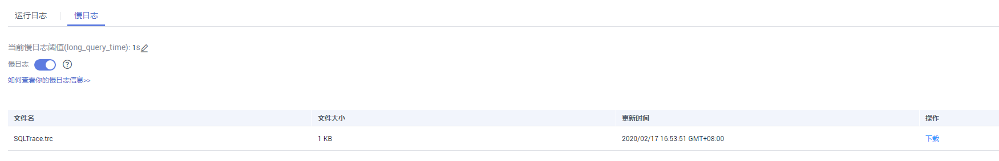

# 查看或下载慢日志

## 操作场景

慢查询日志用来记录执行时间超过当前慢日志阈值“long\_query\_time“（默认是1秒）的语句，您可以通过慢查询日志的日志明细，查找出执行效率低的语句，进行优化。您也可以下载慢查询日志进行业务分析。

## 参数解析

**表 1**  SQL Server慢查询相关的参数解析

<table><thead align="left"><tr id="zh-cn_topic_0171818656_row1755318241201"><th class="cellrowborder" valign="top" width="22.79%" id="mcps1.2.3.1.1">
参数名称

</th>
<th class="cellrowborder" valign="top" width="77.21000000000001%" id="mcps1.2.3.1.2">
说明

</th>
</tr>
</thead>
<tbody><tr id="zh-cn_topic_0171818656_row145532241400"><td class="cellrowborder" valign="top" width="22.79%" headers="mcps1.2.3.1.1 ">
long_query_time

</td>
<td class="cellrowborder" valign="top" width="77.21000000000001%" headers="mcps1.2.3.1.2 ">
大于等于此时间记录慢查询日志，精度可达微秒级别，默认为1s，当SQL语句执行时间超过此数值时，就会被记录到慢日志中。

您可以根据自己的需要，修改当前实例慢日志阈值，具体步骤如下：

<ol id="zh-cn_topic_0171818656_ol2197921185015"><li>登录管理控制台。</li><li>单击管理控制台左上角的，选择区域和项目。</li><li>选择“数据库 &gt; 云数据库 RDS”。进入云数据库 RDS信息页面。</li><li>在“实例管理”页面，选择目标实例，单击实例名称，进入实例的“基本信息”页面。</li><li>在左侧导航栏单击“日志管理”，在“慢日志”页签，在“当前慢日志阈值(long_query_time)”处，单击，修改慢日志阈值。<ul id="zh-cn_topic_0171818656_ul1137218215315"><li>单击 ，提交修改。</li><li>单击，取消修改。</li></ul>

 说明： 

建议设置为1s。锁等待时间并不计算在执行时间内。

</li></ol>
</td>
</tr>
</tbody>
</table>

## 查看慢日志

1.  登录管理控制台。
2.  单击管理控制台左上角的，选择区域和项目。
3.  选择“数据库  \>  云数据库 RDS“。进入云数据库 RDS信息页面。
4.  在“实例管理”页面，选择目标实例，单击实例名称，进入实例的“基本信息“页签。
5.  在左侧导航栏单击“日志管理“，在“慢日志“页签，单击，开启SQL Server慢日志功能。
6.  在“慢日志”页面，记录所生成的慢日志文件名。

    **图 1**  SQL Server慢日志  
    

    > **说明：**   
    >打开慢日志搜集功能会对当前实例的性能产生一定影响。  

7.  通过SQL Server客户端连接目标实例，具体操作请参见[通过公网连接SQL Server实例](https://support.huaweicloud.com/qs-rds/rds_03_0007.html)。
8.  目标实例连接成功后，通过执行如下sql查看慢日志详情。

    **select \* from ::fn\_trace\_gettable\(‘D:\\SQLTrace\\audit\\**_XXX_**’, default\)**

    > **说明：**   
    >_XXX_为[6](#zh-cn_topic_0171818656_li654810813132)中所记录的慢日志文件名。  

    查看慢日志详情，示例如下：

    **select \* from ::fn\_trace\_gettable\(‘D:\\SQLTrace\\audit\\SQLTrace.trc’, default\)**

    查看慢日志结果如[图2](#zh-cn_topic_0171818656_fig19196129142415)所示。

    **图 2**  慢日志详情  
    

## 下载慢日志

1.  登录管理控制台。
2.  单击管理控制台左上角的，选择区域和项目。
3.  选择“数据库  \>  云数据库 RDS“。进入云数据库 RDS信息页面。
4.  在“实例管理”页面，选择目标实例，单击实例名称，进入实例的“基本信息“页签。
5.  在左侧导航栏单击“日志管理“，在“慢日志“页签，单击，开启SQL Server慢日志功能。

    > **说明：**   
    >打开慢日志搜集功能会对当前实例的性能产生一定影响。  

6.  选择目标日志文件，单击操作列中的“下载“。
    1.  系统会在“下载“弹出框中自动加载下载准备任务，加载时长受日志文件大小及网络环境影响。
        -   下载准备过程中，状态显示为“准备中...”。
        -   下载准备完成，状态显示为“准备完成”。
        -   下载准备工作失败，状态显示为“异常”。

    2.  在“下载“弹出框中，对于“准备完成“的日志文件，单击“确定“，下载慢日志。单击“取消“，则不下载慢日志文件，直接返回下载页签。

        下载链接有效期为5分钟。如果超时，提示用户下载链接已失效，关闭窗口后执行[6](#zh-cn_topic_0171818656_li121912551908)重新下载日志文件。

