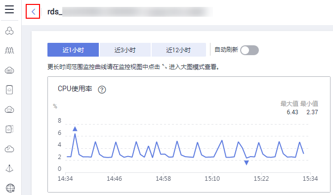
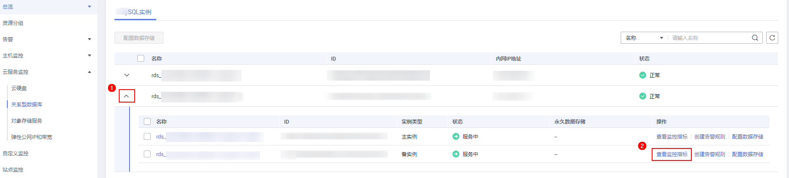
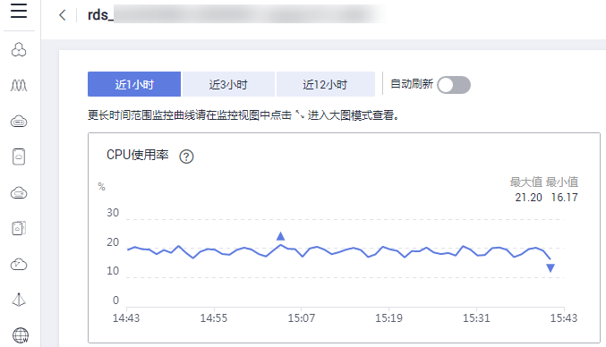

# 查看监控指标

## 操作场景

云服务平台提供的云监控，可以对关系型数据库的运行状态进行日常监控。您可以通过管理控制台，直观地查看关系型数据库的各项监控指标。您可以[查看主实例监控](#section3645894911344)和[查看备实例监控](#section1479519207209)。

由于监控数据的获取与传输会花费一定时间，因此，云监控显示的是当前时间5～10分钟前的关系型数据库状态。如果您的关系型数据库刚创建完成，请等待5～10分钟后查看监控数据。

## 前提条件

-   关系型数据库正常运行。

    故障、删除状态的关系型数据库，无法在云监控中查看其监控指标。当关系型数据库再次启动或恢复后，即可正常查看。

> **说明：**   
>故障24小时的关系型数据库，云监控将默认该关系型数据库不存在，并在监控列表中删除，不再对其进行监控，但告警规则需要用户手动清理。  

-   关系型数据库已正常运行一段时间（约10分钟）。

    对于新创建的关系型数据库，需要等待一段时间，才能查看上报的监控数据和监控视图。

## 查看主实例监控

1.  登录管理控制台。
2.  单击管理控制台左上角的，选择区域和项目。
3.  选择“数据库  \>  云数据库 RDS“。进入云数据库 RDS信息页面。
4.  在“实例管理”页面，选择目标实例，单击操作列中的“查看监控“，跳转到云监控页面。

    您也可以在“实例管理“页面，单击目标实例名称，在页面右上角，单击“查看监控“，跳转到云监控页面。

    该页面默认展示RDS主实例监控信息，您也可以[查看备实例监控](#section1479519207209)。

5.  在云监控页面，可以查看实例监控信息。
    -   通过“设置监控指标“框可选择您在页面中要展示的指标名称并排序。
    -   您也可根据业务需求，拖动其中的监控视图，调整监控视图的顺序。
    -   云监控支持的性能指标监控时间窗包括：近1小时、近3小时、近12小时、近24小时、近1周和近1月。

## 查看备实例监控

1.  登录管理控制台。
2.  单击管理控制台左上角的，选择区域和项目。
3.  选择“数据库  \>  云数据库 RDS“。进入云数据库 RDS信息页面。
4.  在“实例管理”页面，选择目标实例，单击操作列中的“查看监控“，跳转到云监控页面，该页面默认展示RDS主实例监控信息。

    您也可以在“实例管理“页面，单击目标实例名称，在页面右上角，单击“查看监控“，跳转到云监控页面。

5.  在主实例监控页面，单击，返回云服务监控页面。

    **图 1**  返回云服务监控页面  
    

6.  在实例列表单击主备实例前的，可看到主实例与备实例，单击备实例后面的“查看监控指标“，即可查看备实例监控信息。

    **图 2**  备实例监控入口  
    

7.  在云监控页面，可以查看备实例监控信息。

    -   通过“设置监控指标“框可选择您在页面中要展示的指标名称并排序。
    -   您也可根据业务需求，拖动其中的监控视图，调整监控视图的顺序。
    -   云监控支持的性能指标监控时间窗包括：近1小时、近3小时、近12小时、近24小时、近1周和近1月。

    **图 3**  查看备实例监控信息  
    

